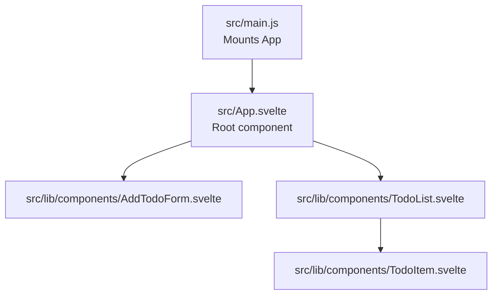
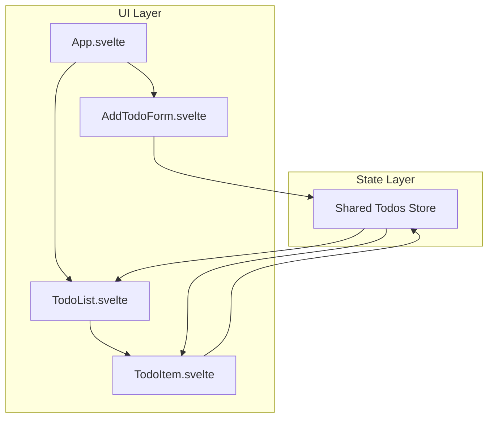
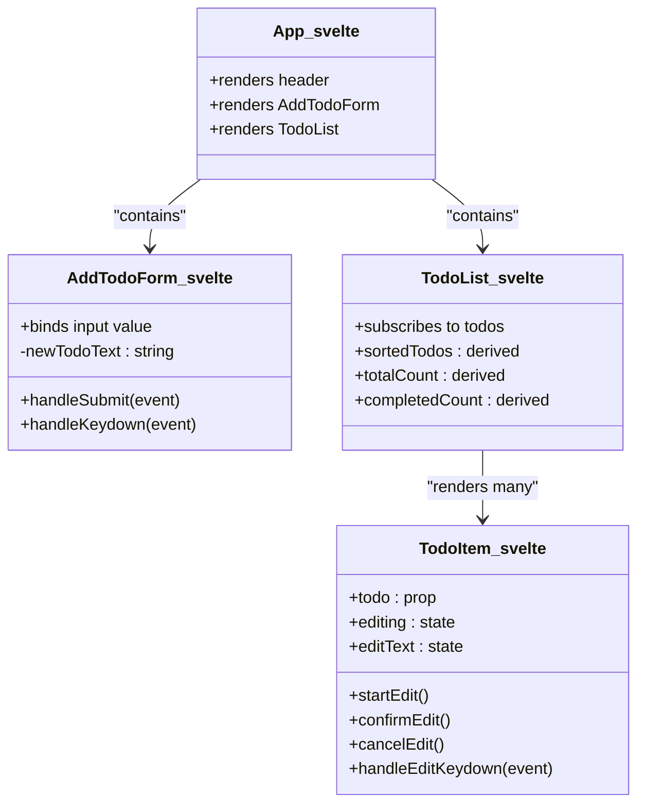
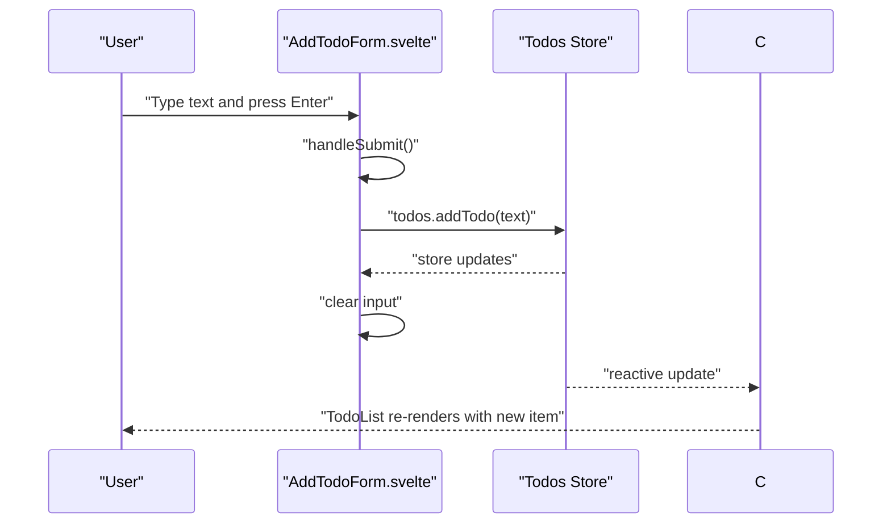
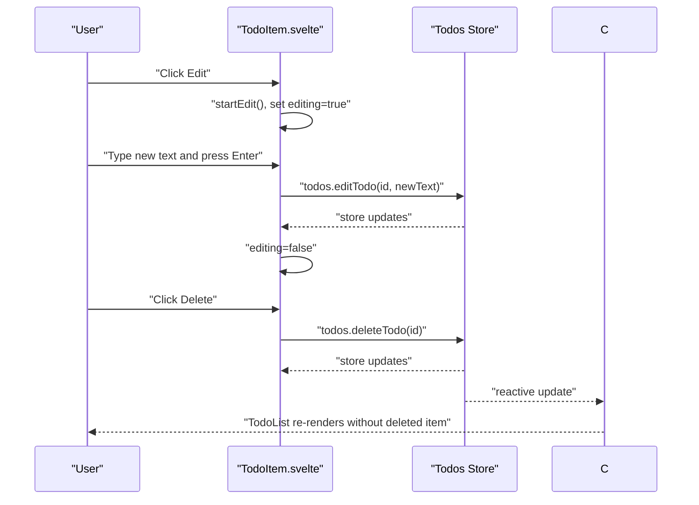
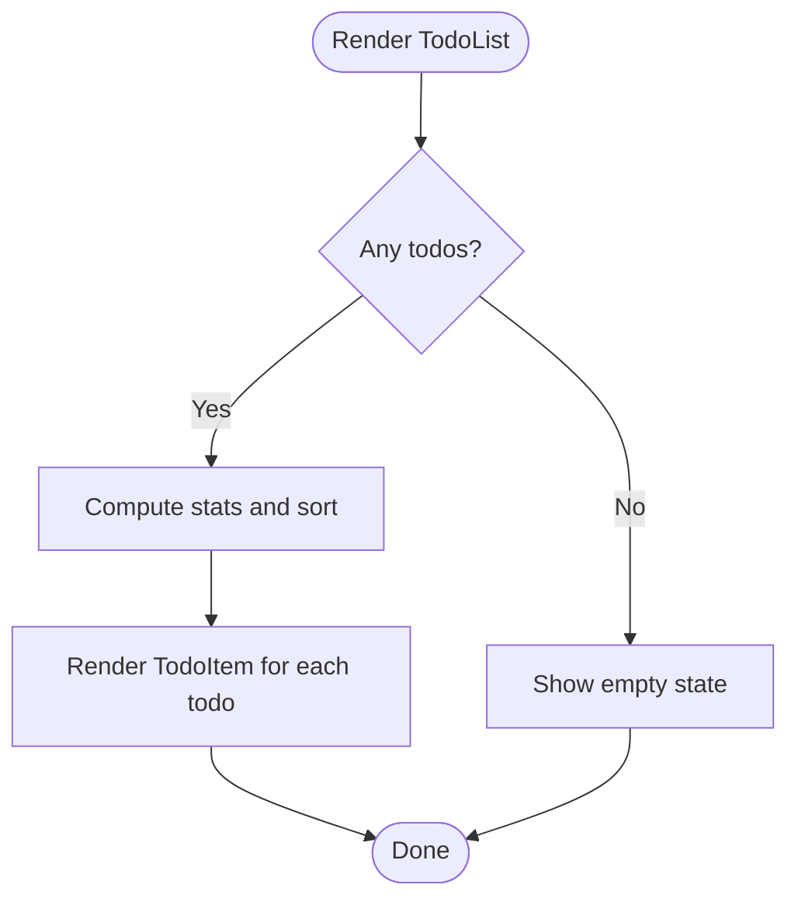
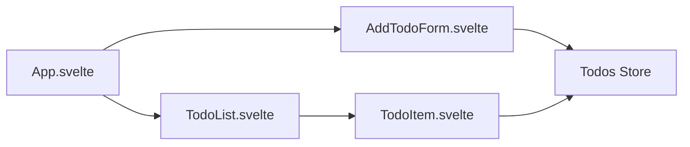

# Application Architecture

<cite>
**Referenced Files in This Document**
- [src/App.svelte](file://src/App.svelte)
- [src/main.js](file://src/main.js)
- [src/lib/components/AddTodoForm.svelte](file://src/lib/components/AddTodoForm.svelte)
- [src/lib/components/TodoList.svelte](file://src/lib/components/TodoList.svelte)
- [src/lib/components/TodoItem.svelte](file://src/lib/components/TodoItem.svelte)
</cite>

## Table of Contents
1. [Introduction](#introduction)
2. [Project Structure](#project-structure)
3. [Core Components](#core-components)
4. [Architecture Overview](#architecture-overview)
5. [Detailed Component Analysis](#detailed-component-analysis)
6. [Dependency Analysis](#dependency-analysis)
7. [Performance Considerations](#performance-considerations)
8. [Troubleshooting Guide](#troubleshooting-guide)
9. [Conclusion](#conclusion)

## Introduction
This document describes the architecture of a Svelte-based Todo List application. It focuses on the component-based architecture, the hierarchical structure among App.svelte, AddTodoForm, TodoList, and TodoItem, and the store-based reactive state management pattern. It also explains how user actions propagate through the component tree to update the centralized todos store and how Svelte’s Single File Component (SFC) model and CSS-in-Svelte styling methodology are applied.

## Project Structure
The application follows a clear SFC layout with a small set of focused components and a centralized store module. The runtime bootstrap mounts the root App component into the DOM. The UI is composed of a header and a main content area containing an input form and a list of items.

**Diagram sources**
- [src/main.js:1-9](file://src/main.js#L1-L9)
- [src/App.svelte:1-76](file://src/App.svelte#L1-L76)
- [src/lib/components/AddTodoForm.svelte:1-124](file://src/lib/components/AddTodoForm.svelte#L1-L124)
- [src/lib/components/TodoList.svelte:1-114](file://src/lib/components/TodoList.svelte#L1-L114)
- [src/lib/components/TodoItem.svelte:1-212](file://src/lib/components/TodoItem.svelte#L1-L212)

**Section sources**
- [src/main.js:1-9](file://src/main.js#L1-L9)
- [src/App.svelte:1-76](file://src/App.svelte#L1-L76)

## Core Components
- App.svelte: Declares the application shell with a header and a main container. It imports and renders AddTodoForm and TodoList.
- AddTodoForm.svelte: Provides an input field bound to local state and a submit handler that delegates creation to the shared store. It supports Enter-key submission and disables the button when input is empty.
- TodoList.svelte: Subscribes to the shared store, derives computed lists and statistics, and renders TodoItem instances with transitions. It shows an empty state when there are no items.
- TodoItem.svelte: Receives a single todo via props, manages local editing state, and invokes store methods for toggling completion, editing text, and deletion.

These components collectively implement a unidirectional data flow: user interactions trigger store updates, which cause derived computations and re-renders across the component tree.

**Section sources**
- [src/App.svelte:1-76](file://src/App.svelte#L1-L76)
- [src/lib/components/AddTodoForm.svelte:1-124](file://src/lib/components/AddTodoForm.svelte#L1-L124)
- [src/lib/components/TodoList.svelte:1-114](file://src/lib/components/TodoList.svelte#L1-L114)
- [src/lib/components/TodoItem.svelte:1-212](file://src/lib/components/TodoItem.svelte#L1-L212)

## Architecture Overview
The architecture is component-centric with a centralized store driving reactivity. The root component composes child components that remain decoupled from each other except through the shared store. Updates originate from user events in leaf components and propagate upward to the store, which triggers downstream reactivity.

**Diagram sources**
- [src/App.svelte:1-76](file://src/App.svelte#L1-L76)
- [src/lib/components/AddTodoForm.svelte:1-124](file://src/lib/components/AddTodoForm.svelte#L1-L124)
- [src/lib/components/TodoList.svelte:1-114](file://src/lib/components/TodoList.svelte#L1-L114)
- [src/lib/components/TodoItem.svelte:1-212](file://src/lib/components/TodoItem.svelte#L1-L212)

## Detailed Component Analysis

### Component Class Model

**Diagram sources**
- [src/App.svelte:1-76](file://src/App.svelte#L1-L76)
- [src/lib/components/AddTodoForm.svelte:1-124](file://src/lib/components/AddTodoForm.svelte#L1-L124)
- [src/lib/components/TodoList.svelte:1-114](file://src/lib/components/TodoList.svelte#L1-L114)
- [src/lib/components/TodoItem.svelte:1-212](file://src/lib/components/TodoItem.svelte#L1-L212)

### Data Flow: Adding a Todo

**Diagram sources**
- [src/lib/components/AddTodoForm.svelte:1-124](file://src/lib/components/AddTodoForm.svelte#L1-L124)
- [src/lib/components/TodoList.svelte:1-114](file://src/lib/components/TodoList.svelte#L1-L114)

### Data Flow: Editing and Deleting a Todo

**Diagram sources**
- [src/lib/components/TodoItem.svelte:1-212](file://src/lib/components/TodoItem.svelte#L1-L212)
- [src/lib/components/TodoList.svelte:1-114](file://src/lib/components/TodoList.svelte#L1-L114)

### Conditional Rendering and Transitions

**Diagram sources**
- [src/lib/components/TodoList.svelte:1-114](file://src/lib/components/TodoList.svelte#L1-L114)

## Dependency Analysis
- App.svelte depends on AddTodoForm and TodoList.
- TodoList depends on TodoItem and imports animation/transitions from Svelte.
- Both AddTodoForm and TodoItem depend on the shared Todos store module.
- The store itself is imported by components but is not shown here; its presence enables reactive updates across the tree.

**Diagram sources**
- [src/App.svelte:1-76](file://src/App.svelte#L1-L76)
- [src/lib/components/AddTodoForm.svelte:1-124](file://src/lib/components/AddTodoForm.svelte#L1-L124)
- [src/lib/components/TodoList.svelte:1-114](file://src/lib/components/TodoList.svelte#L1-L114)
- [src/lib/components/TodoItem.svelte:1-212](file://src/lib/components/TodoItem.svelte#L1-L212)

**Section sources**
- [src/App.svelte:1-76](file://src/App.svelte#L1-L76)
- [src/lib/components/AddTodoForm.svelte:1-124](file://src/lib/components/AddTodoForm.svelte#L1-L124)
- [src/lib/components/TodoList.svelte:1-114](file://src/lib/components/TodoList.svelte#L1-L114)
- [src/lib/components/TodoItem.svelte:1-212](file://src/lib/components/TodoItem.svelte#L1-L212)

## Performance Considerations
- Derived values: Sorting and filtering are performed via derived values in TodoList, ensuring recomputation only when the underlying todos change.
- Local state isolation: Components maintain minimal local state (e.g., input binding and editing flags), reducing unnecessary re-renders.
- Transitions: Animations are scoped to list updates and item rendering, keeping the cost localized.
- Conditional rendering: Empty state avoids rendering heavy list structures when there are no items.

[No sources needed since this section provides general guidance]

## Troubleshooting Guide
- Form submission does nothing:
  - Verify the input binding and submit handler are present and that the button is enabled when input is non-empty.
  - Confirm the store method for adding todos exists and is invoked.
- Editing does not save:
  - Ensure the Enter key handler triggers the confirm action and that the store edit method is called.
  - Check that editing state flips back after saving.
- Checkbox toggle or delete do not update the list:
  - Confirm the store methods for toggling and deleting are invoked and that the store emits updates.
  - Verify TodoList subscribes to the store and that derived values reflect the current state.

**Section sources**
- [src/lib/components/AddTodoForm.svelte:1-124](file://src/lib/components/AddTodoForm.svelte#L1-L124)
- [src/lib/components/TodoItem.svelte:1-212](file://src/lib/components/TodoItem.svelte#L1-L212)
- [src/lib/components/TodoList.svelte:1-114](file://src/lib/components/TodoList.svelte#L1-L114)

## Conclusion
The application employs a clean component hierarchy with a centralized store enabling reactive updates. User interactions in leaf components propagate to the store, which drives derived computations and re-renders across the tree. The SFC approach keeps styles and logic co-located per component, while transitions and animations enhance UX without sacrificing performance.

[No sources needed since this section summarizes without analyzing specific files]