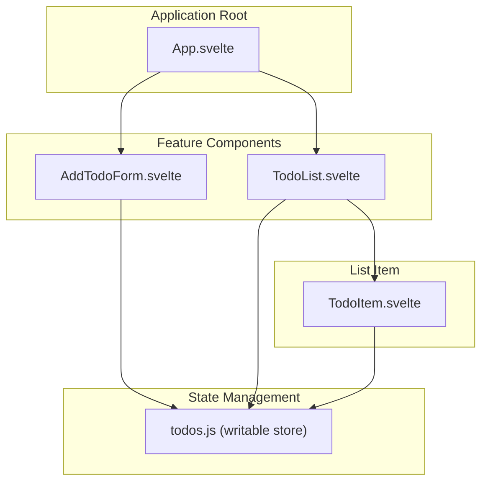
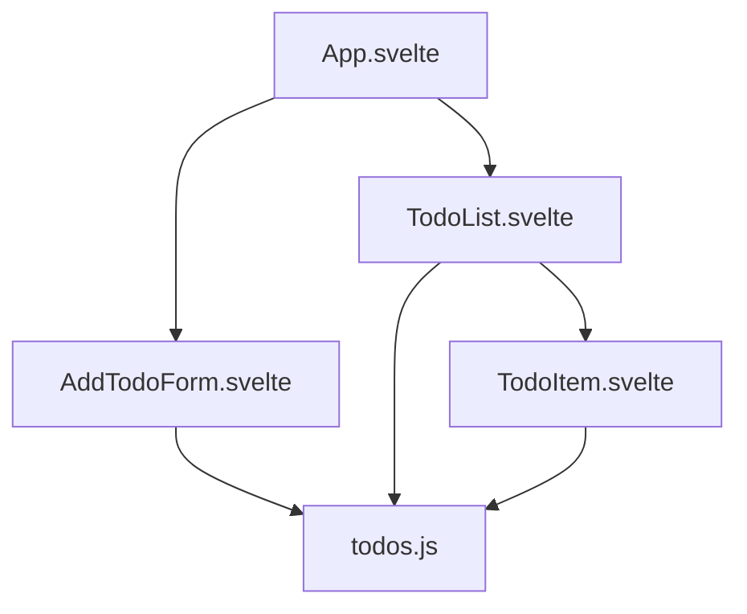
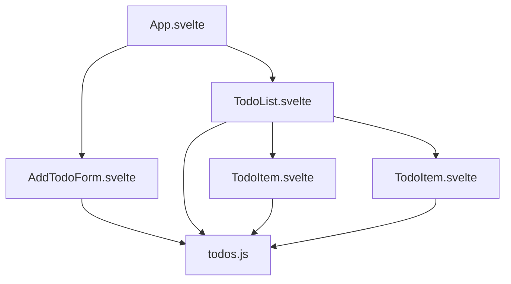
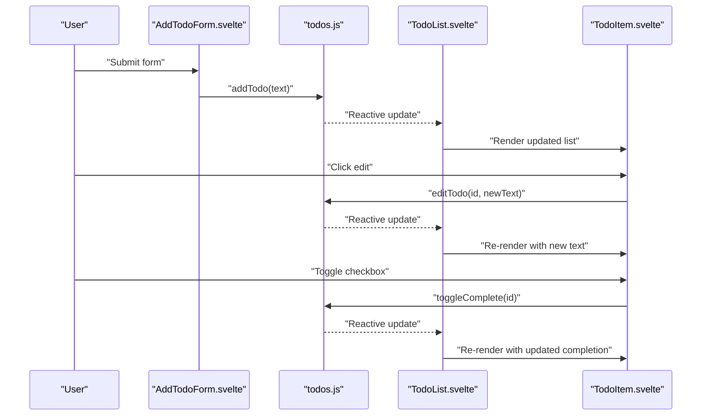

# Component Hierarchy

<cite>
**Referenced Files in This Document**
- [App.svelte](file://src/App.svelte)
- [AddTodoForm.svelte](file://src/lib/components/AddTodoForm.svelte)
- [TodoList.svelte](file://src/lib/components/TodoList.svelte)
- [TodoItem.svelte](file://src/lib/components/TodoItem.svelte)
- [todos.js](file://src/lib/stores/todos.js)
- [main.js](file://src/main.js)
- [index.html](file://index.html)
- [package.json](file://package.json)
</cite>

## Table of Contents
1. [Introduction](#introduction)
2. [Project Structure](#project-structure)
3. [Core Components](#core-components)
4. [Architecture Overview](#architecture-overview)
5. [Detailed Component Analysis](#detailed-component-analysis)
6. [Dependency Analysis](#dependency-analysis)
7. [Performance Considerations](#performance-considerations)
8. [Troubleshooting Guide](#troubleshooting-guide)
9. [Conclusion](#conclusion)

## Introduction
This document explains the component hierarchy of the Todo List application built with Svelte. It focuses on the parent-child relationships between the root container App.svelte and its children AddTodoForm, TodoList, and TodoItem. It documents how data flows from parent to child components, how props are passed, and how events are handled. It also describes the Single File Component (SFC) architecture and how each component encapsulates its HTML, CSS, and JavaScript logic. Finally, it covers component lifecycle and reactivity within the hierarchy.

## Project Structure
The application follows a straightforward structure:
- The root component App.svelte renders the header and the two primary child components: AddTodoForm and TodoList.
- The TodoList component manages the list of tasks and renders individual TodoItem entries.
- A centralized store todos.js manages the application state and persists it to local storage.
- The application is mounted via main.js into index.html.

**Diagram sources**
- [App.svelte:1-18](file://src/App.svelte#L1-L18)
- [AddTodoForm.svelte:1-19](file://src/lib/components/AddTodoForm.svelte#L1-L19)
- [TodoList.svelte:1-16](file://src/lib/components/TodoList.svelte#L1-L16)
- [TodoItem.svelte:1-32](file://src/lib/components/TodoItem.svelte#L1-L32)
- [todos.js:1-62](file://src/lib/stores/todos.js#L1-L62)

**Section sources**
- [App.svelte:1-18](file://src/App.svelte#L1-L18)
- [main.js:1-9](file://src/main.js#L1-L9)
- [index.html:1-13](file://index.html#L1-L13)
- [package.json:1-17](file://package.json#L1-L17)

## Core Components
This section documents the three core components and their roles in the hierarchy.

- App.svelte
  - Acts as the root container, importing and rendering AddTodoForm and TodoList.
  - Provides global layout and styling for the application shell.
  - Serves as the composition root for the feature components.

- AddTodoForm.svelte
  - Accepts user input to add new tasks.
  - Uses a local reactive state variable to track the input value.
  - Invokes store actions to add a new task and clears the input after submission.

- TodoList.svelte
  - Subscribes to the store to derive computed statistics and a sorted task list.
  - Renders an empty state when there are no tasks.
  - Iterates over the derived sorted list and renders TodoItem instances.
  - Applies transitions and animations for item insertion/removal.

- TodoItem.svelte
  - Receives a single task object via props.
  - Manages local editing state and edits the task text through the store.
  - Toggles completion and deletes items via store actions.
  - Implements keyboard shortcuts for confirming/canceling edits.

**Section sources**
- [App.svelte:1-18](file://src/App.svelte#L1-L18)
- [AddTodoForm.svelte:1-19](file://src/lib/components/AddTodoForm.svelte#L1-L19)
- [TodoList.svelte:1-16](file://src/lib/components/TodoList.svelte#L1-L16)
- [TodoItem.svelte:1-32](file://src/lib/components/TodoItem.svelte#L1-L32)

## Architecture Overview
The Todo List uses a unidirectional data flow:
- Parent components (App.svelte) render child components (AddTodoForm, TodoList).
- Child components (AddTodoForm, TodoList, TodoItem) dispatch actions to a shared store (todos.js).
- The store updates reactive state, which triggers re-rendering of dependent components.

**Diagram sources**
- [App.svelte:1-18](file://src/App.svelte#L1-L18)
- [AddTodoForm.svelte:1-19](file://src/lib/components/AddTodoForm.svelte#L1-L19)
- [TodoList.svelte:1-16](file://src/lib/components/TodoList.svelte#L1-L16)
- [TodoItem.svelte:1-32](file://src/lib/components/TodoItem.svelte#L1-L32)
- [todos.js:1-62](file://src/lib/stores/todos.js#L1-L62)

## Detailed Component Analysis

### Component Tree and Data Flow
The component tree starts at App.svelte and branches into AddTodoForm and TodoList. TodoList further renders multiple TodoItem instances. Data flows from the store to the UI via derived computations and props.

**Diagram sources**
- [App.svelte:1-18](file://src/App.svelte#L1-L18)
- [AddTodoForm.svelte:1-19](file://src/lib/components/AddTodoForm.svelte#L1-L19)
- [TodoList.svelte:1-16](file://src/lib/components/TodoList.svelte#L1-L16)
- [TodoItem.svelte:1-32](file://src/lib/components/TodoItem.svelte#L1-L32)
- [todos.js:1-62](file://src/lib/stores/todos.js#L1-L62)

### Prop Passing Mechanisms
- TodoList passes a single task object to each TodoItem via Svelte's spread prop syntax. This allows the child to receive the task as a destructured prop and manage its own editing state independently.
- App.svelte does not pass props to AddTodoForm or TodoList; these components are self-contained and subscribe to the store internally.

**Section sources**
- [TodoList.svelte:30-32](file://src/lib/components/TodoList.svelte#L30-L32)
- [TodoItem.svelte:4](file://src/lib/components/TodoItem.svelte#L4)

### Event Handling Between Components
- AddTodoForm handles form submission and keydown events to add new tasks. After adding, it clears the input state.
- TodoList derives counts and sorts tasks; it does not handle user events directly but renders interactive TodoItems.
- TodoItem handles checkbox changes, edit/delete button clicks, and keyboard events for confirming or canceling edits. These actions call store methods to mutate state.

**Diagram sources**
- [AddTodoForm.svelte:6-12](file://src/lib/components/AddTodoForm.svelte#L6-L12)
- [TodoItem.svelte:13-17](file://src/lib/components/TodoItem.svelte#L13-L17)
- [TodoItem.svelte:57](file://src/lib/components/TodoItem.svelte#L57)
- [todos.js:28-58](file://src/lib/stores/todos.js#L28-L58)
- [TodoList.svelte:7-12](file://src/lib/components/TodoList.svelte#L7-L12)

### Single File Component (SFC) Architecture
Each component is a Svelte SFC that encapsulates:
- Script block: Declares reactive state, props, and event handlers.
- Template block: Defines the HTML structure and binds reactive values.
- Style block: Encapsulated styles scoped to the component.

Examples:
- App.svelte: Imports child components and defines global layout and styles.
- AddTodoForm.svelte: Manages local state for input and submits to the store.
- TodoList.svelte: Derives computed values and renders a list with transitions.
- TodoItem.svelte: Receives props, manages local editing state, and interacts with the store.

**Section sources**
- [App.svelte:1-18](file://src/App.svelte#L1-L18)
- [AddTodoForm.svelte:1-19](file://src/lib/components/AddTodoForm.svelte#L1-L19)
- [TodoList.svelte:1-16](file://src/lib/components/TodoList.svelte#L1-L16)
- [TodoItem.svelte:1-32](file://src/lib/components/TodoItem.svelte#L1-L32)

### Component Lifecycle and Reactivity
- Reactive declarations:
  - Local state: AddTodoForm maintains a local state variable for the input field.
  - Derived state: TodoList computes sorted tasks and counts using derived values.
  - Store subscription: All components subscribe to the store to react to changes.
- Re-rendering:
  - Updates to the store trigger re-computation of derived values and re-rendering of affected components.
  - Transitions and animations are applied during list updates to enhance UX.
- Persistence:
  - The store subscribes to changes and writes to local storage, ensuring persistence across sessions.

**Section sources**
- [AddTodoForm.svelte:4](file://src/lib/components/AddTodoForm.svelte#L4)
- [TodoList.svelte:7-12](file://src/lib/components/TodoList.svelte#L7-L12)
- [todos.js:14-23](file://src/lib/stores/todos.js#L14-L23)

## Dependency Analysis
The following diagram shows how components depend on the store and on each other.

**Diagram sources**
- [App.svelte:1-18](file://src/App.svelte#L1-L18)
- [AddTodoForm.svelte:1-19](file://src/lib/components/AddTodoForm.svelte#L1-L19)
- [TodoList.svelte:1-16](file://src/lib/components/TodoList.svelte#L1-L16)
- [TodoItem.svelte:1-32](file://src/lib/components/TodoItem.svelte#L1-L32)
- [todos.js:1-62](file://src/lib/stores/todos.js#L1-L62)

**Section sources**
- [App.svelte:1-18](file://src/App.svelte#L1-L18)
- [AddTodoForm.svelte:1-19](file://src/lib/components/AddTodoForm.svelte#L1-L19)
- [TodoList.svelte:1-16](file://src/lib/components/TodoList.svelte#L1-L16)
- [TodoItem.svelte:1-32](file://src/lib/components/TodoItem.svelte#L1-L32)
- [todos.js:1-62](file://src/lib/stores/todos.js#L1-L62)

## Performance Considerations
- Derived computations: TodoList uses derived values to compute sorted lists and counts, minimizing recomputation and keeping the UI responsive.
- Efficient updates: The store uses a single writable store with a single subscription, reducing overhead.
- Animations: Transitions and animations are applied selectively to improve perceived performance and user feedback.
- Local storage: Persistence is handled efficiently with a single write on store updates.

[No sources needed since this section provides general guidance]

## Troubleshooting Guide
- No tasks appear:
  - Verify the store initialization and local storage loading logic.
  - Confirm that TodoList's condition checks for total count are functioning.
- Editing does not save:
  - Ensure the edit action is invoked and the store's edit method is called.
  - Check that the TodoItem component receives the correct props and that the store subscription is active.
- Checkbox or delete actions not working:
  - Confirm that the store methods for toggling completion and deleting are being called.
  - Verify that the TodoList re-renders after store updates.

**Section sources**
- [TodoList.svelte:19-42](file://src/lib/components/TodoList.svelte#L19-L42)
- [TodoItem.svelte:13-17](file://src/lib/components/TodoItem.svelte#L13-L17)
- [TodoItem.svelte:57](file://src/lib/components/TodoItem.svelte#L57)
- [todos.js:28-58](file://src/lib/stores/todos.js#L28-L58)

## Conclusion
The Todo List application demonstrates a clean component hierarchy with clear separation of concerns. App.svelte composes AddTodoForm and TodoList, which in turn render TodoItem instances. Props are passed to children to render individual tasks, while events propagate upward through store actions. The SFC architecture keeps each component self-contained, and the store-driven reactivity ensures efficient updates and persistence. This structure supports maintainability, testability, and scalability.