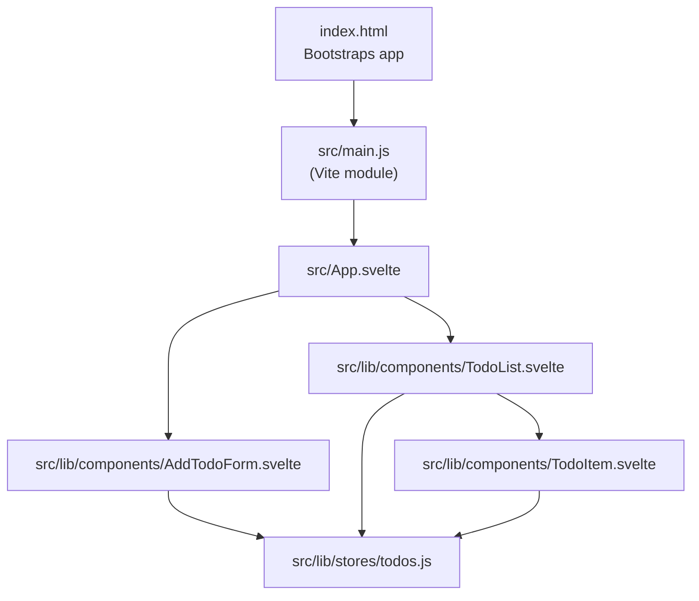
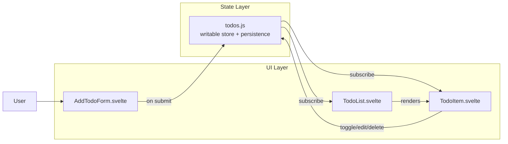
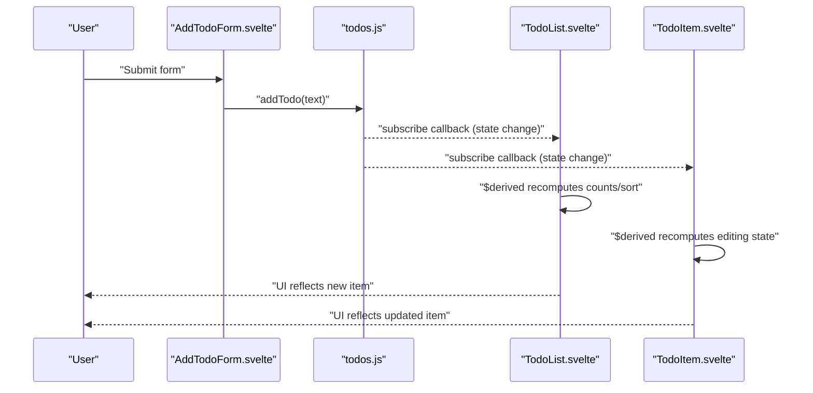
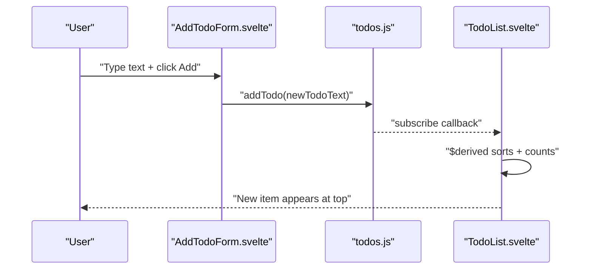
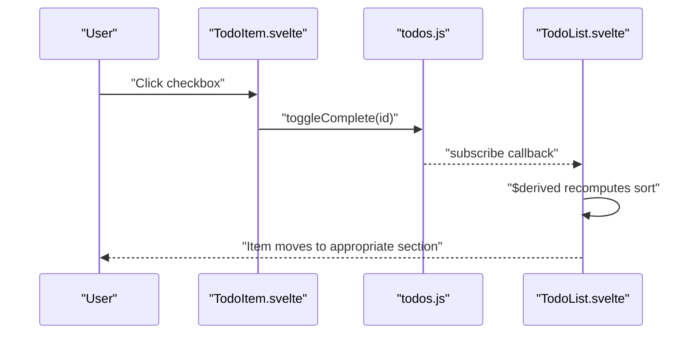
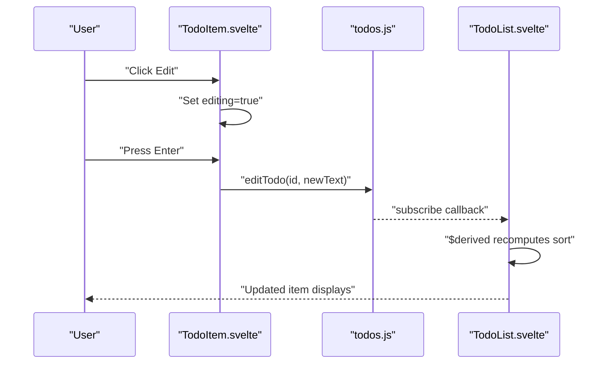
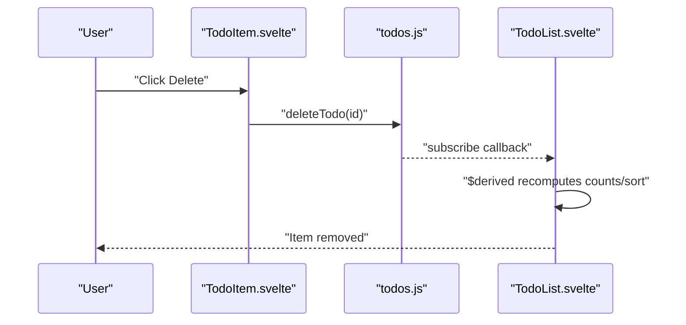
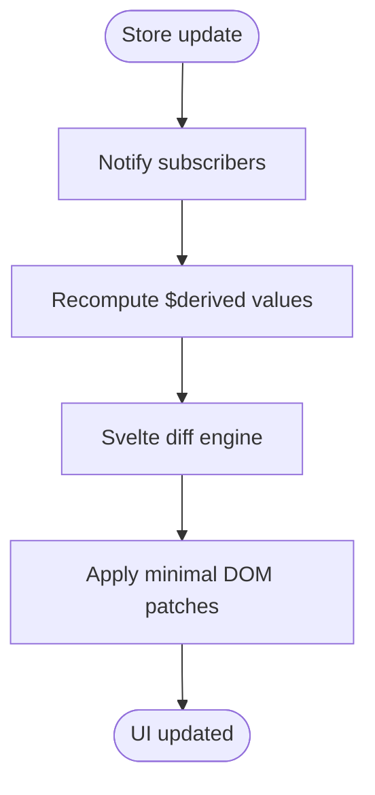
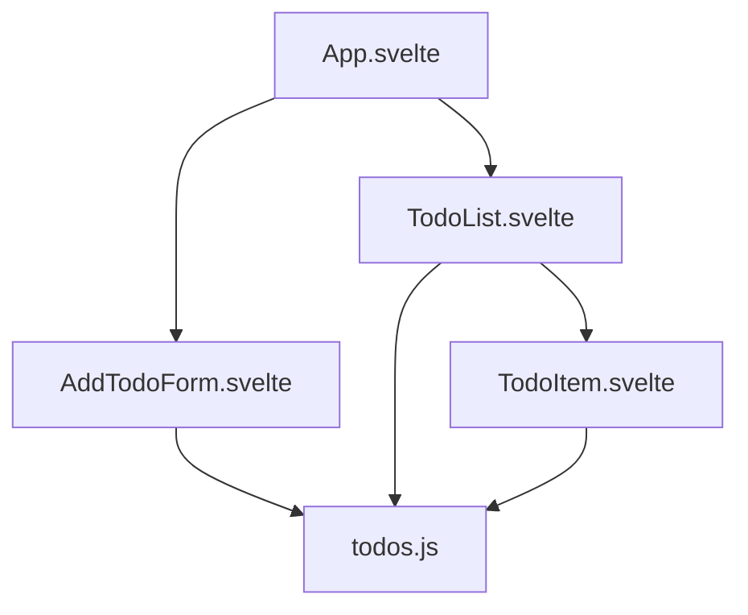

# Data Flow

<cite>
**Referenced Files in This Document**
- [App.svelte](file://src/App.svelte)
- [AddTodoForm.svelte](file://src/lib/components/AddTodoForm.svelte)
- [TodoList.svelte](file://src/lib/components/TodoList.svelte)
- [TodoItem.svelte](file://src/lib/components/TodoItem.svelte)
- [todos.js](file://src/lib/stores/todos.js)
- [index.html](file://index.html)
</cite>

## Table of Contents
1. [Introduction](#introduction)
2. [Project Structure](#project-structure)
3. [Core Components](#core-components)
4. [Architecture Overview](#architecture-overview)
5. [Detailed Component Analysis](#detailed-component-analysis)
6. [Dependency Analysis](#dependency-analysis)
7. [Performance Considerations](#performance-considerations)
8. [Troubleshooting Guide](#troubleshooting-guide)
9. [Conclusion](#conclusion)

## Introduction
This document explains the data flow architecture of the Todo List application. It traces how user interactions propagate through component events to store mutations and result in UI re-rendering. The application follows a unidirectional data flow pattern: user actions trigger store mutations, which update the shared state and drive reactive re-renders across components. We also explain how Svelte’s compiler optimizes rendering, how event bubbling and custom event handling work, and how components communicate via shared stores.

## Project Structure
The application is organized around a small set of Svelte components and a single centralized store. The root component composes the form and list, while the store encapsulates state and persistence.

**Diagram sources**
- [index.html](file://index.html)
- [App.svelte](file://src/App.svelte)
- [AddTodoForm.svelte](file://src/lib/components/AddTodoForm.svelte)
- [TodoList.svelte](file://src/lib/components/TodoList.svelte)
- [TodoItem.svelte](file://src/lib/components/TodoItem.svelte)
- [todos.js](file://src/lib/stores/todos.js)

**Section sources**
- [App.svelte](file://src/App.svelte)
- [index.html](file://index.html)

## Core Components
- App.svelte: Renders the header and composes AddTodoForm and TodoList.
- AddTodoForm.svelte: Captures user input, validates, and dispatches addTodo to the store.
- TodoList.svelte: Subscribes to the store, derives computed stats and sorting, and renders TodoItem entries.
- TodoItem.svelte: Edits, toggles completion, and deletes items by invoking store methods.
- todos.js: Centralized store with add/edit/delete/toggle operations and localStorage persistence.

**Section sources**
- [App.svelte](file://src/App.svelte)
- [AddTodoForm.svelte](file://src/lib/components/AddTodoForm.svelte)
- [TodoList.svelte](file://src/lib/components/TodoList.svelte)
- [TodoItem.svelte](file://src/lib/components/TodoItem.svelte)
- [todos.js](file://src/lib/stores/todos.js)

## Architecture Overview
The system enforces a strict unidirectional data flow:
- User interactions occur in presentational components (AddTodoForm, TodoItem).
- Events call methods on the shared store (todos).
- Store mutations update the global state atomically.
- Reactive bindings cause dependent components to recompute derived values and re-render efficiently.

**Diagram sources**
- [AddTodoForm.svelte](file://src/lib/components/AddTodoForm.svelte)
- [TodoList.svelte](file://src/lib/components/TodoList.svelte)
- [TodoItem.svelte](file://src/lib/components/TodoItem.svelte)
- [todos.js](file://src/lib/stores/todos.js)

## Detailed Component Analysis

### Unidirectional Data Flow and Reactive Updates
- AddTodoForm triggers store mutation via a method call on the store.
- TodoList subscribes to the store and derives computed values (counts, sort order).
- TodoItem subscribes to the store and invokes mutation methods on user actions.
- Changes propagate reactively; Svelte’s compiler minimizes DOM updates by tracking dependencies precisely.

**Diagram sources**
- [AddTodoForm.svelte](file://src/lib/components/AddTodoForm.svelte)
- [todos.js](file://src/lib/stores/todos.js)
- [TodoList.svelte](file://src/lib/components/TodoList.svelte)
- [TodoItem.svelte](file://src/lib/components/TodoItem.svelte)

**Section sources**
- [AddTodoForm.svelte](file://src/lib/components/AddTodoForm.svelte)
- [todos.js](file://src/lib/stores/todos.js)
- [TodoList.svelte](file://src/lib/components/TodoList.svelte)
- [TodoItem.svelte](file://src/lib/components/TodoItem.svelte)

### Adding a Task
- User types into the input and submits.
- Form validates non-empty input and calls addTodo on the store.
- Store prepends a new item and persists to localStorage.
- Subscribers recompute derived values and render the new item.

**Diagram sources**
- [AddTodoForm.svelte](file://src/lib/components/AddTodoForm.svelte)
- [todos.js](file://src/lib/stores/todos.js)
- [TodoList.svelte](file://src/lib/components/TodoList.svelte)

**Section sources**
- [AddTodoForm.svelte](file://src/lib/components/AddTodoForm.svelte)
- [todos.js](file://src/lib/stores/todos.js)
- [TodoList.svelte](file://src/lib/components/TodoList.svelte)

### Completing a Task
- User toggles the checkbox in TodoItem.
- TodoItem calls toggleComplete on the store.
- Store flips the completed flag; subscribers recompute and re-render.

**Diagram sources**
- [TodoItem.svelte](file://src/lib/components/TodoItem.svelte)
- [todos.js](file://src/lib/stores/todos.js)
- [TodoList.svelte](file://src/lib/components/TodoList.svelte)

**Section sources**
- [TodoItem.svelte](file://src/lib/components/TodoItem.svelte)
- [todos.js](file://src/lib/stores/todos.js)
- [TodoList.svelte](file://src/lib/components/TodoList.svelte)

### Editing a Task
- User clicks Edit in TodoItem, entering inline edit mode.
- On Enter, confirmEdit invokes editTodo on the store; Escape cancels.
- Store updates the item text; subscribers re-render.

**Diagram sources**
- [TodoItem.svelte](file://src/lib/components/TodoItem.svelte)
- [todos.js](file://src/lib/stores/todos.js)
- [TodoList.svelte](file://src/lib/components/TodoList.svelte)

**Section sources**
- [TodoItem.svelte](file://src/lib/components/TodoItem.svelte)
- [todos.js](file://src/lib/stores/todos.js)
- [TodoList.svelte](file://src/lib/components/TodoList.svelte)

### Deleting a Task
- User clicks Delete in TodoItem.
- TodoItem calls deleteTodo on the store.
- Store filters the item; subscribers recompute and remove the DOM node.

**Diagram sources**
- [TodoItem.svelte](file://src/lib/components/TodoItem.svelte)
- [todos.js](file://src/lib/stores/todos.js)
- [TodoList.svelte](file://src/lib/components/TodoList.svelte)

**Section sources**
- [TodoItem.svelte](file://src/lib/components/TodoItem.svelte)
- [todos.js](file://src/lib/stores/todos.js)
- [TodoList.svelte](file://src/lib/components/TodoList.svelte)

### Reactive Update Cycle and Rendering Optimizations
- Svelte’s compiler tracks reactive dependencies at compile time. Components recompute only when their subscribed store values change.
- Derived values ($derived) are memoized until dependencies change, minimizing work.
- Animations and transitions are declarative and scoped to nodes, reducing unnecessary DOM churn.
- The store’s subscribe handler writes to localStorage, ensuring persistence without blocking UI updates.

**Diagram sources**
- [TodoList.svelte](file://src/lib/components/TodoList.svelte)
- [todos.js](file://src/lib/stores/todos.js)

**Section sources**
- [TodoList.svelte](file://src/lib/components/TodoList.svelte)
- [todos.js](file://src/lib/stores/todos.js)

### Event Bubbling and Custom Event Handling
- Native DOM events (e.g., form submit, input keydown, checkbox change) are handled directly in components.
- There are no custom element events or explicit dispatches in the current code; all interactions are handled locally within components and delegated to the store.
- Event handlers prevent default behavior when necessary (e.g., form submission) to maintain SPA semantics.

**Section sources**
- [AddTodoForm.svelte](file://src/lib/components/AddTodoForm.svelte)
- [TodoItem.svelte](file://src/lib/components/TodoItem.svelte)

## Dependency Analysis
The following diagram shows import and usage relationships among components and the store.

**Diagram sources**
- [App.svelte](file://src/App.svelte)
- [AddTodoForm.svelte](file://src/lib/components/AddTodoForm.svelte)
- [TodoList.svelte](file://src/lib/components/TodoList.svelte)
- [TodoItem.svelte](file://src/lib/components/TodoItem.svelte)
- [todos.js](file://src/lib/stores/todos.js)

**Section sources**
- [App.svelte](file://src/App.svelte)
- [AddTodoForm.svelte](file://src/lib/components/AddTodoForm.svelte)
- [TodoList.svelte](file://src/lib/components/TodoList.svelte)
- [TodoItem.svelte](file://src/lib/components/TodoItem.svelte)
- [todos.js](file://src/lib/stores/todos.js)

## Performance Considerations
- Prefer $derived for derived computations to avoid redundant work.
- Keep store updates atomic; batching multiple updates inside a single update callback reduces re-renders.
- Use keyed each blocks to preserve component state during reordering (already present via per-item wrappers).
- Avoid heavy synchronous work in subscribe callbacks; keep persistence lightweight.
- Leverage Svelte’s built-in transitions and animations sparingly to minimize layout thrash.

## Troubleshooting Guide
- If edits do not save, verify that the edit input is non-empty before calling editTodo and that the store method is invoked.
- If tasks disappear after refresh, check that localStorage persistence is enabled and not blocked by browser settings.
- If toggling does nothing, ensure the checkbox handler calls the correct store method with the right id.
- If animations feel sluggish, reduce transition durations or simplify styles causing layout recalculation.

**Section sources**
- [TodoItem.svelte](file://src/lib/components/TodoItem.svelte)
- [todos.js](file://src/lib/stores/todos.js)

## Conclusion
The Todo List application implements a clean, unidirectional data flow centered on a single store. User interactions in presentational components trigger store mutations, which propagate through subscriptions to drive efficient, targeted re-renders. Svelte’s compiler and reactive primitives ensure minimal DOM updates and smooth UX, while local persistence maintains state across sessions. The design supports straightforward extension for additional features such as filtering, bulk operations, or custom events if needed.