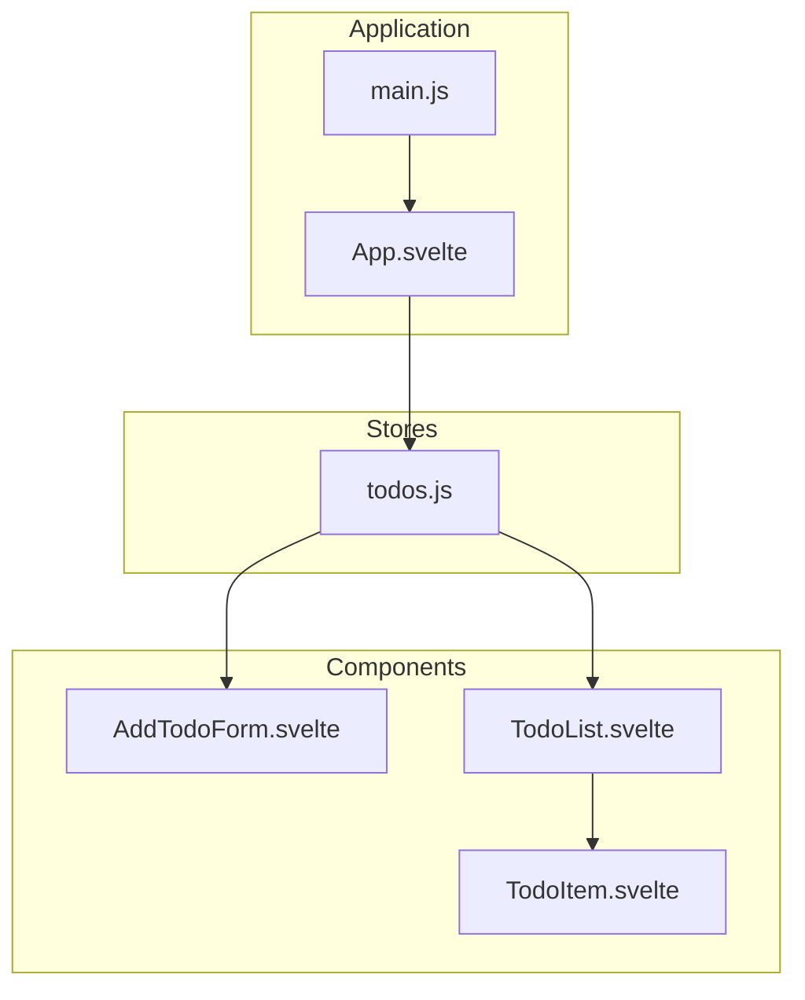
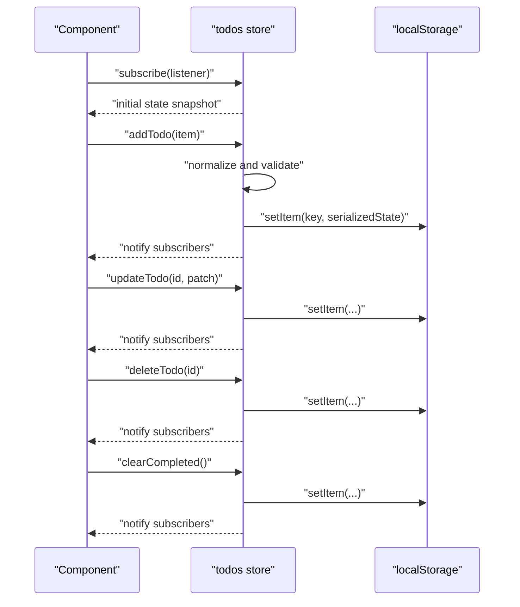
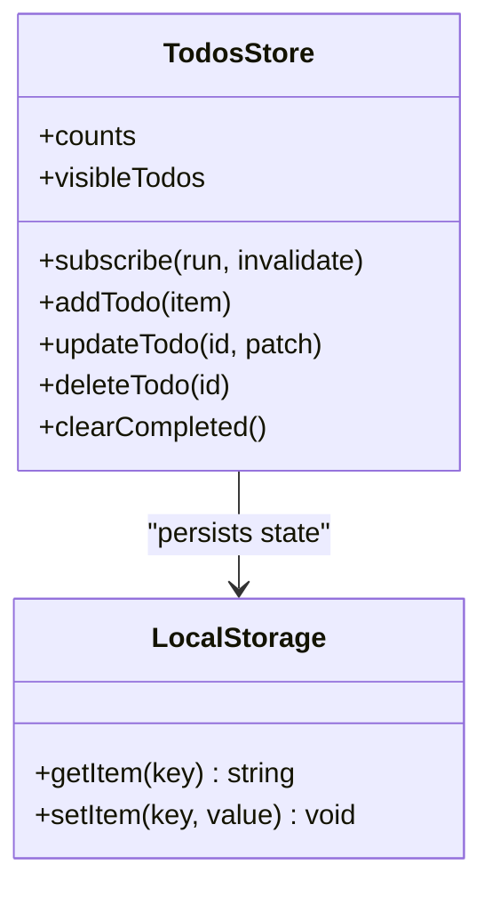
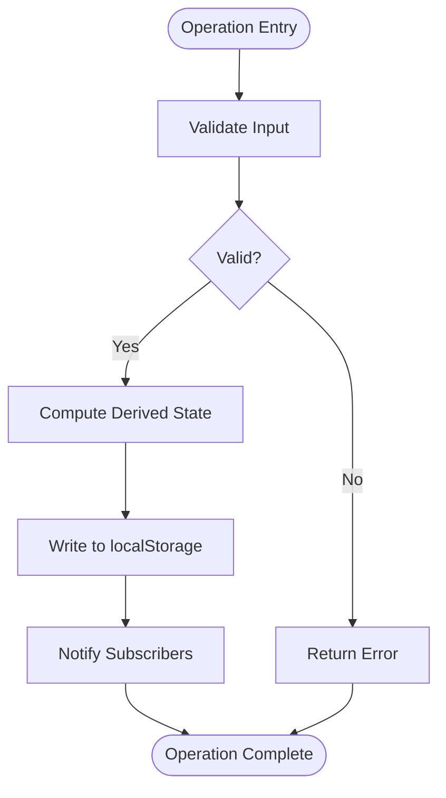
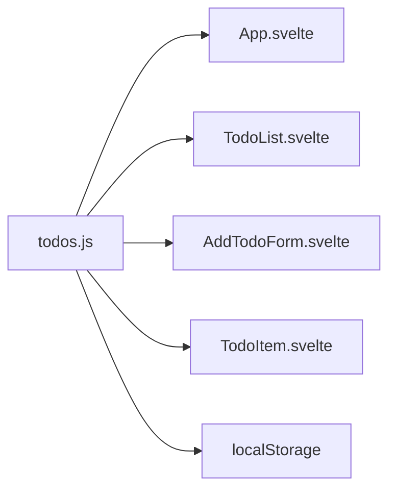

# State Management

<cite>
**Referenced Files in This Document**
- [todos.js](file://src/lib/stores/todos.js)
- [App.svelte](file://src/App.svelte)
- [main.js](file://src/main.js)
- [AddTodoForm.svelte](file://src/lib/components/AddTodoForm.svelte)
- [TodoList.svelte](file://src/lib/components/TodoList.svelte)
- [TodoItem.svelte](file://src/lib/components/TodoItem.svelte)
</cite>

## Table of Contents
1. [Introduction](#introduction)
2. [Project Structure](#project-structure)
3. [Core Components](#core-components)
4. [Architecture Overview](#architecture-overview)
5. [Detailed Component Analysis](#detailed-component-analysis)
6. [Dependency Analysis](#dependency-analysis)
7. [Performance Considerations](#performance-considerations)
8. [Troubleshooting Guide](#troubleshooting-guide)
9. [Conclusion](#conclusion)

## Introduction
This document explains the centralized state management system implemented with Svelte’s built-in store pattern. It focuses on the todos store that manages reactive application state, including operations to add, update, delete, and clear completed items. It also documents localStorage integration for persistence across browser sessions, reactive declarations ($state, $derived), subscription patterns, and error handling strategies within the store layer.

## Project Structure
The state management is centered around a single store module that exposes a Svelte store interface. Components consume the store reactively and subscribe to updates to keep the UI synchronized.

**Diagram sources**
- [App.svelte](file://src/App.svelte)
- [main.js](file://src/main.js)
- [todos.js](file://src/lib/stores/todos.js)
- [AddTodoForm.svelte](file://src/lib/components/AddTodoForm.svelte)
- [TodoList.svelte](file://src/lib/components/TodoList.svelte)
- [TodoItem.svelte](file://src/lib/components/TodoItem.svelte)

**Section sources**
- [App.svelte](file://src/App.svelte)
- [main.js](file://src/main.js)
- [todos.js](file://src/lib/stores/todos.js)

## Core Components
- Centralized Store: The todos store encapsulates the application state and exposes methods to mutate and query it. It persists state to localStorage and provides derived state for filtered lists.
- Reactive Consumers: Components subscribe to the store to render and update UI reactively. They trigger mutations via exposed actions.

Key responsibilities:
- State mutation: addTodo, updateTodo, deleteTodo, clearCompleted
- Derived state: counts, visibility filters, and normalized item access
- Persistence: sync with localStorage on state changes
- Validation: basic checks to prevent invalid mutations
- Error handling: graceful fallbacks and logging for persistence failures

**Section sources**
- [todos.js](file://src/lib/stores/todos.js)

## Architecture Overview
The store follows Svelte’s store contract: it exposes a readable interface and a set of action functions. Components subscribe to the store to receive updates automatically. The store internally manages normalized state and writes to localStorage to maintain persistence.

**Diagram sources**
- [todos.js](file://src/lib/stores/todos.js)

## Detailed Component Analysis

### Todos Store
The todos store defines:
- Internal state: a normalized collection of items keyed by id
- Actions: addTodo, updateTodo, deleteTodo, clearCompleted
- Derived computations: counts and filtered lists based on visibility
- Persistence: write to and read from localStorage
- Validation: input checks and defensive programming
- Error handling: try/catch around storage operations

**Diagram sources**
- [todos.js](file://src/lib/stores/todos.js)

Implementation highlights:
- Reactive subscriptions: Components subscribe to the store to receive updates when state changes.
- Derived state: Computed properties expose counts and filtered views for rendering.
- Normalization: Items are stored in a normalized map keyed by id to simplify updates and avoid duplication.
- Persistence: After each mutation, the store serializes state and writes to localStorage.
- Validation: Mutations validate inputs and guard against invalid ids or missing fields.
- Error handling: Storage errors are caught and logged to prevent crashes while still notifying subscribers.

**Section sources**
- [todos.js](file://src/lib/stores/todos.js)

### Component Integration Examples
- App.svelte: Subscribes to the store to render TodoList and pass down props derived from the store.
- TodoList.svelte: Renders the list of visible todos and handles bulk actions like clearing completed.
- AddTodoForm.svelte: Triggers addTodo with new item data.
- TodoItem.svelte: Calls updateTodo and deleteTodo for individual items.

Subscription patterns:
- Subscribe once in component initialization to receive updates.
- Use store-derived values (e.g., counts, visibleTodos) to drive UI rendering.
- Trigger store actions from event handlers to mutate state.

Reactivity:
- $state and $derived are used in components to declare reactive local state and computed values.
- Components re-render automatically when subscribed store values change.

**Section sources**
- [App.svelte](file://src/App.svelte)
- [AddTodoForm.svelte](file://src/lib/components/AddTodoForm.svelte)
- [TodoList.svelte](file://src/lib/components/TodoList.svelte)
- [TodoItem.svelte](file://src/lib/components/TodoItem.svelte)

### Operations Flow
Each operation follows a consistent flow: validate input, compute derived state, persist to localStorage, and notify subscribers.

**Diagram sources**
- [todos.js](file://src/lib/stores/todos.js)

## Dependency Analysis
The store depends on:
- Svelte’s store interface for subscription and updates
- Browser localStorage for persistence
- Component consumers that subscribe and trigger actions

**Diagram sources**
- [todos.js](file://src/lib/stores/todos.js)
- [App.svelte](file://src/App.svelte)
- [TodoList.svelte](file://src/lib/components/TodoList.svelte)
- [AddTodoForm.svelte](file://src/lib/components/AddTodoForm.svelte)
- [TodoItem.svelte](file://src/lib/components/TodoItem.svelte)

**Section sources**
- [todos.js](file://src/lib/stores/todos.js)
- [App.svelte](file://src/App.svelte)
- [TodoList.svelte](file://src/lib/components/TodoList.svelte)
- [AddTodoForm.svelte](file://src/lib/components/AddTodoForm.svelte)
- [TodoItem.svelte](file://src/lib/components/TodoItem.svelte)

## Performance Considerations
- Minimize re-renders: Keep derived computations efficient and avoid unnecessary recomputation.
- Batch updates: Prefer a single mutation per logical change to reduce redundant localStorage writes.
- Normalized state: Using a map keyed by id reduces lookup costs and simplifies updates.
- Debounce persistence: If frequent writes occur, consider debouncing localStorage writes to improve responsiveness.

## Troubleshooting Guide
Common issues and resolutions:
- Storage quota exceeded: Catch exceptions during localStorage.setItem and log warnings; fall back gracefully.
- Corrupted data: On parse errors when reading from localStorage, reset to a clean initial state.
- Duplicate ids: Ensure addTodo generates unique ids and guards against duplicates.
- Invalid ids: Validate ids before update/delete/clearCompleted to prevent accidental state corruption.

**Section sources**
- [todos.js](file://src/lib/stores/todos.js)

## Conclusion
The todos store provides a robust, centralized state layer with clear separation of concerns. It leverages Svelte’s reactive primitives, maintains normalized state, persists data to localStorage, and offers derived views for efficient rendering. Components remain decoupled from persistence details while benefiting from automatic UI updates through reactive subscriptions.