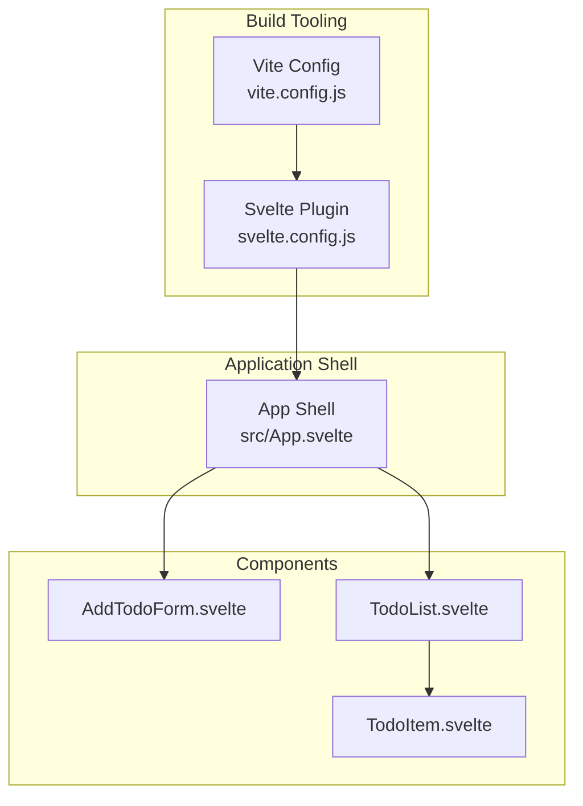
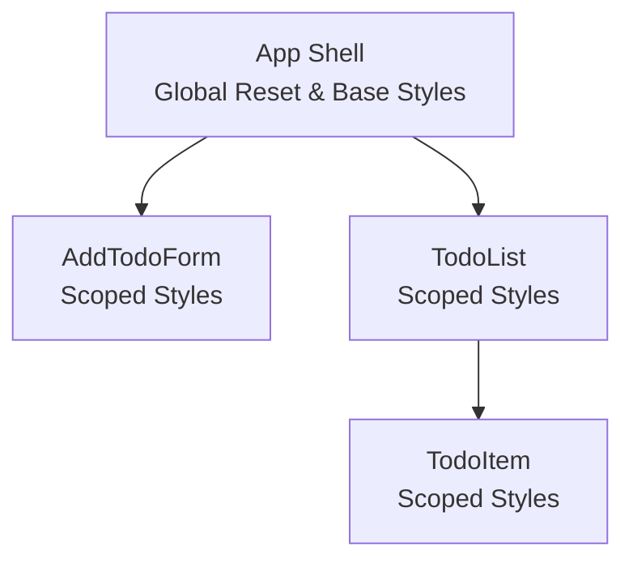
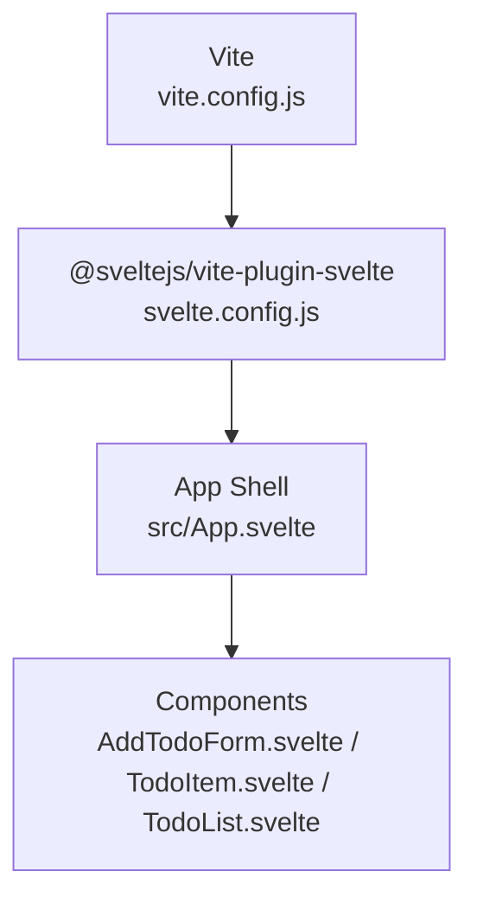

# Styling Architecture

<cite>
**Referenced Files in This Document**
- [App.svelte](file://src/App.svelte)
- [AddTodoForm.svelte](file://src/lib/components/AddTodoForm.svelte)
- [TodoItem.svelte](file://src/lib/components/TodoItem.svelte)
- [TodoList.svelte](file://src/lib/components/TodoList.svelte)
- [package.json](file://package.json)
- [svelte.config.js](file://svelte.config.js)
- [vite.config.js](file://vite.config.js)
</cite>

## Table of Contents
1. [Introduction](#introduction)
2. [Project Structure](#project-structure)
3. [Core Components](#core-components)
4. [Architecture Overview](#architecture-overview)
5. [Detailed Component Analysis](#detailed-component-analysis)
6. [Dependency Analysis](#dependency-analysis)
7. [Performance Considerations](#performance-considerations)
8. [Troubleshooting Guide](#troubleshooting-guide)
9. [Conclusion](#conclusion)

## Introduction
This document explains the CSS-in-Svelte styling architecture and Material Design integration used in the project. It focuses on how components encapsulate styles using scoped CSS to prevent style leakage, how Material icons are integrated, and how typography, color schemes, and animations are applied consistently. It also outlines the CSS methodologies used (utility-like classes, component-specific styles, and global resets), and provides guidelines for maintaining and extending the design system.

## Project Structure
The styling architecture is primarily implemented within individual Svelte components, with a small global reset in the root application shell. Build-time tooling integrates with Vite and the Svelte compiler to process component-scoped styles.

**Diagram sources**
- [vite.config.js:1-8](file://vite.config.js#L1-L8)
- [svelte.config.js:1-3](file://svelte.config.js#L1-L3)
- [App.svelte:1-76](file://src/App.svelte#L1-L76)
- [AddTodoForm.svelte:1-124](file://src/lib/components/AddTodoForm.svelte#L1-L124)
- [TodoItem.svelte:1-212](file://src/lib/components/TodoItem.svelte#L1-L212)
- [TodoList.svelte:1-114](file://src/lib/components/TodoList.svelte#L1-L114)

**Section sources**
- [vite.config.js:1-8](file://vite.config.js#L1-L8)
- [svelte.config.js:1-3](file://svelte.config.js#L1-L3)
- [App.svelte:1-76](file://src/App.svelte#L1-L76)

## Core Components
- Global reset and base styles are defined in the application shell using a global selector block, ensuring consistent typography and layout baseline.
- Each component defines its own scoped styles, including hover, focus, and interactive states, enabling encapsulation and reuse.
- Material icons are used via the material-icons class on span elements within components.
- Animations and transitions leverage Svelte’s built-in transition and animation primitives.

Key implementation references:
- Global reset and typography: [App.svelte:20-32](file://src/App.svelte#L20-L32)
- Scoped component styles: [AddTodoForm.svelte:38-123](file://src/lib/components/AddTodoForm.svelte#L38-L123), [TodoItem.svelte:75-211](file://src/lib/components/TodoItem.svelte#L75-L211), [TodoList.svelte:45-113](file://src/lib/components/TodoList.svelte#L45-L113)
- Material icons usage: [App.svelte](file://src/App.svelte#L9), [AddTodoForm.svelte](file://src/lib/components/AddTodoForm.svelte#L23), [TodoItem.svelte:44-70](file://src/lib/components/TodoItem.svelte#L44-L70), [TodoList.svelte](file://src/lib/components/TodoList.svelte#L38)
- Transitions and animations: [TodoList.svelte:4-6](file://src/lib/components/TodoList.svelte#L4-L6)

**Section sources**
- [App.svelte:20-76](file://src/App.svelte#L20-L76)
- [AddTodoForm.svelte:38-123](file://src/lib/components/AddTodoForm.svelte#L38-L123)
- [TodoItem.svelte:75-211](file://src/lib/components/TodoItem.svelte#L75-L211)
- [TodoList.svelte:4-6](file://src/lib/components/TodoList.svelte#L4-L6)
- [TodoList.svelte:45-113](file://src/lib/components/TodoList.svelte#L45-L113)

## Architecture Overview
The styling architecture follows a component-scoped model:
- Global reset and base styles live in the root shell.
- Each component defines its own styles, ensuring isolation and preventing cross-component style leakage.
- Material Design is applied through iconography and consistent color/typography tokens.
- Interactions and micro-interactions are handled via pseudo-class selectors and Svelte transitions/animations.

**Diagram sources**
- [App.svelte:20-76](file://src/App.svelte#L20-L76)
- [AddTodoForm.svelte:38-123](file://src/lib/components/AddTodoForm.svelte#L38-L123)
- [TodoItem.svelte:75-211](file://src/lib/components/TodoItem.svelte#L75-L211)
- [TodoList.svelte:45-113](file://src/lib/components/TodoList.svelte#L45-L113)

## Detailed Component Analysis

### App Shell (Global Reset and Base Styles)
- Defines a global reset for margins and paddings and sets the base font family and background color.
- Establishes the application bar and container layout with Material-inspired elevation and spacing.
- Uses the material-icons class for the app icon.

Implementation references:
- Global reset and body styles: [App.svelte:20-32](file://src/App.svelte#L20-L32)
- App bar and container layout: [App.svelte:34-74](file://src/App.svelte#L34-L74)
- Material icon usage: [App.svelte](file://src/App.svelte#L9)

**Section sources**
- [App.svelte:20-76](file://src/App.svelte#L20-L76)

### AddTodoForm (Form Input and Button)
- Encapsulated form styles with a focused input container and a prominent primary button.
- Uses Material icons for visual cues and applies hover, active, and disabled states.
- Typography uses Roboto throughout.

Implementation references:
- Form container and input container: [AddTodoForm.svelte:39-63](file://src/lib/components/AddTodoForm.svelte#L39-L63)
- Input field and placeholder: [AddTodoForm.svelte:71-84](file://src/lib/components/AddTodoForm.svelte#L71-L84)
- Primary button styles and states: [AddTodoForm.svelte:86-118](file://src/lib/components/AddTodoForm.svelte#L86-L118)
- Material icon sizing: [AddTodoForm.svelte:120-122](file://src/lib/components/AddTodoForm.svelte#L120-L122)

**Section sources**
- [AddTodoForm.svelte:38-123](file://src/lib/components/AddTodoForm.svelte#L38-L123)

### TodoItem (Interactive List Item)
- Encapsulated item styles with hover, completion state, and action visibility.
- Uses Material icons for checkbox visuals, actions, and edit confirm/cancel.
- Implements interactive states with transitions and color changes.

Implementation references:
- Item container and hover state: [TodoItem.svelte:76-89](file://src/lib/components/TodoItem.svelte#L76-L89)
- Completion state and text styling: [TodoItem.svelte:91-127](file://src/lib/components/TodoItem.svelte#L91-L127)
- Action buttons and hover states: [TodoItem.svelte:129-191](file://src/lib/components/TodoItem.svelte#L129-L191)
- Edit mode input and underline: [TodoItem.svelte:193-210](file://src/lib/components/TodoItem.svelte#L193-L210)
- Material icon usage: [TodoItem.svelte:44-70](file://src/lib/components/TodoItem.svelte#L44-L70)

**Section sources**
- [TodoItem.svelte:75-211](file://src/lib/components/TodoItem.svelte#L75-L211)

### TodoList (List Container and Empty State)
- Encapsulated list container with statistics, progress bar, and empty state.
- Uses Svelte transitions (fly, fade) and animation (flip) for dynamic updates.
- Applies Material icon for empty state illustration.

Implementation references:
- Statistics and progress bar: [TodoList.svelte:50-78](file://src/lib/components/TodoList.svelte#L50-L78)
- List container and item layout: [TodoList.svelte:46-83](file://src/lib/components/TodoList.svelte#L46-L83)
- Empty state and icon: [TodoList.svelte:85-98](file://src/lib/components/TodoList.svelte#L85-L98)
- Transitions and animations: [TodoList.svelte:4-6](file://src/lib/components/TodoList.svelte#L4-L6)

**Section sources**
- [TodoList.svelte:45-113](file://src/lib/components/TodoList.svelte#L45-L113)

### Material Design Integration
- Iconography: Material icons are used via the material-icons class on spans within components for visual affordances.
- Color scheme: A consistent primary color is used across components for inputs, buttons, and highlights.
- Typography: Roboto is applied globally and within components for consistent readability.
- Elevation and spacing: Box shadows and spacing utilities are used to create depth and rhythm.

References:
- Icons: [App.svelte](file://src/App.svelte#L9), [AddTodoForm.svelte](file://src/lib/components/AddTodoForm.svelte#L23), [TodoItem.svelte:44-70](file://src/lib/components/TodoItem.svelte#L44-L70), [TodoList.svelte](file://src/lib/components/TodoList.svelte#L38)
- Primary color usage: [App.svelte](file://src/App.svelte#L41), [AddTodoForm.svelte](file://src/lib/components/AddTodoForm.svelte#L91), [TodoItem.svelte](file://src/lib/components/TodoItem.svelte#L203), [TodoList.svelte](file://src/lib/components/TodoList.svelte#L75)
- Typography: [App.svelte](file://src/App.svelte#L28), [AddTodoForm.svelte](file://src/lib/components/AddTodoForm.svelte#L76), [TodoItem.svelte](file://src/lib/components/TodoItem.svelte#L120), [TodoList.svelte](file://src/lib/components/TodoList.svelte#L61)

**Section sources**
- [App.svelte:28-41](file://src/App.svelte#L28-L41)
- [AddTodoForm.svelte](file://src/lib/components/AddTodoForm.svelte#L76)
- [TodoItem.svelte](file://src/lib/components/TodoItem.svelte#L120)
- [TodoList.svelte](file://src/lib/components/TodoList.svelte#L61)

### Animation and Transition Implementation
- Transitions: The list container uses fly and fade transitions for item entry/exit.
- Animation: The flip animation is applied to list items to smoothly reorder them.
- Interactive feedback: Hover, focus-within, and active states provide immediate feedback.

References:
- Transitions and animation: [TodoList.svelte:4-6](file://src/lib/components/TodoList.svelte#L4-L6)

**Section sources**
- [TodoList.svelte:4-6](file://src/lib/components/TodoList.svelte#L4-L6)

### CSS Methodologies
- Utility-like classes: Components apply utility-like classes for common patterns (e.g., icon buttons, input containers).
- Component-specific styles: Each component defines its own scoped styles to avoid conflicts.
- Global resets: A minimal global reset ensures consistent baseline styles across the app.

References:
- Utility-like classes: [AddTodoForm.svelte:50-84](file://src/lib/components/AddTodoForm.svelte#L50-L84), [TodoItem.svelte:140-151](file://src/lib/components/TodoItem.svelte#L140-L151)
- Component-specific styles: [AddTodoForm.svelte:38-123](file://src/lib/components/AddTodoForm.svelte#L38-L123), [TodoItem.svelte:75-211](file://src/lib/components/TodoItem.svelte#L75-L211), [TodoList.svelte:45-113](file://src/lib/components/TodoList.svelte#L45-L113)
- Global reset: [App.svelte:20-32](file://src/App.svelte#L20-L32)

**Section sources**
- [AddTodoForm.svelte:38-123](file://src/lib/components/AddTodoForm.svelte#L38-L123)
- [TodoItem.svelte:75-211](file://src/lib/components/TodoItem.svelte#L75-L211)
- [TodoList.svelte:45-113](file://src/lib/components/TodoList.svelte#L45-L113)
- [App.svelte:20-32](file://src/App.svelte#L20-L32)

## Dependency Analysis
The styling architecture relies on:
- Vite for module bundling and asset handling.
- Svelte compiler plugin for processing component-scoped styles.
- Material icons for iconography.

**Diagram sources**
- [vite.config.js:1-8](file://vite.config.js#L1-L8)
- [svelte.config.js:1-3](file://svelte.config.js#L1-L3)
- [App.svelte:1-76](file://src/App.svelte#L1-L76)
- [AddTodoForm.svelte:1-124](file://src/lib/components/AddTodoForm.svelte#L1-L124)
- [TodoItem.svelte:1-212](file://src/lib/components/TodoItem.svelte#L1-L212)
- [TodoList.svelte:1-114](file://src/lib/components/TodoList.svelte#L1-L114)

**Section sources**
- [package.json:1-17](file://package.json#L1-L17)
- [vite.config.js:1-8](file://vite.config.js#L1-L8)
- [svelte.config.js:1-3](file://svelte.config.js#L1-L3)

## Performance Considerations
- Prefer component-scoped styles to minimize cascade and reduce specificity wars.
- Use transitions and animations judiciously; keep durations short for responsiveness.
- Keep global resets minimal to avoid unnecessary reflows.
- Consolidate repeated styles into reusable component classes to reduce CSS size.

## Troubleshooting Guide
- Style leakage: Verify that styles are scoped to the component and not relying on global selectors unintentionally.
- Icon rendering: Ensure the material-icons class is applied to span elements and that the icon font is available.
- Transition performance: Keep transition durations reasonable and avoid heavy transforms on many elements simultaneously.
- Focus states: Confirm focus-within and hover states are defined for interactive elements to maintain accessibility.

## Conclusion
The project employs a clean, component-scoped CSS architecture with a global reset and consistent Material Design integration. By leveraging Svelte’s native scoping, Material icons, and built-in transitions/animations, the system achieves encapsulation, maintainability, and a cohesive user experience. Extending the design system involves adding new component-scoped styles, reusing utility-like classes, and adhering to the established color and typography tokens.