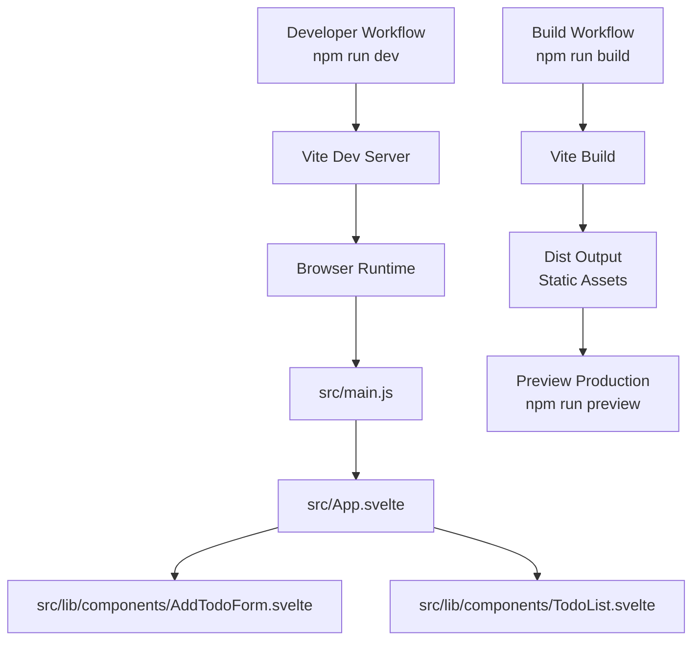
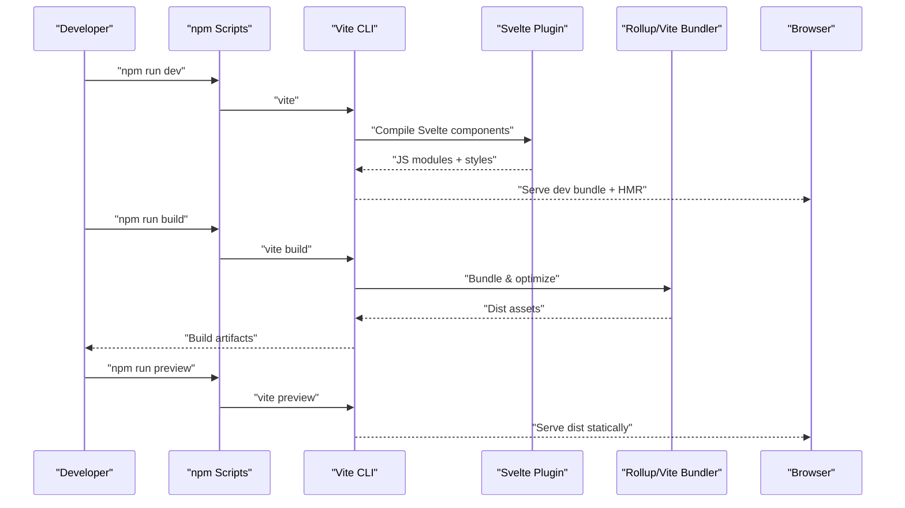
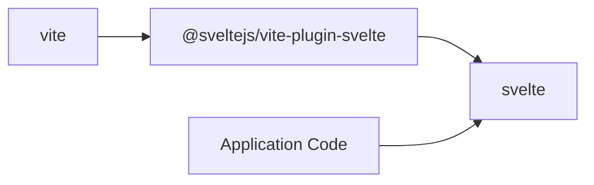

# Build and Deployment

<cite>
**Referenced Files in This Document**
- [vite.config.js](file://vite.config.js)
- [svelte.config.js](file://svelte.config.js)
- [package.json](file://package.json)
- [index.html](file://index.html)
- [src/main.js](file://src/main.js)
- [src/App.svelte](file://src/App.svelte)
- [src/lib/components/AddTodoForm.svelte](file://src/lib/components/AddTodoForm.svelte)
- [src/lib/components/TodoList.svelte](file://src/lib/components/TodoList.svelte)
- [jsconfig.json](file://jsconfig.json)
- [README.md](file://README.md)
</cite>

## Table of Contents
1. [Introduction](#introduction)
2. [Project Structure](#project-structure)
3. [Core Components](#core-components)
4. [Architecture Overview](#architecture-overview)
5. [Detailed Component Analysis](#detailed-component-analysis)
6. [Dependency Analysis](#dependency-analysis)
7. [Performance Considerations](#performance-considerations)
8. [Troubleshooting Guide](#troubleshooting-guide)
9. [Conclusion](#conclusion)
10. [Appendices](#appendices)

## Introduction
This document explains the build and deployment process for the Todo List application. It covers Vite configuration, Svelte compiler settings, development server behavior, asset handling, production build optimizations, environment configurations, and practical guidance for customization and troubleshooting. The goal is to help developers confidently build, preview, and deploy the application with predictable performance and minimal friction.

## Project Structure
The project follows a minimal, Vite-powered Svelte setup:
- Application entry point mounts the root Svelte component into the DOM.
- HTML provides the host page with a script tag pointing to the module entry.
- Vite handles development and bundling, while the Svelte plugin compiles Svelte components.
- TypeScript-friendly configuration enables strictness and source maps for DX.

**Diagram sources**
- [index.html:1-14](file://index.html#L1-L14)
- [src/main.js:1-9](file://src/main.js#L1-L9)
- [src/App.svelte:1-76](file://src/App.svelte#L1-L76)
- [src/lib/components/AddTodoForm.svelte:1-124](file://src/lib/components/AddTodoForm.svelte#L1-L124)
- [src/lib/components/TodoList.svelte:1-114](file://src/lib/components/TodoList.svelte#L1-L114)
- [vite.config.js:1-8](file://vite.config.js#L1-L8)
- [package.json:6-10](file://package.json#L6-L10)

**Section sources**
- [index.html:1-14](file://index.html#L1-L14)
- [src/main.js:1-9](file://src/main.js#L1-L9)
- [src/App.svelte:1-76](file://src/App.svelte#L1-L76)
- [vite.config.js:1-8](file://vite.config.js#L1-L8)
- [package.json:6-10](file://package.json#L6-L10)

## Core Components
- Vite configuration defines the project’s build tooling and integrates the Svelte plugin.
- Svelte configuration is minimal, allowing defaults for the Svelte compiler pipeline.
- Package scripts expose dev, build, and preview commands.
- The HTML host page injects the module entry script and provides a mounting point.
- The main module mounts the root Svelte component into the DOM element with id app.

Key behaviors:
- Development server starts with the dev script and serves the SPA from memory.
- Hot Module Replacement (HMR) updates components without full reloads.
- Production builds bundle assets and optimize output for distribution.

**Section sources**
- [vite.config.js:1-8](file://vite.config.js#L1-L8)
- [svelte.config.js:1-3](file://svelte.config.js#L1-L3)
- [package.json:6-10](file://package.json#L6-L10)
- [index.html:9-12](file://index.html#L9-L12)
- [src/main.js:1-9](file://src/main.js#L1-L9)

## Architecture Overview
The build pipeline connects the entrypoint, Svelte components, and Vite tooling to produce a static site suitable for hosting.

**Diagram sources**
- [package.json:6-10](file://package.json#L6-L10)
- [vite.config.js:1-8](file://vite.config.js#L1-L8)
- [src/main.js:1-9](file://src/main.js#L1-L9)

## Detailed Component Analysis

### Vite Configuration
- Minimal configuration enables the Svelte plugin and leaves defaults for other Vite features.
- No explicit base path, port, or SSR settings are configured, so defaults apply.
- Plugins array includes the Svelte plugin for component compilation.

Customization opportunities:
- Add aliases via resolve.alias for shorter imports.
- Introduce build.rollupOptions for advanced Rollup control.
- Configure optimizeDeps for pre-bundling specific dependencies.
- Set build.assetsDir/build.outDir for custom output layout.

**Section sources**
- [vite.config.js:1-8](file://vite.config.js#L1-L8)

### Svelte Configuration
- Empty configuration defers to plugin defaults for Svelte compiler options.
- Typical defaults include modern JS output, dev vs prod mode differentiation, and style injection behavior.

Customization opportunities:
- Enable or tune preprocessors if using TypeScript, SCSS, or Pug.
- Adjust runes vs legacy APIs behavior if migrating legacy code.
- Configure style compilation (e.g., CSS extraction) if needed.

**Section sources**
- [svelte.config.js:1-3](file://svelte.config.js#L1-L3)

### TypeScript and Editor Configuration
- jsconfig.json sets modern ECMAScript targets and module resolution for bundlers.
- Source maps enabled by default for accurate diagnostics.
- checkJs enabled to catch common JavaScript pitfalls in Svelte and JS files.
- Includes relevant file globs for type checking across Svelte and JS files.

Practical impact:
- Strong developer experience with editor hints and compile-time checks.
- Easier migration to TypeScript if desired by adjusting compiler options.

**Section sources**
- [jsconfig.json:1-34](file://jsconfig.json#L1-L34)

### Entry Point and Mounting
- index.html declares the DOM container with id app and loads the module entry.
- src/main.js mounts the root Svelte component into the declared container.

Implications:
- Changing the container id requires updating both index.html and main.js consistently.
- The module entry path must match the actual location of main.js.

**Section sources**
- [index.html:9-12](file://index.html#L9-L12)
- [src/main.js:1-9](file://src/main.js#L1-L9)

### Root Component Composition
- src/App.svelte composes child components and applies global styles.
- Styles are scoped locally via Svelte’s style blocks; global resets are applied via :global.

Considerations:
- Keep styles modular and component-scoped to reduce coupling.
- Prefer Svelte’s built-in transitions and animations for lightweight effects.

**Section sources**
- [src/App.svelte:1-76](file://src/App.svelte#L1-L76)

### Component Details
- AddTodoForm.svelte manages form state with Svelte’s $state and interacts with a shared store.
- TodoList.svelte derives computed values and renders transitions for list updates.

Notes:
- Transitions and animations rely on Svelte runtime; ensure they are compatible with production builds.
- Derived values improve reactivity performance by minimizing recomputation.

**Section sources**
- [src/lib/components/AddTodoForm.svelte:1-124](file://src/lib/components/AddTodoForm.svelte#L1-L124)
- [src/lib/components/TodoList.svelte:1-114](file://src/lib/components/TodoList.svelte#L1-L114)

### Development Server and HMR
- The dev script launches Vite’s development server.
- HMR updates components without full reloads; state preservation is disabled by default to avoid unexpected behavior.

Guidance:
- For stateful components, prefer external stores to preserve state across edits.
- If encountering HMR issues, restart the dev server or adjust plugin options.

**Section sources**
- [package.json:7-7](file://package.json#L7-L7)
- [README.md:32-36](file://README.md#L32-L36)

### Asset Handling
- Static assets placed under public are served at the app root.
- Vite resolves module imports and bundles dependencies; CSS is handled per component by the Svelte plugin.

Recommendations:
- Place favicon and other static assets in public for direct URLs.
- Keep component CSS scoped to minimize conflicts and simplify maintenance.

**Section sources**
- [index.html:5-5](file://index.html#L5-L5)

### Production Build and Preview
- The build script produces optimized static assets in the default output directory.
- The preview script serves the production bundle locally for verification.

Optimization tips:
- Review build.rollupOptions for advanced chunking and externalization.
- Consider enabling CSS extraction if distributing separate stylesheets.
- Validate third-party dependencies for tree-shaking compatibility.

**Section sources**
- [package.json:8-8](file://package.json#L8-L8)
- [package.json:9-9](file://package.json#L9-L9)

## Dependency Analysis
The project relies on Vite and the Svelte plugin for build-time processing, with Svelte runtime for component rendering.

**Diagram sources**
- [package.json:11-15](file://package.json#L11-L15)

**Section sources**
- [package.json:11-15](file://package.json#L11-L15)

## Performance Considerations
- Keep component styles scoped to reduce cascade and improve cacheability.
- Prefer lightweight transitions and animations; test performance in production builds.
- Ensure dependencies are tree-shakeable; remove unused imports.
- Use the preview command to validate bundle sizes and loading behavior before deploying.

[No sources needed since this section provides general guidance]

## Troubleshooting Guide
Common issues and resolutions:
- HMR does not preserve component state: Use external stores for state that must persist across edits.
- Unexpected HMR behavior: Restart the dev server or disable state preservation temporarily to isolate issues.
- Missing favicon or static assets: Confirm placement in the public directory and correct URL usage.
- Build errors related to JavaScript types: Enable/disable checkJs in jsconfig.json depending on desired strictness.
- Preview fails to serve: Verify the output directory exists after build and that the preview command runs from the project root.

**Section sources**
- [README.md:32-36](file://README.md#L32-L36)
- [jsconfig.json:18-26](file://jsconfig.json#L18-L26)
- [index.html:5-5](file://index.html#L5-L5)
- [package.json:8-9](file://package.json#L8-L9)

## Conclusion
The Todo List application uses a clean, minimal Vite + Svelte setup that prioritizes developer experience and straightforward deployment. With the provided configuration, you can develop efficiently, preview production builds locally, and customize the pipeline as needs grow. Follow the guidance here to maintain performance, troubleshoot effectively, and prepare for production with confidence.

[No sources needed since this section summarizes without analyzing specific files]

## Appendices

### Appendix A: Build Commands Reference
- npm run dev: Start the Vite development server with HMR.
- npm run build: Produce optimized static assets for production.
- npm run preview: Serve the production bundle locally for testing.

**Section sources**
- [package.json:6-10](file://package.json#L6-L10)

### Appendix B: Environment Variables
- No environment-specific variables are configured in the repository.
- For environment-aware builds, introduce .env files and access them via Vite’s import.meta.env in code.

[No sources needed since this section provides general guidance]