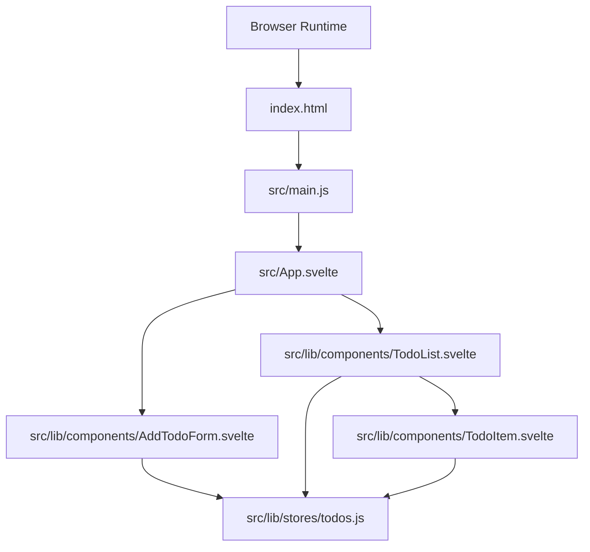
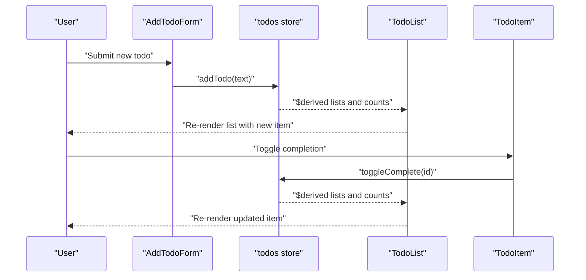
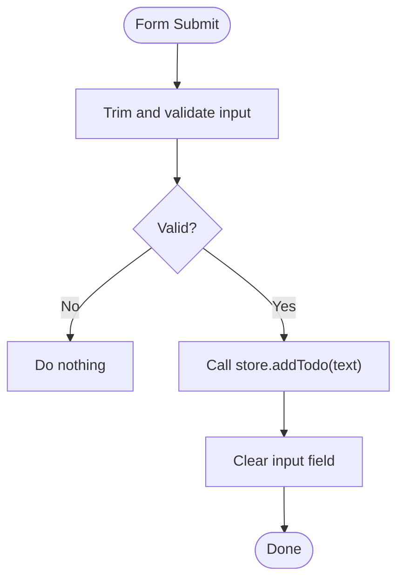
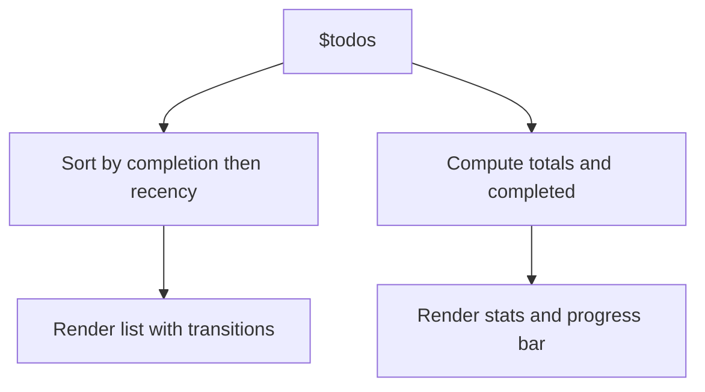
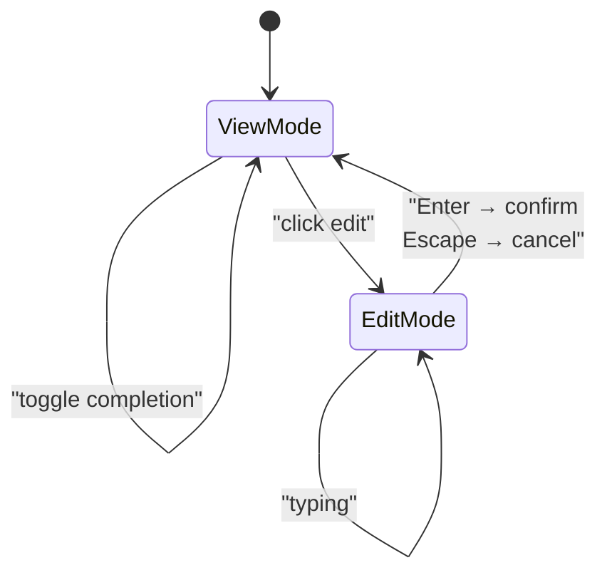
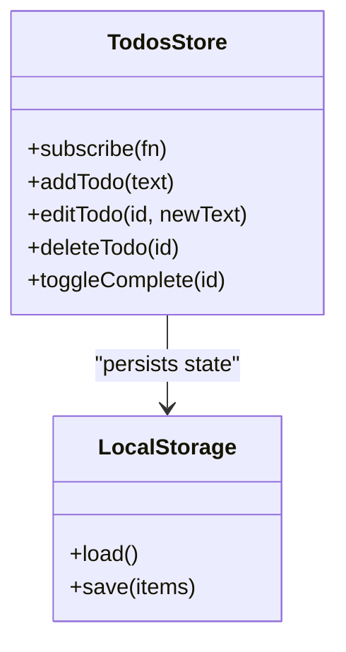
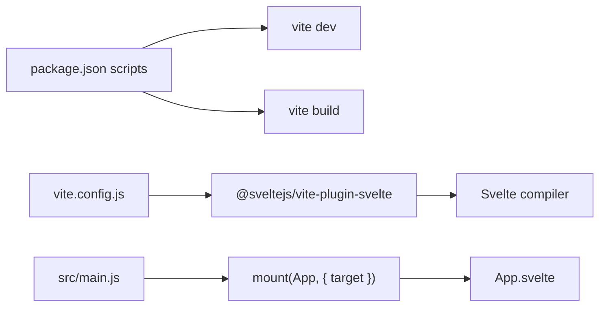

# Development Guide

<cite>
**Referenced Files in This Document**
- [README.md](file://README.md)
- [package.json](file://package.json)
- [index.html](file://index.html)
- [src/main.js](file://src/main.js)
- [src/App.svelte](file://src/App.svelte)
- [src/lib/stores/todos.js](file://src/lib/stores/todos.js)
- [src/lib/components/AddTodoForm.svelte](file://src/lib/components/AddTodoForm.svelte)
- [src/lib/components/TodoList.svelte](file://src/lib/components/TodoList.svelte)
- [src/lib/components/TodoItem.svelte](file://src/lib/components/TodoItem.svelte)
- [svelte.config.js](file://svelte.config.js)
- [vite.config.js](file://vite.config.js)
</cite>

## Table of Contents
1. [Introduction](#introduction)
2. [Project Structure](#project-structure)
3. [Core Components](#core-components)
4. [Architecture Overview](#architecture-overview)
5. [Detailed Component Analysis](#detailed-component-analysis)
6. [Dependency Analysis](#dependency-analysis)
7. [Performance Considerations](#performance-considerations)
8. [Testing Strategies](#testing-strategies)
9. [Debugging Techniques](#debugging-techniques)
10. [Styling Conventions](#styling-conventions)
11. [State Management Patterns](#state-management-patterns)
12. [Extending the Application](#extending-the-application)
13. [Version Compatibility and Migration](#version-compatibility-and-migration)
14. [Contribution Guidelines](#contribution-guidelines)
15. [Troubleshooting Guide](#troubleshooting-guide)
16. [Conclusion](#conclusion)

## Introduction
This development guide explains how to extend and modify the Todo List application built with Svelte and Vite. It focuses on component development best practices, state management patterns, styling conventions, testing strategies, debugging techniques, performance optimization, and maintainability. The guide also covers version compatibility, migration strategies, and contribution guidelines tailored to this codebase.

## Project Structure
The project follows a minimal Svelte + Vite setup with a clear separation of concerns:
- Entry point mounts the root Svelte component into the DOM.
- The root component composes feature components.
- Feature components use a centralized store for state and persistence.
- Styling is scoped per component with global base styles.

**Diagram sources**
- [index.html:1-13](file://index.html#L1-L13)
- [src/main.js:1-9](file://src/main.js#L1-L9)
- [src/App.svelte:1-76](file://src/App.svelte#L1-L76)
- [src/lib/components/AddTodoForm.svelte:1-124](file://src/lib/components/AddTodoForm.svelte#L1-L124)
- [src/lib/components/TodoList.svelte:1-114](file://src/lib/components/TodoList.svelte#L1-L114)
- [src/lib/components/TodoItem.svelte:1-180](file://src/lib/components/TodoItem.svelte#L1-L180)
- [src/lib/stores/todos.js:1-62](file://src/lib/stores/todos.js#L1-L62)

**Section sources**
- [index.html:1-13](file://index.html#L1-L13)
- [src/main.js:1-9](file://src/main.js#L1-L9)
- [src/App.svelte:1-76](file://src/App.svelte#L1-L76)

## Core Components
- Root application container orchestrates layout and typography.
- AddTodoForm handles input capture, validation, and submission to the store.
- TodoList renders statistics, manages sorting, and applies transitions.
- TodoItem encapsulates individual item rendering, editing, and actions.
- todos store manages CRUD operations, derived state, persistence, and subscriptions.

Key implementation patterns:
- Centralized store with subscription-driven persistence.
- Derived state for computed metrics and sorted lists.
- Component-scoped styles with global resets and base typography.
- Material Icons integration for visual affordances.

**Section sources**
- [src/App.svelte:1-76](file://src/App.svelte#L1-L76)
- [src/lib/components/AddTodoForm.svelte:1-124](file://src/lib/components/AddTodoForm.svelte#L1-L124)
- [src/lib/components/TodoList.svelte:1-114](file://src/lib/components/TodoList.svelte#L1-L114)
- [src/lib/components/TodoItem.svelte:1-180](file://src/lib/components/TodoItem.svelte#L1-L180)
- [src/lib/stores/todos.js:1-62](file://src/lib/stores/todos.js#L1-L62)

## Architecture Overview
The application uses a unidirectional data flow:
- UI components trigger actions on the store.
- Store updates reactive state, which re-renders dependent components.
- Side effects (e.g., persistence) occur via store subscriptions.

**Diagram sources**
- [src/lib/components/AddTodoForm.svelte:1-124](file://src/lib/components/AddTodoForm.svelte#L1-L124)
- [src/lib/components/TodoList.svelte:1-114](file://src/lib/components/TodoList.svelte#L1-L114)
- [src/lib/components/TodoItem.svelte:1-180](file://src/lib/components/TodoItem.svelte#L1-L180)
- [src/lib/stores/todos.js:1-62](file://src/lib/stores/todos.js#L1-L62)

## Detailed Component Analysis

### AddTodoForm.svelte
- Purpose: Capture user input, validate, and dispatch add actions.
- Implementation highlights:
  - Uses local reactive state for input binding.
  - Submits on form submit or Enter key.
  - Disables button when input is empty.
- Best practices:
  - Keep input trimming and validation close to submission.
  - Prefer controlled components with two-way binding for simplicity.

**Diagram sources**
- [src/lib/components/AddTodoForm.svelte:1-124](file://src/lib/components/AddTodoForm.svelte#L1-L124)

**Section sources**
- [src/lib/components/AddTodoForm.svelte:1-124](file://src/lib/components/AddTodoForm.svelte#L1-L124)

### TodoList.svelte
- Purpose: Render statistics, sort items, and manage transitions.
- Implementation highlights:
  - Derives sorted list by completion and recency.
  - Computes total and completed counts.
  - Applies Svelte transitions for smooth UX.
- Best practices:
  - Use derived state for expensive computations to avoid recomputation.
  - Keep transition durations consistent for predictable UX.

**Diagram sources**
- [src/lib/components/TodoList.svelte:1-114](file://src/lib/components/TodoList.svelte#L1-L114)

**Section sources**
- [src/lib/components/TodoList.svelte:1-114](file://src/lib/components/TodoList.svelte#L1-L114)

### TodoItem.svelte
- Purpose: Editable, actionable list item with hover controls.
- Implementation highlights:
  - Local state toggles edit mode.
  - Keyboard shortcuts for confirm/cancel.
  - Delegates actions to the store.
- Best practices:
  - Encapsulate inline-editing state within the component.
  - Use semantic events and clear affordances for actions.

**Diagram sources**
- [src/lib/components/TodoItem.svelte:1-180](file://src/lib/components/TodoItem.svelte#L1-L180)

**Section sources**
- [src/lib/components/TodoItem.svelte:1-180](file://src/lib/components/TodoItem.svelte#L1-L180)

### todos Store
- Purpose: Manage application state, persistence, and derived computations.
- Implementation highlights:
  - Creates a writable store initialized from localStorage.
  - Subscribes to updates to persist to localStorage.
  - Exposes typed actions for add/edit/delete/toggle.
- Best practices:
  - Keep store actions pure and idempotent where possible.
  - Persist only after successful updates to avoid inconsistent state.

**Diagram sources**
- [src/lib/stores/todos.js:1-62](file://src/lib/stores/todos.js#L1-L62)

**Section sources**
- [src/lib/stores/todos.js:1-62](file://src/lib/stores/todos.js#L1-L62)

## Dependency Analysis
- Build and dev-time dependencies:
  - Vite provides fast development and optimized builds.
  - Svelte plugin integrates Svelte compilation with Vite.
- Runtime dependencies:
  - Svelte core for component model and reactivity.
  - Material Icons for visual elements.
- Entry point and mounting:
  - The DOM element with id "app" is the mount target.

**Diagram sources**
- [package.json:1-17](file://package.json#L1-L17)
- [vite.config.js:1-8](file://vite.config.js#L1-L8)
- [svelte.config.js:1-3](file://svelte.config.js#L1-L3)
- [src/main.js:1-9](file://src/main.js#L1-L9)
- [src/App.svelte:1-76](file://src/App.svelte#L1-L76)

**Section sources**
- [package.json:1-17](file://package.json#L1-L17)
- [vite.config.js:1-8](file://vite.config.js#L1-L8)
- [svelte.config.js:1-3](file://svelte.config.js#L1-L3)
- [src/main.js:1-9](file://src/main.js#L1-L9)
- [index.html:1-13](file://index.html#L1-L13)

## Performance Considerations
- Derived state:
  - Use $derived for computed values to minimize unnecessary work.
- Transition costs:
  - Keep transition durations balanced; avoid heavy animations on large lists.
- Re-render boundaries:
  - Pass only required props to child components to reduce re-renders.
- Persistence:
  - Persist after store updates to avoid frequent writes; consider debouncing if needed.
- Bundle size:
  - Prefer tree-shaken imports and avoid bundling unused icons.

[No sources needed since this section provides general guidance]

## Testing Strategies
- Unit tests for store actions:
  - Verify add/edit/delete/toggle produce expected state mutations.
  - Test persistence by mocking localStorage and asserting saved values.
- Component tests:
  - Simulate user interactions (submit, toggle, edit, delete) and assert DOM updates.
  - Test keyboard shortcuts and disabled states.
- Integration tests:
  - End-to-end flows: add item → sort order → completion → deletion.
- Tooling:
  - Use SvelteKit Test Runner or Vitest for unit tests.
  - Use Playwright/Cypress for E2E tests.

[No sources needed since this section provides general guidance]

## Debugging Techniques
- Enable type checking:
  - The template enables JavaScript checks to catch common mistakes early.
- Hot module replacement (HMR):
  - Local component state is not preserved by default; use external stores for persistent state during development.
- Console logging:
  - Log store updates and component lifecycle hooks to trace data flow.
- DevTools:
  - Inspect Svelte devtools to observe component state and reactivity.

**Section sources**
- [README.md:32-43](file://README.md#L32-L43)

## Styling Conventions
- Component scoping:
  - Each component defines its own styles; avoid global overrides when possible.
- Global resets and typography:
  - Base styles reset margins/padding and set fonts/body sizing in the root component.
- Interactive states:
  - Use focus-within, hover, and disabled states to provide feedback.
- Consistency:
  - Maintain consistent spacing, shadows, and transitions across components.

**Section sources**
- [src/App.svelte:20-75](file://src/App.svelte#L20-L75)
- [src/lib/components/AddTodoForm.svelte:38-123](file://src/lib/components/AddTodoForm.svelte#L38-L123)
- [src/lib/components/TodoList.svelte:45-113](file://src/lib/components/TodoList.svelte#L45-L113)
- [src/lib/components/TodoItem.svelte:75-179](file://src/lib/components/TodoItem.svelte#L75-L179)

## State Management Patterns
- External store pattern:
  - Keep state outside of components to survive HMR and share across the app.
- Derived state:
  - Compute derived values from store state to keep UI declarative.
- Action encapsulation:
  - Expose small, focused actions on the store to enforce consistent updates.
- Subscription side effects:
  - Persist state via store subscriptions to keep persistence implicit and centralized.

**Section sources**
- [src/lib/stores/todos.js:1-62](file://src/lib/stores/todos.js#L1-L62)
- [README.md:36-43](file://README.md#L36-L43)

## Extending the Application
- Adding a new feature:
  - Define a new component under src/lib/components/.
  - Introduce or reuse a store action to mutate state.
  - Wire the component into the app shell (e.g., App.svelte).
- Creating custom components:
  - Use local state for ephemeral UI state.
  - Accept props for data and callbacks for actions.
  - Keep styles scoped to the component.
- Integrating additional functionality:
  - Add new dependencies via npm/yarn and configure Vite if needed.
  - Ensure compatibility with Svelte 5 and Vite 8 as currently configured.

**Section sources**
- [src/App.svelte:1-18](file://src/App.svelte#L1-L18)
- [src/lib/components/AddTodoForm.svelte:1-124](file://src/lib/components/AddTodoForm.svelte#L1-L124)
- [src/lib/components/TodoList.svelte:1-114](file://src/lib/components/TodoList.svelte#L1-L114)
- [src/lib/components/TodoItem.svelte:1-180](file://src/lib/components/TodoItem.svelte#L1-L180)
- [src/lib/stores/todos.js:1-62](file://src/lib/stores/todos.js#L1-L62)

## Version Compatibility and Migration
- Current versions:
  - Svelte: 5.x
  - Vite: 8.x
  - @sveltejs/vite-plugin-svelte: 7.x
- Migration tips:
  - Review Svelte 5 breaking changes and reactivity updates.
  - Align Vite plugins and configurations with Svelte 5 expectations.
- SvelteKit migration:
  - The template is structured to resemble SvelteKit; migrating later is straightforward.

**Section sources**
- [package.json:11-15](file://package.json#L11-L15)
- [README.md:22-22](file://README.md#L22-L22)

## Contribution Guidelines
- Code style:
  - Follow existing patterns: component-scoped styles, derived state, and external stores.
- Commit hygiene:
  - Keep commits focused and add clear messages.
- Pull requests:
  - Reference related issues and test changes locally.

[No sources needed since this section provides general guidance]

## Troubleshooting Guide
- HMR state preservation:
  - Important component state should be moved to an external store to persist across edits.
- Local storage errors:
  - The store ignores persistence failures; ensure storage quota and permissions are sufficient.
- Missing icons:
  - Confirm Material Icons availability in the current build pipeline.

**Section sources**
- [README.md:32-43](file://README.md#L32-L43)
- [src/lib/stores/todos.js:17-23](file://src/lib/stores/todos.js#L17-L23)

## Conclusion
This guide outlined how to develop, extend, and maintain the Todo List application. By leveraging Svelte’s reactivity, centralizing state in an external store, and keeping components modular and styled locally, you can build robust features efficiently. Follow the testing, debugging, and performance recommendations to ensure a high-quality user experience.