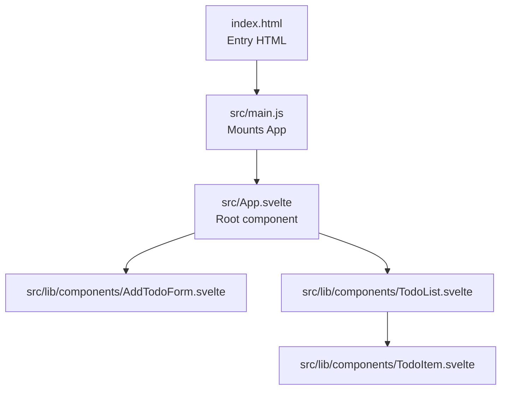

# Getting Started

<cite>
**Referenced Files in This Document**
- [README.md](file://README.md)
- [package.json](file://package.json)
- [vite.config.js](file://vite.config.js)
- [svelte.config.js](file://svelte.config.js)
- [index.html](file://index.html)
- [src/main.js](file://src/main.js)
- [src/App.svelte](file://src/App.svelte)
- [src/lib/components/AddTodoForm.svelte](file://src/lib/components/AddTodoForm.svelte)
- [src/lib/components/TodoList.svelte](file://src/lib/components/TodoList.svelte)
- [src/lib/components/TodoItem.svelte](file://src/lib/components/TodoItem.svelte)
- [jsconfig.json](file://jsconfig.json)
</cite>

## Table of Contents
1. [Introduction](#introduction)
2. [Prerequisites](#prerequisites)
3. [Installation](#installation)
4. [Development Server](#development-server)
5. [First Run Verification](#first-run-verification)
6. [Project Structure Overview](#project-structure-overview)
7. [Key Dependencies](#key-dependencies)
8. [Basic Usage Patterns](#basic-usage-patterns)
9. [Making Initial Modifications](#making-initial-modifications)
10. [Understanding the Development Workflow](#understanding-the-development-workflow)
11. [Troubleshooting Guide](#troubleshooting-guide)
12. [IDE Recommendations](#ide-recommendations)
13. [Conclusion](#conclusion)

## Introduction
This guide helps you set up and run the Svelte Todo List application locally. It covers prerequisites, installation, development server setup with Vite, verifying your first run, understanding the project structure, key dependencies, basic usage patterns, making initial modifications, and common troubleshooting steps. The application uses Svelte 5 with Vite and demonstrates modern Svelte features like reactive statements, derived stores, transitions, and animations.

## Prerequisites
- Node.js: Ensure you have Node.js installed. The project uses ES modules and modern JavaScript features.
- Package manager: npm or yarn. The scripts in this project are configured for npm-style commands.

**Section sources**
- [package.json:6-10](file://package.json#L6-L10)

## Installation
1. Install dependencies:
   - Run the standard install command for your package manager to install all devDependencies.
2. Verify installation:
   - After installation completes, you should see the devDependencies in your lock file and node_modules.

What gets installed:
- Svelte runtime and compiler
- Vite build tool and dev server
- Svelte plugin for Vite

**Section sources**
- [package.json:11-15](file://package.json#L11-L15)

## Development Server
Start the local development server using Vite:
- Use the dev script to launch the server with hot module replacement (HMR).

Access the application:
- Open the URL shown in the terminal after the dev server starts.

Build and preview production:
- Use the build script to create an optimized production bundle.
- Use the preview script to serve the built assets locally for testing.

**Section sources**
- [package.json:6-10](file://package.json#L6-L10)
- [vite.config.js:1-8](file://vite.config.js#L1-L8)

## First Run Verification
After starting the dev server:
- Confirm the browser loads the Todo List interface.
- Verify the header displays the app title and icon.
- Test adding a new todo via the form and observe it appear in the list.
- Toggle completion and delete items to ensure interactivity works.

If the page appears blank:
- Check that the HTML references the correct entry script and the DOM element exists.

**Section sources**
- [index.html:1-14](file://index.html#L1-L14)
- [src/main.js:1-9](file://src/main.js#L1-L9)
- [src/App.svelte:1-76](file://src/App.svelte#L1-L76)

## Project Structure Overview
High-level layout:
- Root-level configuration files for Vite and Svelte.
- Public assets and source code under src/.
- Application entry point mounts the root Svelte component into the DOM.

Key directories and files:
- Configuration: vite.config.js, svelte.config.js, jsconfig.json
- Entry: index.html, src/main.js
- Root component: src/App.svelte
- Components: src/lib/components/*.svelte
- Styles: scoped styles within components and global resets in the root component

**Diagram sources**
- [index.html:1-14](file://index.html#L1-L14)
- [src/main.js:1-9](file://src/main.js#L1-L9)
- [src/App.svelte:1-76](file://src/App.svelte#L1-L76)
- [src/lib/components/AddTodoForm.svelte:1-124](file://src/lib/components/AddTodoForm.svelte#L1-L124)
- [src/lib/components/TodoList.svelte:1-114](file://src/lib/components/TodoList.svelte#L1-L114)
- [src/lib/components/TodoItem.svelte:1-212](file://src/lib/components/TodoItem.svelte#L1-L212)

**Section sources**
- [vite.config.js:1-8](file://vite.config.js#L1-L8)
- [svelte.config.js:1-3](file://svelte.config.js#L1-L3)
- [jsconfig.json:1-34](file://jsconfig.json#L1-L34)

## Key Dependencies
Primary runtime and build dependencies:
- Svelte: Provides the component model and compiler.
- Vite: Fast build tool and dev server with HMR.
- Svelte plugin for Vite: Integrates Svelte compilation into the Vite pipeline.

These dependencies are declared as devDependencies and are sufficient for local development and building the project.

**Section sources**
- [package.json:11-15](file://package.json#L11-L15)

## Basic Usage Patterns
Application components and interactions:
- Root component composes the header and the todo form and list.
- AddTodoForm captures user input and dispatches actions to add a new todo.
- TodoList renders items, sorts them by completion status and creation time, and shows progress statistics.
- TodoItem supports inline editing, toggling completion, and deletion.

Common interactions:
- Submitting the form adds a new item.
- Clicking the checkbox toggles completion.
- Editing mode allows updating item text with Enter or Escape keys.
- Deleting removes items from the list.

**Section sources**
- [src/App.svelte:1-76](file://src/App.svelte#L1-L76)
- [src/lib/components/AddTodoForm.svelte:1-124](file://src/lib/components/AddTodoForm.svelte#L1-L124)
- [src/lib/components/TodoList.svelte:1-114](file://src/lib/components/TodoList.svelte#L1-L114)
- [src/lib/components/TodoItem.svelte:1-212](file://src/lib/components/TodoItem.svelte#L1-L212)

## Making Initial Modifications
Recommended first steps:
1. Modify the root component title and styling to personalize the app.
2. Adjust the AddTodoForm placeholder or button text.
3. Experiment with TodoList sorting or stats display.
4. Try adding a new action in TodoItem (for example, prioritizing items) and wire it through the shared store.

Where to start:
- Root component: src/App.svelte
- Form: src/lib/components/AddTodoForm.svelte
- List: src/lib/components/TodoList.svelte
- Item: src/lib/components/TodoItem.svelte

Build and test:
- After changes, rebuild using the build script and preview the production bundle to verify correctness.

**Section sources**
- [src/App.svelte:1-76](file://src/App.svelte#L1-L76)
- [src/lib/components/AddTodoForm.svelte:1-124](file://src/lib/components/AddTodoForm.svelte#L1-L124)
- [src/lib/components/TodoList.svelte:1-114](file://src/lib/components/TodoList.svelte#L1-L114)
- [src/lib/components/TodoItem.svelte:1-212](file://src/lib/components/TodoItem.svelte#L1-L212)
- [package.json:6-10](file://package.json#L6-L10)

## Understanding the Development Workflow
Typical workflow:
- Start the dev server and open the browser.
- Edit a Svelte component; changes are reflected immediately thanks to HMR.
- Use the build script to create a production-ready bundle.
- Use the preview script to test the production build locally.

Configuration highlights:
- Vite handles asset resolution and HMR.
- Svelte config is minimal; the plugin manages Svelte-specific compilation.
- jsconfig enables strictness and source maps for better DX.

**Section sources**
- [vite.config.js:1-8](file://vite.config.js#L1-L8)
- [svelte.config.js:1-3](file://svelte.config.js#L1-L3)
- [jsconfig.json:1-34](file://jsconfig.json#L1-L34)

## Troubleshooting Guide
Common issues and resolutions:
- Blank page on load:
  - Ensure the HTML file includes a div with the expected ID and loads the compiled script.
  - Confirm the entry script path matches your setup.
- Dev server fails to start:
  - Verify Node.js and package manager versions meet minimum requirements.
  - Reinstall dependencies if there are permission or cache-related errors.
- Hot module replacement not working:
  - Some component states may not persist during edits; consider moving critical state to an external store if persistence is required.
- Linting or type-checking errors:
  - Review jsconfig settings and adjust compiler options as needed.

**Section sources**
- [index.html:1-14](file://index.html#L1-L14)
- [src/main.js:1-9](file://src/main.js#L1-L9)
- [README.md:32-43](file://README.md#L32-L43)
- [jsconfig.json:1-34](file://jsconfig.json#L1-L34)

## IDE Recommendations
Recommended setup:
- Use VS Code with the Svelte extension for enhanced language support, diagnostics, and component navigation.
- The project README suggests this combination for the best development experience.

Additional tips:
- Enable JavaScript type checking in the IDE to catch common mistakes early.
- Configure the editor to show source maps for clearer debugging.

**Section sources**
- [README.md:5-8](file://README.md#L5-L8)

## Conclusion
You now have the essentials to run the Svelte Todo List application locally, understand its structure, and begin making modifications. Use the dev server for rapid iteration, the build script for production bundling, and the preview script to validate your builds. Explore the components to learn Svelte patterns and enhance the application with your own features.