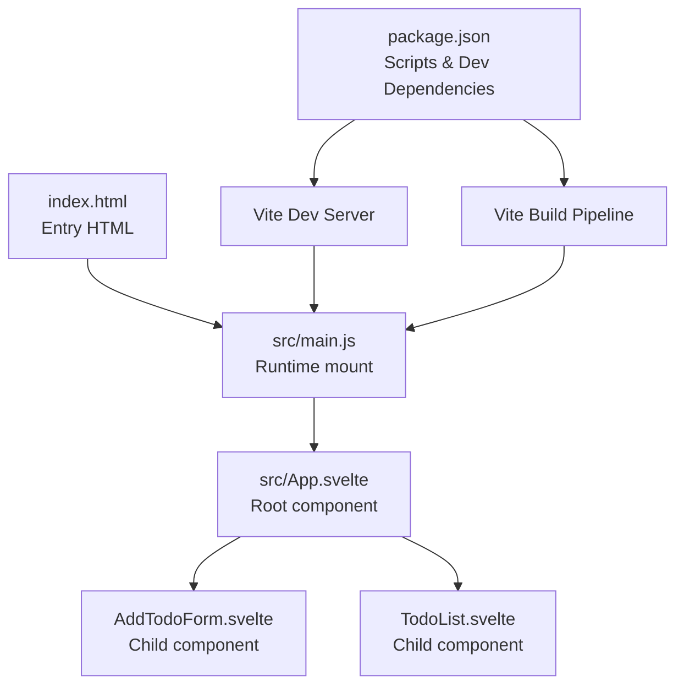
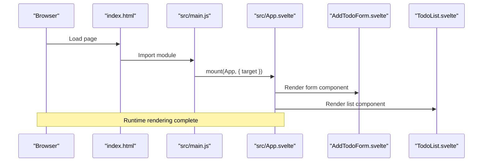
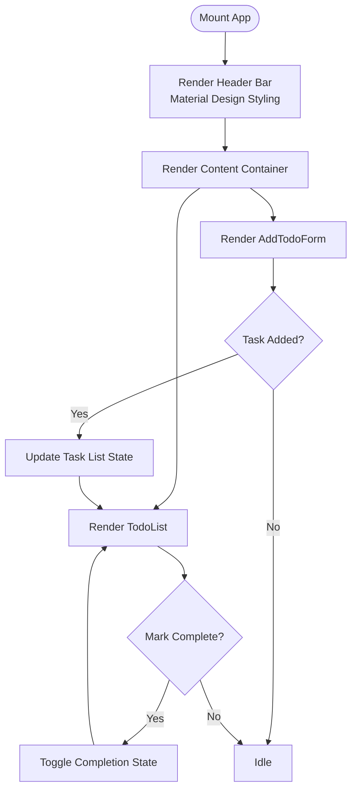
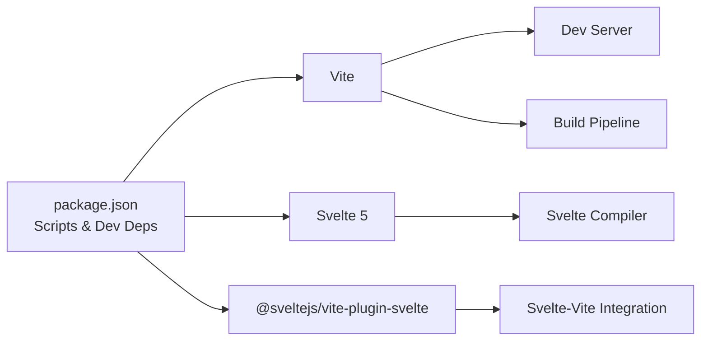

# Project Overview

<cite>
**Referenced Files in This Document**
- [README.md](file://README.md)
- [package.json](file://package.json)
- [src/App.svelte](file://src/App.svelte)
- [src/main.js](file://src/main.js)
- [index.html](file://index.html)
</cite>

## Table of Contents
1. [Introduction](#introduction)
2. [Project Structure](#project-structure)
3. [Core Components](#core-components)
4. [Architecture Overview](#architecture-overview)
5. [Detailed Component Analysis](#detailed-component-analysis)
6. [Dependency Analysis](#dependency-analysis)
7. [Performance Considerations](#performance-considerations)
8. [Troubleshooting Guide](#troubleshooting-guide)
9. [Conclusion](#conclusion)

## Introduction
This Svelte + Vite application serves as a focused, hands-on demonstration of building modern web applications with Svelte 5 and Vite. Its primary purpose is to showcase a practical task management interface that emphasizes clean component composition, reactive state handling, and a polished Material Design-inspired UI. The project is intentionally minimal to reduce cognitive load for learners while still delivering a real-world-capable foundation.

Beyond the UI, the application highlights Svelte’s compiler-driven reactivity, component lifecycle, and seamless integration with Vite’s fast development server and optimized production builds. It is designed to be an accessible entry point for developers new to Svelte 5 and Vite, while offering sufficient depth to demonstrate best practices for structuring Svelte applications, managing styles, and preparing for migration to SvelteKit.

Target use cases include:
- Learning Svelte 5 fundamentals such as reactive declarations, stores, and component composition
- Understanding Vite’s role in development and build pipelines
- Building a small-scale task management UI with Material Design aesthetics
- Experimenting with component boundaries and prop passing patterns
- Preparing for larger SvelteKit projects by mirroring SvelteKit’s structural conventions

## Project Structure
The project follows a compact, Svelte-centric layout optimized for clarity and rapid iteration. At a high level:
- The application bootstraps from a single HTML page that mounts the root Svelte component.
- The root component composes two primary child components: a form for adding tasks and a list for rendering tasks.
- Styles are scoped locally within the root component, leveraging Svelte’s built-in CSS scoping and global resets.
- The build pipeline is configured via Vite, enabling hot module replacement during development and optimized bundles for production.

**Diagram sources**
- [index.html:1-14](file://index.html#L1-L14)
- [src/main.js:1-9](file://src/main.js#L1-L9)
- [src/App.svelte:1-76](file://src/App.svelte#L1-L76)
- [package.json:1-17](file://package.json#L1-L17)

**Section sources**
- [index.html:1-14](file://index.html#L1-L14)
- [src/main.js:1-9](file://src/main.js#L1-L9)
- [src/App.svelte:1-76](file://src/App.svelte#L1-L76)
- [package.json:1-17](file://package.json#L1-L17)

## Core Components
The application’s functionality centers around a minimal set of components orchestrated by the root component. The root component defines the application shell, including a header bar styled with Material Design principles and a container for the interactive parts of the app. Two child components are integrated:
- AddTodoForm: Responsible for capturing new task entries and emitting events to update the task list.
- TodoList: Renders the current collection of tasks and handles user interactions such as marking completion.

These components communicate with the root component primarily through props and event emissions, keeping the data flow straightforward and easy to reason about for newcomers. Styling is encapsulated within the root component, ensuring a cohesive look-and-feel with a consistent color palette and typography.

Practical examples of capabilities:
- Adding new tasks via the form component and immediately reflecting them in the list
- Visually distinguishing completed tasks through UI affordances
- Maintaining focus and keyboard-friendly interactions for quick task entry

**Section sources**
- [src/App.svelte:1-76](file://src/App.svelte#L1-L76)

## Architecture Overview
The runtime architecture is intentionally simple to emphasize Svelte’s component model and Vite’s development experience. The flow begins with the browser loading the HTML entry, which imports the application’s JavaScript bundle. The Svelte runtime mounts the root component into the designated DOM element, after which the root component renders its children. During development, Vite’s HMR updates the UI reactively without full reloads, accelerating iteration cycles.

**Diagram sources**
- [index.html:1-14](file://index.html#L1-L14)
- [src/main.js:1-9](file://src/main.js#L1-L9)
- [src/App.svelte:1-76](file://src/App.svelte#L1-L76)

## Detailed Component Analysis
This section focuses on the root component’s role as the orchestrator of the application’s UI and styling. It establishes:
- A sticky header bar with a prominent brand icon and title, styled using Material Design color tokens and spacing
- A centered content container that hosts the form and list components
- Global CSS resets and typography defaults applied via Svelte’s :global selector
- Responsive sizing and consistent padding for optimal readability

The component’s simplicity makes it an excellent teaching tool for understanding how to structure a Svelte application, how to scope styles effectively, and how to integrate icons and typography for a polished UI.

**Diagram sources**
- [src/App.svelte:1-76](file://src/App.svelte#L1-L76)

**Section sources**
- [src/App.svelte:1-76](file://src/App.svelte#L1-L76)

## Dependency Analysis
The project relies on a lean set of dependencies managed through npm scripts:
- Vite powers the development server and build pipeline
- Svelte 5 provides the component framework and compiler
- The @sveltejs/vite-plugin-svelte integrates Svelte with Vite

This combination delivers fast HMR, optimized production builds, and a streamlined developer experience. The README outlines why this template favors Vite + Svelte over SvelteKit for smaller projects and how the structure supports future migration to SvelteKit.

**Diagram sources**
- [package.json:1-17](file://package.json#L1-L17)
- [README.md:1-44](file://README.md#L1-L44)

**Section sources**
- [package.json:1-17](file://package.json#L1-L17)
- [README.md:1-44](file://README.md#L1-L44)

## Performance Considerations
- Keep components small and focused to minimize unnecessary re-renders
- Prefer local component state for transient UI concerns; use external stores for cross-component data that needs persistence across edits
- Leverage Svelte’s built-in CSS scoping to avoid global style conflicts and reduce cascade complexity
- Use Vite’s development server for rapid feedback; rely on production builds for performance profiling and optimization

## Troubleshooting Guide
Common scenarios and guidance:
- HMR state preservation: HMR intentionally does not preserve local component state by default. To retain state across edits, move persistent data into an external store
- Type checking in JavaScript: The template enables JavaScript checks to catch common type-related mistakes early
- Migration readiness: The project’s structure mirrors SvelteKit conventions, easing future migration

**Section sources**
- [README.md:32-43](file://README.md#L32-L43)

## Conclusion
This Svelte + Vite Todo List application provides a concise yet instructive foundation for learning Svelte 5 development. By combining a clear component hierarchy, Material Design-inspired styling, and a streamlined build process, it offers both conceptual clarity for beginners and practical insights for experienced developers. Whether you are experimenting with Svelte’s reactivity, exploring Vite’s capabilities, or preparing for SvelteKit, this project demonstrates how to keep things simple while maintaining a professional-grade UI and developer experience.