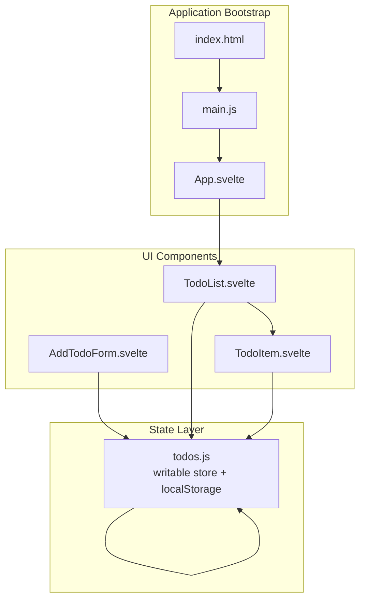
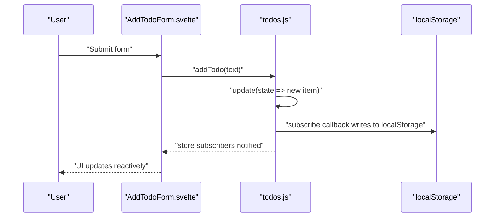
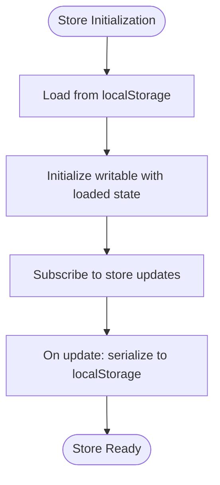
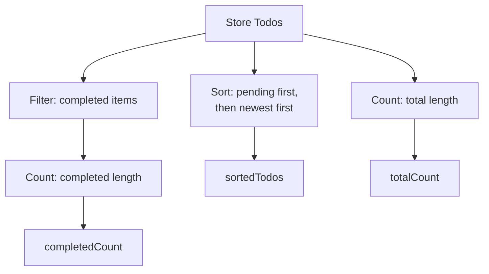
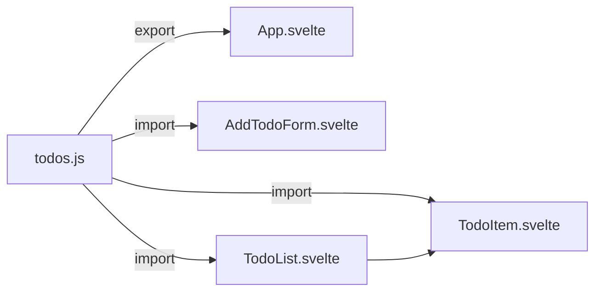

# State Management

<cite>
**Referenced Files in This Document**
- [todos.js](file://src/lib/stores/todos.js)
- [AddTodoForm.svelte](file://src/lib/components/AddTodoForm.svelte)
- [TodoItem.svelte](file://src/lib/components/TodoItem.svelte)
- [TodoList.svelte](file://src/lib/components/TodoList.svelte)
- [App.svelte](file://src/App.svelte)
- [main.js](file://src/main.js)
- [index.html](file://index.html)
</cite>

## Table of Contents
1. [Introduction](#introduction)
2. [Project Structure](#project-structure)
3. [Core Components](#core-components)
4. [Architecture Overview](#architecture-overview)
5. [Detailed Component Analysis](#detailed-component-analysis)
6. [Dependency Analysis](#dependency-analysis)
7. [Performance Considerations](#performance-considerations)
8. [Troubleshooting Guide](#troubleshooting-guide)
9. [Conclusion](#conclusion)

## Introduction
This document explains the state management system in the Todo List application. It focuses on the todos store built with Svelte's reactive primitives, how state updates propagate through subscriptions, and how the store integrates with localStorage for persistence. It also covers derived state patterns for computed properties, synchronization across component re-renders, mutation examples, filtering operations, and progress calculations. Best practices for reactive state management in Svelte are included to guide maintainable implementations.

## Project Structure
The state management is centered around a single store module that encapsulates all todo-related state and persistence. Components consume this store reactively, ensuring automatic UI updates when state changes. The application bootstraps via a minimal HTML page and mounts the Svelte root component.

**Diagram sources**
- [index.html:1-13](file://index.html#L1-L13)
- [main.js](file://src/main.js)
- [App.svelte](file://src/App.svelte)
- [todos.js:1-62](file://src/lib/stores/todos.js#L1-L62)
- [AddTodoForm.svelte:1-61](file://src/lib/components/AddTodoForm.svelte#L1-L61)
- [TodoList.svelte:1-45](file://src/lib/components/TodoList.svelte#L1-L45)
- [TodoItem.svelte:1-58](file://src/lib/components/TodoItem.svelte#L1-L58)

**Section sources**
- [index.html:1-13](file://index.html#L1-L13)
- [main.js](file://src/main.js)
- [App.svelte](file://src/App.svelte)

## Core Components
- Todos Store: Provides reactive state for the todo list, exposes mutation methods, and persists changes to localStorage automatically via a subscription hook.
- UI Components: Consume the store reactively using Svelte's reactive declarations ($state, $derived) and trigger mutations through user interactions.

Key responsibilities:
- Store: Initialize from localStorage, expose subscribe/update/set, and persist state changes.
- Components: Bind local reactive state for forms, derive computed values (sorting, counts), and call store methods for mutations.

**Section sources**
- [todos.js:1-62](file://src/lib/stores/todos.js#L1-L62)
- [AddTodoForm.svelte:1-61](file://src/lib/components/AddTodoForm.svelte#L1-L61)
- [TodoList.svelte:1-45](file://src/lib/components/TodoList.svelte#L1-L45)
- [TodoItem.svelte:1-58](file://src/lib/components/TodoItem.svelte#L1-L58)

## Architecture Overview
The system follows a unidirectional data flow:
- Components read from the store using reactive declarations.
- Mutations are performed by calling store methods exposed by the store module.
- The store's subscription writes back to localStorage, ensuring persistence.
- Reactive declarations in components cause automatic re-rendering when state changes.

**Diagram sources**
- [AddTodoForm.svelte:1-61](file://src/lib/components/AddTodoForm.svelte#L1-L61)
- [todos.js:14-62](file://src/lib/stores/todos.js#L14-L62)

## Detailed Component Analysis

### Todos Store Implementation
The store is implemented as a writable store initialized from localStorage. It exposes:
- subscribe: Standard Svelte store subscription for reactive reads.
- addTodo: Creates a new todo with a unique ID, trims text, sets completion to false, records creation timestamp, and prepends to the list.
- editTodo: Updates the text of a specific todo by ID.
- deleteTodo: Removes a todo by ID.
- toggleComplete: Flips the completion status of a specific todo.

Persistence mechanism:
- A subscriber serializes the current state and writes it to localStorage on every change. Errors during serialization are ignored to avoid blocking updates.

**Diagram sources**
- [todos.js:5-23](file://src/lib/stores/todos.js#L5-L23)

**Section sources**
- [todos.js:1-62](file://src/lib/stores/todos.js#L1-L62)

### Data Model for Todo Items
Each todo item is represented as an object with the following fields:
- id: Unique identifier generated at creation time.
- text: Trimmed string representing the task description.
- completed: Boolean flag indicating completion status.
- createdAt: Timestamp marking when the item was created.

This model supports efficient sorting, filtering, and rendering across components.

**Section sources**
- [todos.js:28-37](file://src/lib/stores/todos.js#L28-L37)

### Derived State Patterns in TodoList
The TodoList component demonstrates two derived computations:
- sortedTodos: A derived array that sorts items so pending items appear before completed ones, and within each group, items are ordered by recency (newest first).
- totalCount: A derived count of all items.
- completedCount: A derived count of completed items.

These derived values enable concise UI logic and automatic recomputation when the underlying store changes.

**Diagram sources**
- [TodoList.svelte:7-16](file://src/lib/components/TodoList.svelte#L7-L16)

**Section sources**
- [TodoList.svelte:1-45](file://src/lib/components/TodoList.svelte#L1-L45)

### State Synchronization Across Re-renders
Components synchronize with store changes through Svelte's reactive declarations:
- Components bind to store values using reactive declarations to ensure reactivity.
- Local reactive state is used for transient UI concerns (e.g., input binding in forms).
- Derived state ensures computed values stay up-to-date without manual invalidation.

This pattern guarantees that UI reflects the latest store state after any mutation.

**Section sources**
- [AddTodoForm.svelte:1-61](file://src/lib/components/AddTodoForm.svelte#L1-L61)
- [TodoList.svelte:1-45](file://src/lib/components/TodoList.svelte#L1-L45)
- [TodoItem.svelte:1-58](file://src/lib/components/TodoItem.svelte#L1-L58)

### State Mutation Examples
Common mutations invoked by components:
- Adding a new todo: Form submission triggers a store mutation that prepends a new item.
- Editing an existing todo: Item component triggers a mutation to update text by ID.
- Deleting a todo: Item component triggers a mutation to remove an item by ID.
- Toggling completion: Checkbox change triggers a mutation to flip the completion flag.

These mutations are atomic and leverage immutable-style updates via map/filter to produce new arrays.

**Section sources**
- [AddTodoForm.svelte:6-12](file://src/lib/components/AddTodoForm.svelte#L6-L12)
- [TodoItem.svelte:13-18](file://src/lib/components/TodoItem.svelte#L13-L18)
- [TodoItem.svelte:57-57](file://src/lib/components/TodoItem.svelte#L57-L57)
- [todos.js:28-58](file://src/lib/stores/todos.js#L28-L58)

### Filtering Operations and Progress Calculations
Filtering:
- The completedCount is derived by filtering the store todos for items where completion is true.

Progress calculation:
- The UI computes a percentage using the derived counts and applies it as a width style for a progress bar element.

This approach keeps filtering and presentation logic localized and reactive.

**Section sources**
- [TodoList.svelte:14-26](file://src/lib/components/TodoList.svelte#L14-L26)

### Subscription Mechanisms and Automatic Persistence
The store subscribes to its own updates and writes serialized state to localStorage. This ensures persistence without explicit persistence calls elsewhere in the app. The subscription runs whenever the store's value changes, guaranteeing that the persisted state matches the current in-memory state.

**Section sources**
- [todos.js:17-23](file://src/lib/stores/todos.js#L17-L23)

## Dependency Analysis
The store module is a singleton dependency consumed by multiple UI components. Components depend on the store for both reading and writing state. The store depends on the browser's localStorage API for persistence.

**Diagram sources**
- [todos.js:62-62](file://src/lib/stores/todos.js#L62-L62)
- [App.svelte](file://src/App.svelte)
- [AddTodoForm.svelte:2-2](file://src/lib/components/AddTodoForm.svelte#L2-L2)
- [TodoList.svelte:2-2](file://src/lib/components/TodoList.svelte#L2-L2)
- [TodoItem.svelte:2-2](file://src/lib/components/TodoItem.svelte#L2-L2)

**Section sources**
- [todos.js:1-62](file://src/lib/stores/todos.js#L1-L62)
- [AddTodoForm.svelte:1-61](file://src/lib/components/AddTodoForm.svelte#L1-L61)
- [TodoList.svelte:1-45](file://src/lib/components/TodoList.svelte#L1-L45)
- [TodoItem.svelte:1-58](file://src/lib/components/TodoItem.svelte#L1-L58)

## Performance Considerations
- Prefer immutable-style updates: Using map/filter to transform arrays avoids unnecessary DOM churn and aligns with Svelte's change detection.
- Keep derived computations simple: Sorting and counting are O(n log n) and O(n), respectively; keep lists reasonably sized or introduce pagination if needed.
- Debounce heavy operations: If adding future features like search or complex filters, consider debouncing to reduce re-computation frequency.
- Avoid excessive localStorage writes: The current subscription writes on every change; this is appropriate for simplicity but could be throttled if needed.

## Troubleshooting Guide
- State not persisting: Verify that the subscription writes to localStorage succeed and that the storage key matches expectations.
- UI not updating after mutation: Ensure components use reactive declarations to read from the store and that mutations use the store's update/set methods.
- Duplicate or stale items: Confirm that new items receive unique IDs and that the store initializes from localStorage correctly.
- Derived values incorrect: Check derived computations for sorting and filtering logic to ensure they match intended behavior.

**Section sources**
- [todos.js:17-23](file://src/lib/stores/todos.js#L17-L23)
- [TodoList.svelte:7-16](file://src/lib/components/TodoList.svelte#L7-L16)

## Conclusion
The Todo List application employs a clean, reactive state management architecture centered on a single store module. By leveraging Svelte's writable store, subscriptions, and derived values, it achieves automatic persistence, efficient UI updates, and maintainable code. The demonstrated patterns—immutable-style mutations, derived computations, and component-local reactive state—are recommended best practices for building scalable Svelte applications.