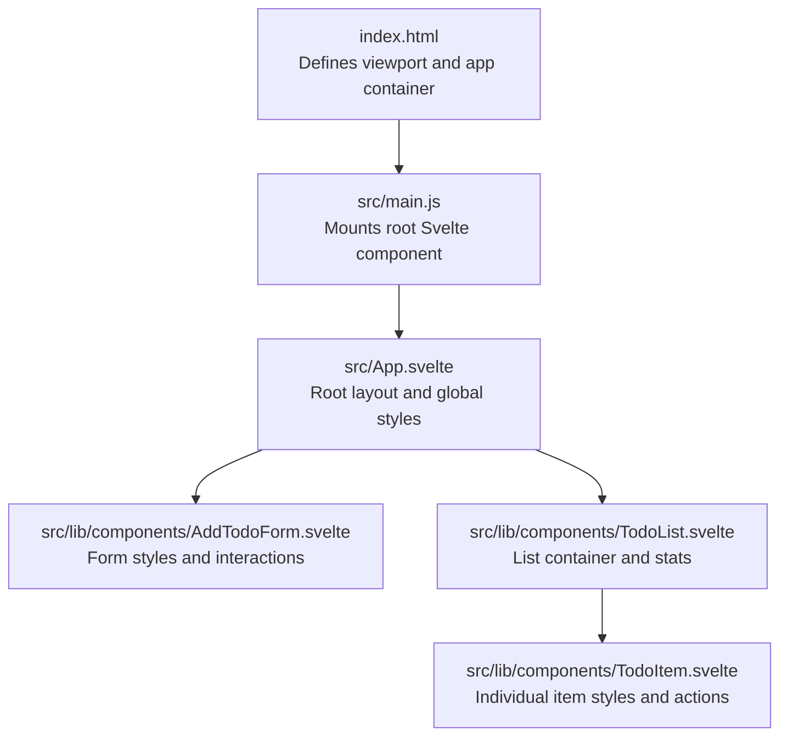
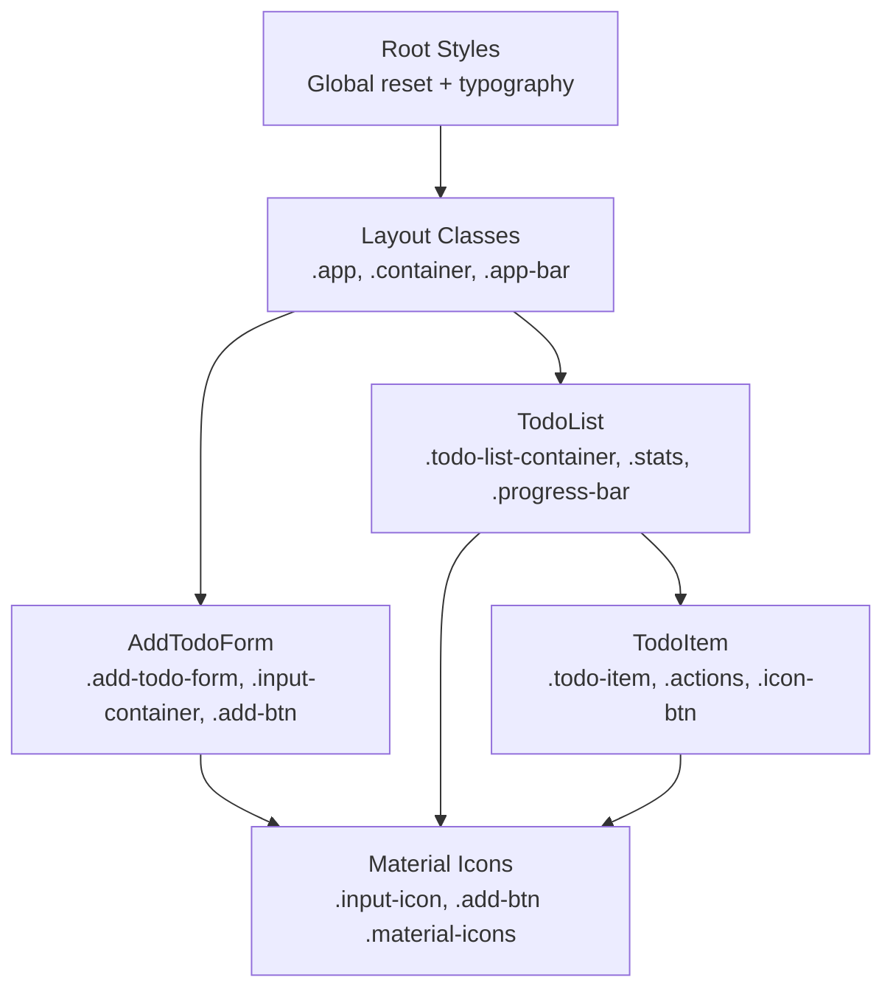
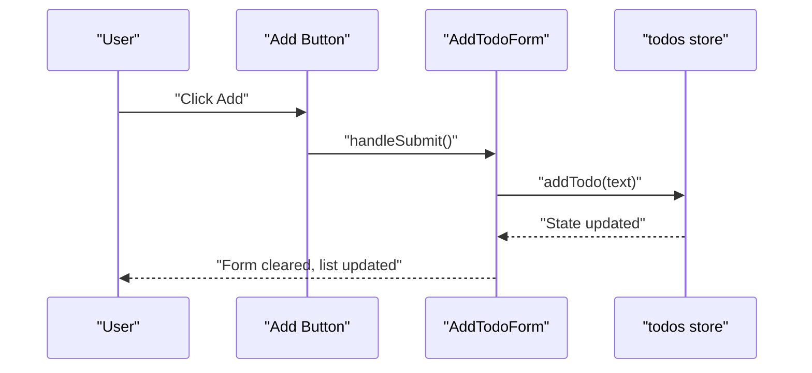
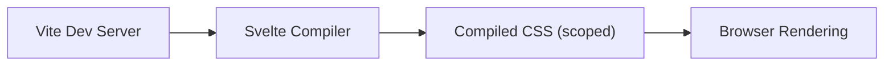

# Styling and Theming

<cite>
**Referenced Files in This Document**
- [index.html](file://index.html)
- [package.json](file://package.json)
- [svelte.config.js](file://svelte.config.js)
- [src/App.svelte](file://src/App.svelte)
- [src/main.js](file://src/main.js)
- [src/lib/components/AddTodoForm.svelte](file://src/lib/components/AddTodoForm.svelte)
- [src/lib/components/TodoList.svelte](file://src/lib/components/TodoList.svelte)
- [src/lib/components/TodoItem.svelte](file://src/lib/components/TodoItem.svelte)
</cite>

## Table of Contents
1. [Introduction](#introduction)
2. [Project Structure](#project-structure)
3. [Core Components](#core-components)
4. [Architecture Overview](#architecture-overview)
5. [Detailed Component Analysis](#detailed-component-analysis)
6. [Dependency Analysis](#dependency-analysis)
7. [Performance Considerations](#performance-considerations)
8. [Troubleshooting Guide](#troubleshooting-guide)
9. [Conclusion](#conclusion)
10. [Appendices](#appendices)

## Introduction
This document explains the styling strategy and theming approach used in the Todo List application. It covers the Material Design-inspired implementation, CSS-in-Svelte methodology, responsive design principles, component-specific styling patterns, shared styles, and transitions/animations. It also provides guidelines for customizing colors, typography, spacing, and interactive states, along with accessibility, browser compatibility, and performance optimization recommendations.

## Project Structure
The styling system is implemented primarily within Svelte components using scoped styles and global resets. The application mounts the root Svelte component into the DOM via the Vite entry script. Global typography and base resets are applied at the root level, while individual components encapsulate their own styles.

**Diagram sources**
- [index.html:1-14](file://index.html#L1-L14)
- [src/main.js:1-9](file://src/main.js#L1-L9)
- [src/App.svelte:1-76](file://src/App.svelte#L1-L76)
- [src/lib/components/AddTodoForm.svelte:1-124](file://src/lib/components/AddTodoForm.svelte#L1-L124)
- [src/lib/components/TodoList.svelte:1-114](file://src/lib/components/TodoList.svelte#L1-L114)
- [src/lib/components/TodoItem.svelte:1-212](file://src/lib/components/TodoItem.svelte#L1-L212)

**Section sources**
- [index.html:1-14](file://index.html#L1-L14)
- [src/main.js:1-9](file://src/main.js#L1-L9)
- [src/App.svelte:1-76](file://src/App.svelte#L1-L76)

## Core Components
- Root application styles and global resets are defined in the root component, ensuring consistent typography, spacing, and baseline layout.
- The AddTodoForm component defines form layout, focus states, and button interactions with Material icons.
- The TodoList component manages list layout, progress indicators, and empty state visuals with transitions.
- The TodoItem component handles item presentation, hover actions, checkbox visuals, and inline editing modes.

Key styling characteristics:
- Scoped styles per component with minimal cross-component coupling.
- Global reset and body typography applied once at the root.
- Consistent use of Material Icons for visual affordances.
- Transitions and animations for interactive feedback and list updates.

**Section sources**
- [src/App.svelte:20-75](file://src/App.svelte#L20-L75)
- [src/lib/components/AddTodoForm.svelte:38-123](file://src/lib/components/AddTodoForm.svelte#L38-L123)
- [src/lib/components/TodoList.svelte:45-113](file://src/lib/components/TodoList.svelte#L45-L113)
- [src/lib/components/TodoItem.svelte:75-211](file://src/lib/components/TodoItem.svelte#L75-L211)

## Architecture Overview
The styling architecture follows a layered approach:
- Global baseline: Reset and typography set at the root.
- Component-level scoping: Each component encapsulates its styles.
- Shared tokens: Colors and typography are repeated across components for consistency.
- Interactions: Hover, focus, and active states are defined locally for clarity.

**Diagram sources**
- [src/App.svelte:20-75](file://src/App.svelte#L20-L75)
- [src/lib/components/AddTodoForm.svelte:38-123](file://src/lib/components/AddTodoForm.svelte#L38-L123)
- [src/lib/components/TodoList.svelte:45-113](file://src/lib/components/TodoList.svelte#L45-L113)
- [src/lib/components/TodoItem.svelte:75-211](file://src/lib/components/TodoItem.svelte#L75-L211)

## Detailed Component Analysis

### Root Application Styles (.app, .container, .app-bar)
- Global reset ensures consistent margins/padding and border-box sizing.
- Body typography uses Roboto, with background and text color established for readability.
- Sticky header bar applies brand color, shadow, and z-index for prominence.
- Container centers content with a max width and responsive padding.

Responsive considerations:
- Flexible container with percentage widths and centered margins.
- Typography scales appropriately with viewport units and rem/em equivalents.

Accessibility considerations:
- Sufficient color contrast for text and interactive elements.
- Focus-visible emphasis via focus-within on input containers.

**Section sources**
- [src/App.svelte:20-75](file://src/App.svelte#L20-L75)

### AddTodoForm Styling (.add-todo-form, .input-container, .add-btn)
- Form layout uses flexbox for alignment and spacing.
- Input container supports focus-within to highlight active state with brand accent.
- Button includes hover, active, and disabled states with transitions and shadows.
- Material icons integrate seamlessly with text labels.

Transitions and interactivity:
- Smooth background and shadow transitions on focus and hover.
- Button press-down effect via scale transform.

**Section sources**
- [src/lib/components/AddTodoForm.svelte:38-123](file://src/lib/components/AddTodoForm.svelte#L38-L123)

### TodoList Styling (.todo-list-container, .stats, .progress-bar, .empty-state)
- Stats area displays completion counts and a progress bar with smooth width transitions.
- Progress fill uses brand color and rounded corners.
- Empty state leverages Material icons and muted colors for visual hierarchy.
- Animations include fade for empty state and fly/flip for list item transitions.

**Section sources**
- [src/lib/components/TodoList.svelte:45-113](file://src/lib/components/TodoList.svelte#L45-L113)

### TodoItem Styling (.todo-item, .actions, .icon-btn, .edit-input)
- Item container includes hover elevation and optional opacity for completed items.
- Checkbox visuals are hidden but controlled via native input; custom checkmark uses Material icons.
- Actions panel fades in on hover and hosts icon buttons with distinct hover states.
- Edit mode replaces label content with inline input and confirmation/cancel actions.

Transitions and animations:
- Hover effects on items and buttons provide immediate feedback.
- Icon buttons change color on hover for actionable clarity.

**Section sources**
- [src/lib/components/TodoItem.svelte:75-211](file://src/lib/components/TodoItem.svelte#L75-L211)

### Material Design Implementation
- Color palette: Brand primary color applied consistently across interactive elements and accents.
- Typography: Roboto used for body copy and inputs; uppercase text-transform for buttons aligns with Material tendencies.
- Elevation and shadows: Subtle shadows for cards and raised buttons; focus rings via box-shadows.
- Icons: Material Icons integrated for affordance and compactness.

Responsive design:
- Flexbox layouts adapt to available space.
- Max widths and padding ensure readability on small screens.

Accessibility:
- Clear focus states via focus-within and hover states.
- Sufficient color contrast for text and icons.
- Semantic inputs for checkboxes and buttons.

**Section sources**
- [src/App.svelte:27-32](file://src/App.svelte#L27-L32)
- [src/lib/components/AddTodoForm.svelte:90-102](file://src/lib/components/AddTodoForm.svelte#L90-L102)
- [src/lib/components/TodoItem.svelte:140-151](file://src/lib/components/TodoItem.svelte#L140-L151)

### CSS-in-Svelte Methodology
- Each component defines its own styles within a dedicated style block.
- Styles are scoped automatically by the Svelte compiler, preventing leakage.
- Global resets and root typography are centralized in the root component.

Build-time considerations:
- Svelte compiler emits scoped CSS; Vite handles bundling and dev server behavior.

**Section sources**
- [src/App.svelte:20-75](file://src/App.svelte#L20-L75)
- [src/lib/components/AddTodoForm.svelte:38-123](file://src/lib/components/AddTodoForm.svelte#L38-L123)
- [src/lib/components/TodoItem.svelte:75-211](file://src/lib/components/TodoItem.svelte#L75-L211)

### Animations and Transitions
- Button press-down effect via transform on active state.
- Hover elevation on cards and buttons.
- List item transitions: fly-in/out and flip animations for reordering.
- Fade transitions for empty state rendering.

**Diagram sources**
- [src/lib/components/AddTodoForm.svelte:6-18](file://src/lib/components/AddTodoForm.svelte#L6-L18)
- [src/lib/components/TodoList.svelte:31-33](file://src/lib/components/TodoList.svelte#L31-L33)

## Dependency Analysis
External dependencies relevant to styling and theming:
- Svelte runtime and compiler manage component compilation and scoped CSS.
- Vite provides development server and build pipeline; Svelte plugin integrates with Svelte compiler.
- No external CSS frameworks are used; theming is self-contained within component styles.

**Diagram sources**
- [package.json:11-16](file://package.json#L11-L16)
- [svelte.config.js:1-3](file://svelte.config.js#L1-L3)

**Section sources**
- [package.json:11-16](file://package.json#L11-L16)
- [svelte.config.js:1-3](file://svelte.config.js#L1-L3)

## Performance Considerations
- CSS-in-Svelte scoping avoids global cascade; keep styles localized to reduce specificity conflicts.
- Prefer transitions sparingly; use them for meaningful UX cues (hover, focus, entry/exit).
- Minimize heavy shadows and transforms on many elements simultaneously; batch animations where possible.
- Keep font stacks minimal; Roboto is efficient and widely available.
- Ensure icons are loaded efficiently; Material Icons CDN or local assets should be optimized.

[No sources needed since this section provides general guidance]

## Troubleshooting Guide
Common styling issues and resolutions:
- Styles not applying: Verify component style blocks are present and not overridden by global selectors unintentionally.
- Focus states missing: Ensure focus-within is used for input containers and that keyboard navigation remains visible.
- Transition jank: Reduce number of animated properties or lower duration; prefer transform and opacity.
- Responsive breakage: Confirm max-widths and padding remain effective on smaller viewports; test with device emulation.

Accessibility checks:
- Contrast ratios: Verify text and icon colors meet WCAG guidelines against backgrounds.
- Keyboard operability: Ensure all interactive elements are reachable via Tab and visually focused.

**Section sources**
- [src/App.svelte:20-75](file://src/App.svelte#L20-L75)
- [src/lib/components/AddTodoForm.svelte:38-123](file://src/lib/components/AddTodoForm.svelte#L38-L123)
- [src/lib/components/TodoItem.svelte:75-211](file://src/lib/components/TodoItem.svelte#L75-L211)

## Conclusion
The Todo List application employs a clean, Material Design-inspired styling strategy implemented entirely within Svelte components. Global resets and typography are centralized, while each component encapsulates its styles and interactions. Transitions and animations enhance usability without compromising performance. The approach is maintainable, accessible, and ready for theme customization.

[No sources needed since this section summarizes without analyzing specific files]

## Appendices

### Theme Customization Guidelines
- Colors: Replace brand primary color and secondary accents consistently across components. Maintain contrast for text and icons.
- Typography: Adjust font stack and sizes; ensure legibility across devices.
- Spacing: Use consistent gaps and paddings; define a spacing scale for predictable layouts.
- Interactive states: Keep hover, focus, and active states consistent in timing and effect.

[No sources needed since this section provides general guidance]