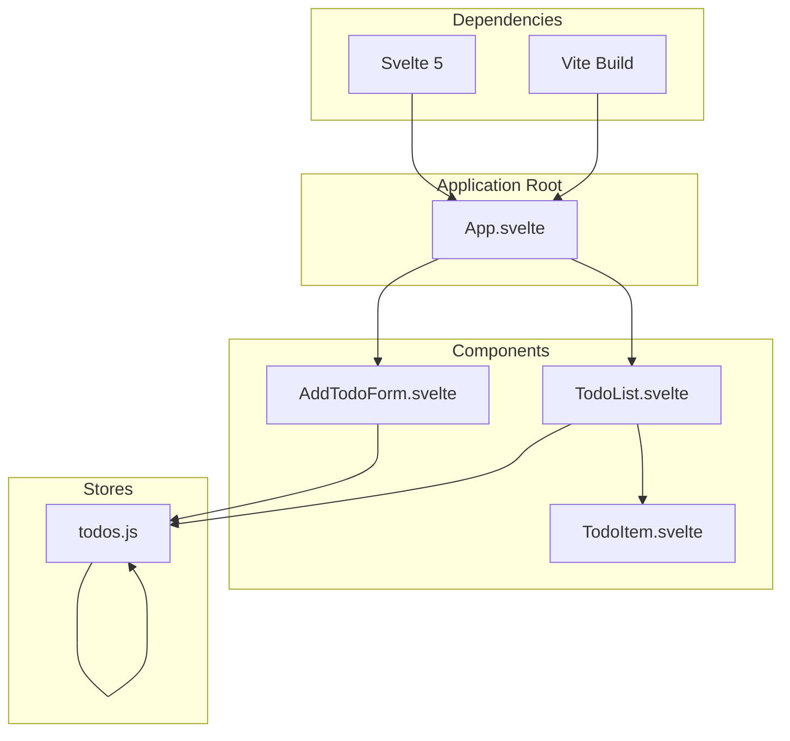
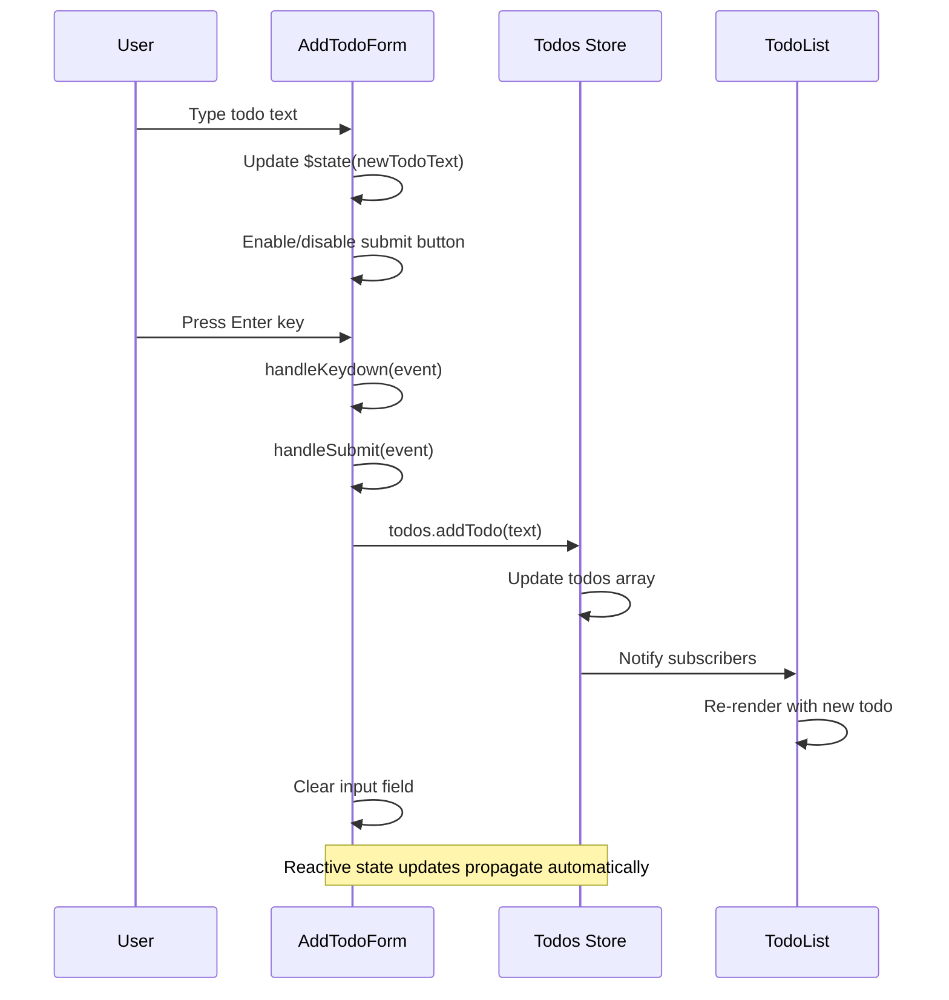
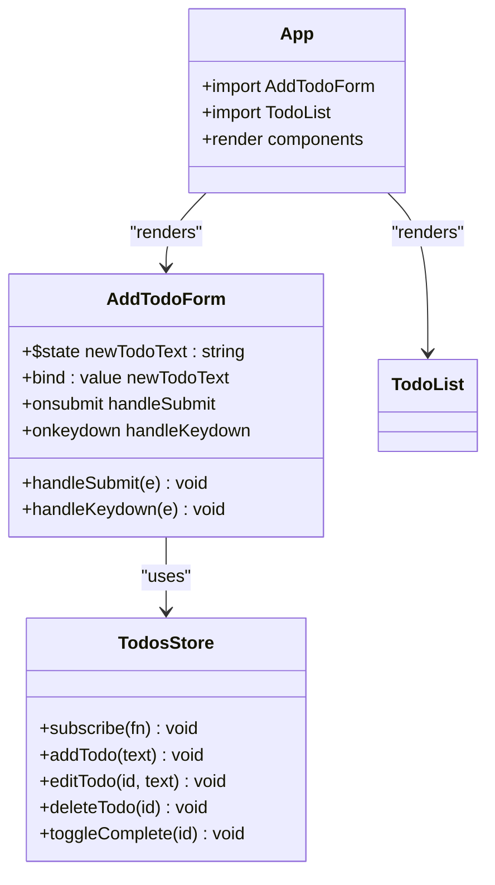
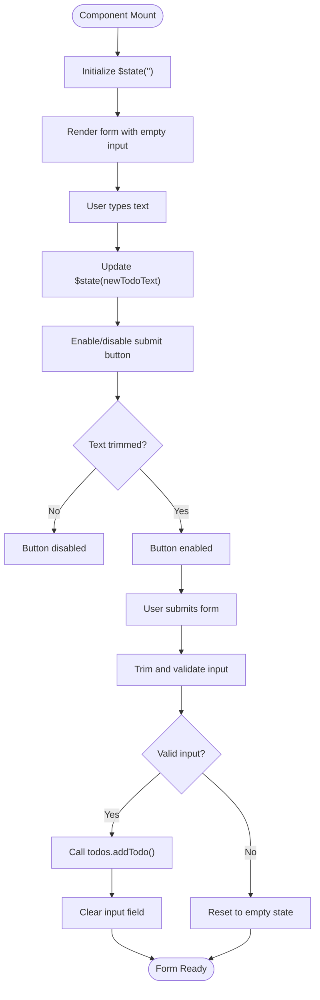
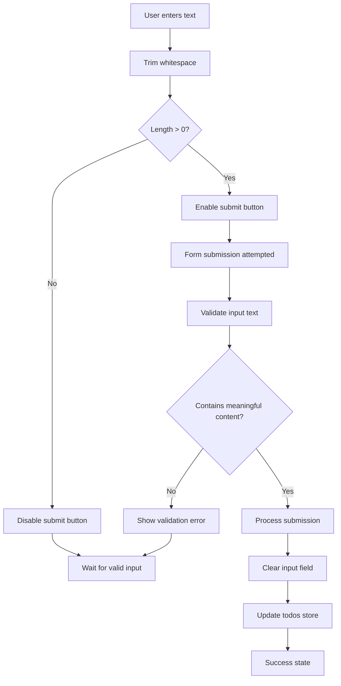
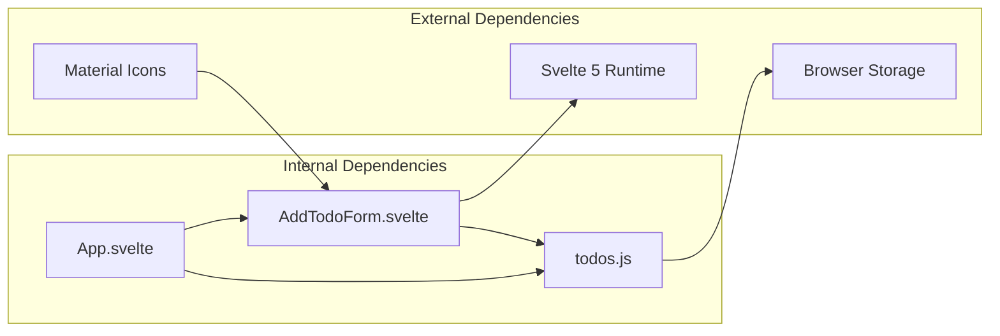

# AddTodoForm Component

<cite>
**Referenced Files in This Document**
- [AddTodoForm.svelte](file://src/lib/components/AddTodoForm.svelte)
- [todos.js](file://src/lib/stores/todos.js)
- [App.svelte](file://src/App.svelte)
- [TodoList.svelte](file://src/lib/components/TodoList.svelte)
- [TodoItem.svelte](file://src/lib/components/TodoItem.svelte)
- [package.json](file://package.json)
</cite>

## Table of Contents
1. [Introduction](#introduction)
2. [Project Structure](#project-structure)
3. [Core Components](#core-components)
4. [Architecture Overview](#architecture-overview)
5. [Detailed Component Analysis](#detailed-component-analysis)
6. [Dependency Analysis](#dependency-analysis)
7. [Performance Considerations](#performance-considerations)
8. [Troubleshooting Guide](#troubleshooting-guide)
9. [Conclusion](#conclusion)

## Introduction

The AddTodoForm component is a Material Design-styled form component designed to capture user input for adding new todo items to a todo list application. Built with Svelte 5's modern reactive primitives, this component demonstrates clean state management patterns, keyboard shortcut handling, and responsive Material Design styling.

The component serves as the primary input interface for the todo application, featuring real-time validation, keyboard navigation support, and seamless integration with the global todos store. It follows Material Design guidelines while maintaining excellent accessibility and user experience standards.

## Project Structure

The AddTodoForm component is part of a larger todo list application built with Svelte 5. The project follows a modular architecture with clear separation between components, stores, and application layout.

**Diagram sources**
- [App.svelte:1-76](file://src/App.svelte#L1-L76)
- [AddTodoForm.svelte:1-124](file://src/lib/components/AddTodoForm.svelte#L1-L124)
- [todos.js:1-63](file://src/lib/stores/todos.js#L1-L63)

**Section sources**
- [App.svelte:1-76](file://src/App.svelte#L1-L76)
- [package.json:1-17](file://package.json#L1-L17)

## Core Components

The AddTodoForm component consists of several key elements that work together to provide a complete user input experience:

### State Management
- Uses Svelte 5 `$state` primitive for reactive local state
- Maintains `newTodoText` as the primary input state
- Implements automatic clearing after successful submission

### Form Handling
- Prevents default form submission behavior
- Validates input before processing
- Integrates with Material Design styling system

### Keyboard Navigation
- Supports Enter key for form submission
- Provides accessible keyboard interaction patterns
- Maintains focus management during interactions

**Section sources**
- [AddTodoForm.svelte:1-124](file://src/lib/components/AddTodoForm.svelte#L1-L124)
- [todos.js:1-63](file://src/lib/stores/todos.js#L1-L63)

## Architecture Overview

The AddTodoForm component operates within a unidirectional data flow architecture, demonstrating clear separation of concerns and reactive state management patterns.

**Diagram sources**
- [AddTodoForm.svelte:6-18](file://src/lib/components/AddTodoForm.svelte#L6-L18)
- [todos.js:28-38](file://src/lib/stores/todos.js#L28-L38)
- [TodoList.svelte:1-113](file://src/lib/components/TodoList.svelte#L1-L113)

The component architecture follows these key principles:
- **Unidirectional Data Flow**: State flows from the store to components, not vice versa
- **Reactive Updates**: Changes trigger automatic UI updates through Svelte's reactivity system
- **Event-Driven Interaction**: User actions trigger store mutations through well-defined handlers
- **Separation of Concerns**: Each component has a single responsibility

## Detailed Component Analysis

### Component Structure and Implementation

The AddTodoForm component is implemented as a self-contained Svelte 5 component with integrated styling and state management.

**Diagram sources**
- [AddTodoForm.svelte:1-124](file://src/lib/components/AddTodoForm.svelte#L1-L124)
- [todos.js:14-62](file://src/lib/stores/todos.js#L14-L62)
- [App.svelte:1-4](file://src/App.svelte#L1-L4)

### State Management Pattern

The component utilizes Svelte 5's modern `$state` primitive for reactive local state management:

**Diagram sources**
- [AddTodoForm.svelte:4-12](file://src/lib/components/AddTodoForm.svelte#L4-L12)

### Material Design Styling Implementation

The component implements comprehensive Material Design styling with interactive states:

#### Base Form Styling
- **Container**: White background with rounded corners (12px radius), subtle shadow (rgba(0,0,0,0.1))
- **Layout**: Flexbox layout with 12px gap between elements
- **Responsive**: Adapts to different screen sizes while maintaining Material Design proportions

#### Input Container States
- **Default**: Light gray background (#f5f5f5) with 8px border radius
- **Focus**: Purple-themed background (#ede7f6) with blue glow effect (rgba(98,0,238,0.2))
- **Transition**: Smooth 0.2-second transition for background and shadow changes

#### Interactive Button States
- **Default**: Purple background (#6200ee) with subtle shadow
- **Hover**: Darker purple (#5000d4) with increased shadow depth
- **Active**: Subtle scaling transform (0.96 scale) for press-down effect
- **Disabled**: Gray background (#bdbdbd) with no interactivity

#### Typography and Icons
- **Font Family**: Roboto for consistent Material Design typography
- **Icon System**: Material Icons for visual consistency
- **Color Palette**: Primary purple (#6200ee) with appropriate contrast ratios

**Section sources**
- [AddTodoForm.svelte:38-123](file://src/lib/components/AddTodoForm.svelte#L38-L123)

### Validation Logic

The component implements client-side validation with the following logic:

**Diagram sources**
- [AddTodoForm.svelte:6-12](file://src/lib/components/AddTodoForm.svelte#L6-L12)

### Keyboard Shortcut Support

The component provides comprehensive keyboard navigation support:

#### Enter Key Handling
- **Event Binding**: `onkeydown={handleKeydown}` on the input element
- **Key Detection**: Specific handling for the Enter key (`e.key === 'Enter'`)
- **Form Submission**: Automatic form submission when Enter is pressed
- **Accessibility**: Maintains keyboard-only navigation capability

#### Focus Management
- **Automatic Focus**: Input field receives focus on mount
- **Tab Navigation**: Standard tab order maintained
- **Accessible Labels**: Proper ARIA attributes for screen readers

**Section sources**
- [AddTodoForm.svelte:14-18](file://src/lib/components/AddTodoForm.svelte#L14-L18)

### Integration with Todos Store

The component integrates seamlessly with the global todos store through the following mechanisms:

#### Store Import and Usage
- **Import Statement**: `import { todos } from '../stores/todos.js'`
- **Method Calls**: Direct invocation of `todos.addTodo(text)`
- **State Propagation**: Automatic UI updates through Svelte's reactivity

#### Store Operations
- **Add Operation**: Creates new todo with unique ID and timestamp
- **Validation**: Trims input text before store operations
- **Persistence**: Store automatically handles localStorage persistence

**Section sources**
- [AddTodoForm.svelte:2](file://src/lib/components/AddTodoForm.svelte#L2)
- [todos.js:28-38](file://src/lib/stores/todos.js#L28-L38)

## Dependency Analysis

The AddTodoForm component has minimal external dependencies, focusing on core Svelte functionality and Material Design principles.

**Diagram sources**
- [AddTodoForm.svelte:1-3](file://src/lib/components/AddTodoForm.svelte#L1-L3)
- [todos.js:1-1](file://src/lib/stores/todos.js#L1-L1)
- [App.svelte:1-4](file://src/App.svelte#L1-L4)

### Component Relationships

The AddTodoForm component works in concert with other application components:

#### Parent-Child Relationship
- **Parent Component**: App.svelte renders AddTodoForm as a child component
- **Sibling Relationship**: Shares the same parent context as TodoList
- **Shared State**: Both components consume the same todos store

#### Data Flow Dependencies
- **Input Flow**: User input flows from AddTodoForm to todos store
- **Output Flow**: Store updates flow from todos store to TodoList
- **Event Flow**: Form submission events trigger store mutations

**Section sources**
- [App.svelte:14-16](file://src/App.svelte#L14-L16)
- [AddTodoForm.svelte:2](file://src/lib/components/AddTodoForm.svelte#L2)

## Performance Considerations

The AddTodoForm component is optimized for performance through several design decisions:

### Reactive State Efficiency
- **Minimal Reactivity**: Only the input text state is reactive, reducing unnecessary updates
- **Efficient Bindings**: Direct two-way binding eliminates intermediate state management
- **Conditional Rendering**: Button state updates only when input changes

### Memory Management
- **Automatic Cleanup**: Svelte handles component lifecycle and event cleanup
- **No Manual DOM Manipulation**: Leverages Svelte's virtual DOM for efficient updates
- **Lightweight Dependencies**: Minimal external dependencies reduce bundle size

### User Experience Optimizations
- **Immediate Feedback**: Real-time button state updates provide instant user feedback
- **Smooth Transitions**: CSS transitions are hardware-accelerated for smooth animations
- **Keyboard Accessibility**: Full keyboard navigation reduces mouse dependency

## Troubleshooting Guide

Common issues and solutions when working with the AddTodoForm component:

### Form Not Submitting
**Symptoms**: Enter key pressed but form doesn't submit
**Causes**: 
- Event handler not properly bound
- Input validation blocking submission
- Store method not accessible

**Solutions**:
- Verify `onkeydown={handleKeydown}` is present on input element
- Check that input contains non-whitespace characters
- Ensure `todos.addTodo` method exists and is exported

### Button Stays Disabled
**Symptoms**: Add button remains disabled after typing
**Causes**:
- State not updating properly
- Binding issues with input element
- Component not re-rendering

**Solutions**:
- Confirm `$state` is properly declared
- Verify `bind:value={newTodoText}` is present
- Check for console errors preventing component initialization

### Styling Issues
**Symptoms**: Component appears unstyled or incorrectly styled
**Causes**:
- Missing Material Icons font
- CSS not loading properly
- Conflicting styles from parent components

**Solutions**:
- Ensure Material Icons font is loaded
- Verify component styles are included in build
- Check for CSS specificity conflicts

### Store Integration Problems
**Symptoms**: Todos not appearing in list after submission
**Causes**:
- Store not properly initialized
- Subscription not established
- Persistence issues

**Solutions**:
- Verify store export and import match
- Check store subscription mechanism
- Confirm localStorage access permissions

**Section sources**
- [AddTodoForm.svelte:24-35](file://src/lib/components/AddTodoForm.svelte#L24-L35)
- [todos.js:14-23](file://src/lib/stores/todos.js#L14-L23)

## Conclusion

The AddTodoForm component exemplifies modern Svelte 5 development practices through its clean implementation of reactive state management, Material Design styling, and keyboard accessibility. The component demonstrates effective separation of concerns, with clear boundaries between presentation, state management, and data persistence.

Key strengths of the implementation include:
- **Modern Reactivity**: Utilization of Svelte 5 `$state` primitive for efficient state management
- **Material Design Compliance**: Consistent implementation of Material Design principles
- **Accessibility**: Comprehensive keyboard navigation and screen reader support
- **Performance**: Optimized for minimal re-renders and efficient updates
- **Maintainability**: Clean, focused implementation with clear separation of concerns

The component serves as an excellent foundation for extending the todo list application, with clear patterns for adding validation, custom styling, and additional keyboard shortcuts. Its integration with the global todos store demonstrates best practices for state management in Svelte applications.