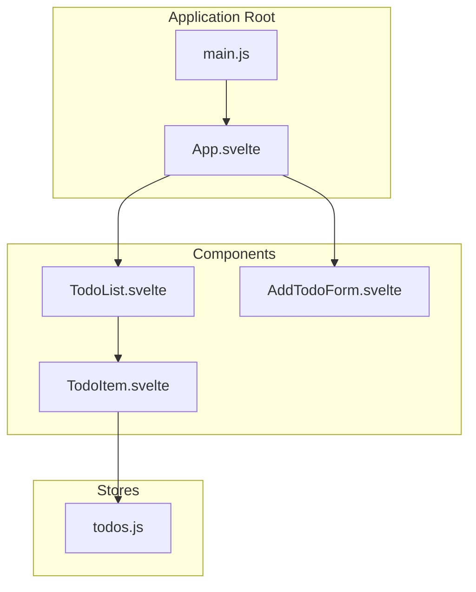
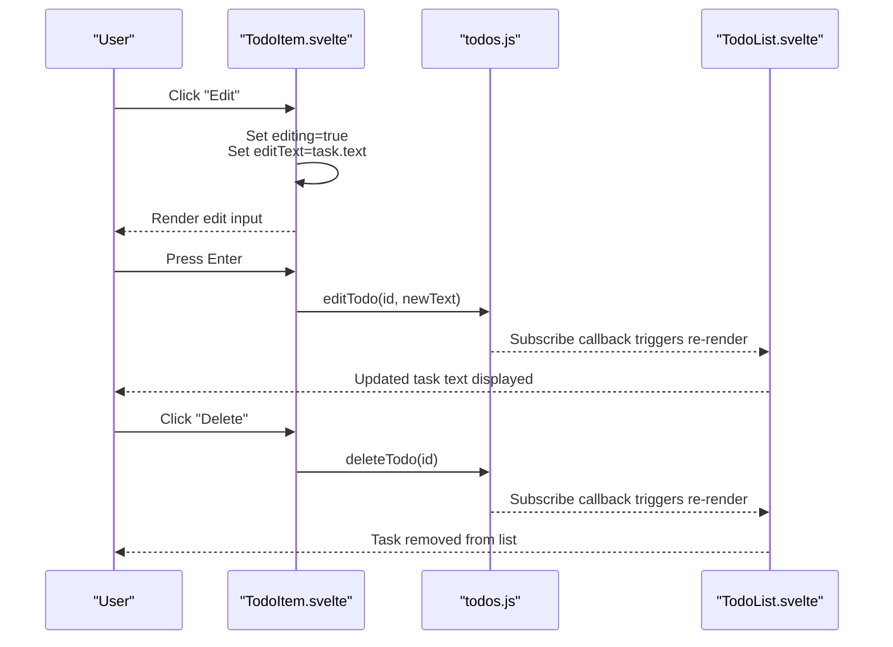
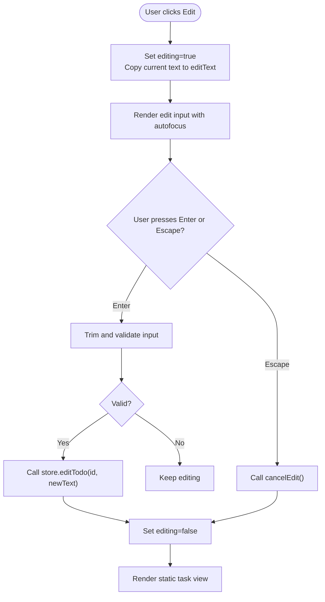
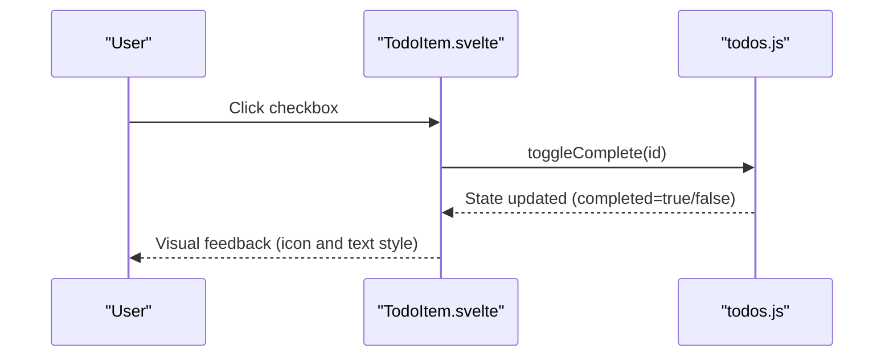
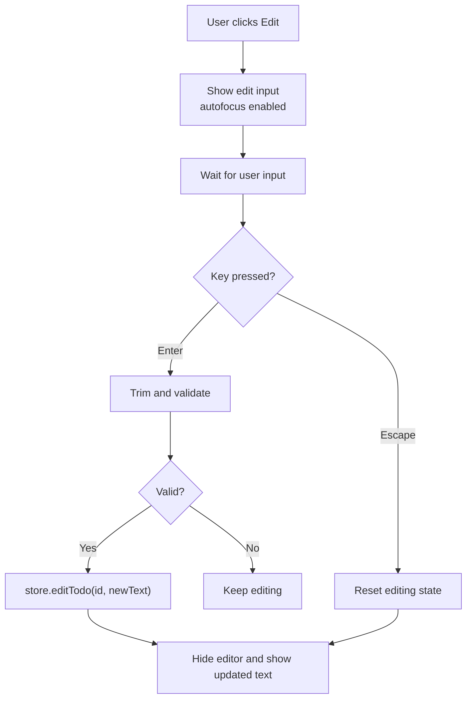
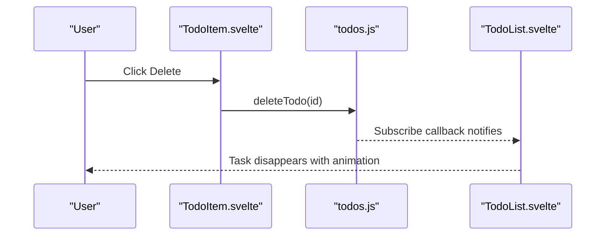
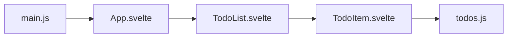

# TodoItem Component

<cite>
**Referenced Files in This Document**
- [TodoItem.svelte](file://src/lib/components/TodoItem.svelte)
- [todos.js](file://src/lib/stores/todos.js)
- [TodoList.svelte](file://src/lib/components/TodoList.svelte)
- [App.svelte](file://src/App.svelte)
- [main.js](file://src/main.js)
</cite>

## Table of Contents
1. [Introduction](#introduction)
2. [Project Structure](#project-structure)
3. [Core Components](#core-components)
4. [Architecture Overview](#architecture-overview)
5. [Detailed Component Analysis](#detailed-component-analysis)
6. [Dependency Analysis](#dependency-analysis)
7. [Performance Considerations](#performance-considerations)
8. [Troubleshooting Guide](#troubleshooting-guide)
9. [Conclusion](#conclusion)

## Introduction
The TodoItem component represents a single task in the todo list application. It encapsulates the core user interactions for managing individual tasks: toggling completion status, entering edit mode to modify task text, and deleting tasks. Built with Svelte, the component leverages reactive state, local styling, and Material Design icons to deliver a clean, responsive interface. The component integrates with a centralized store that persists data to localStorage and coordinates updates across the application.

## Project Structure
The TodoItem component resides within the components library and works alongside a shared store and parent container component. The application bootstraps via a main entry point that mounts the root Svelte component.

**Diagram sources**
- [main.js:1-9](file://src/main.js#L1-L9)
- [App.svelte:1-76](file://src/App.svelte#L1-L76)
- [TodoList.svelte:1-114](file://src/lib/components/TodoList.svelte#L1-L114)
- [TodoItem.svelte:1-212](file://src/lib/components/TodoItem.svelte#L1-L212)
- [todos.js:1-63](file://src/lib/stores/todos.js#L1-L63)

**Section sources**
- [main.js:1-9](file://src/main.js#L1-L9)
- [App.svelte:1-76](file://src/App.svelte#L1-L76)
- [TodoList.svelte:1-114](file://src/lib/components/TodoList.svelte#L1-L114)
- [TodoItem.svelte:1-212](file://src/lib/components/TodoItem.svelte#L1-L212)
- [todos.js:1-63](file://src/lib/stores/todos.js#L1-L63)

## Core Components
The TodoItem component manages its own internal state for edit mode and maintains a binding for the current edit text. It receives a task object as a prop and delegates all persistence and state mutations to the shared store. The component exposes three primary user interaction modes:
- Completion toggle: A checkbox input triggers a completion state change via the store.
- Edit mode activation: An edit action switches the UI into an inline editor with validation and keyboard shortcuts.
- Delete operation: A delete action removes the task from the store.

Material Design is implemented through Material Icons and Roboto typography, with hover effects and transitions enhancing usability. The component conditionally renders either the static task view or the edit interface based on internal state.

**Section sources**
- [TodoItem.svelte:1-32](file://src/lib/components/TodoItem.svelte#L1-L32)
- [TodoItem.svelte:34-73](file://src/lib/components/TodoItem.svelte#L34-L73)
- [TodoItem.svelte:75-212](file://src/lib/components/TodoItem.svelte#L75-L212)

## Architecture Overview
The TodoItem component participates in a unidirectional data flow:
- Parent components render lists and pass task props.
- User interactions trigger component methods.
- Component methods call store functions to update global state.
- Store subscribers persist changes and notify dependent components.
- UI reactivity updates all views automatically.

**Diagram sources**
- [TodoItem.svelte:8-31](file://src/lib/components/TodoItem.svelte#L8-L31)
- [todos.js:40-50](file://src/lib/stores/todos.js#L40-L50)
- [TodoList.svelte:30-34](file://src/lib/components/TodoList.svelte#L30-L34)

## Detailed Component Analysis

### State Management
The TodoItem component uses Svelte's reactive state primitives to manage local UI state:
- editing: Boolean flag controlling whether the component is in edit mode.
- editText: Local binding for the current value being edited.

State transitions occur through explicit handlers:
- startEdit initializes edit mode and copies the current task text.
- confirmEdit validates input, updates the store, and exits edit mode.
- cancelEdit resets edit mode and clears temporary state.

**Diagram sources**
- [TodoItem.svelte:8-31](file://src/lib/components/TodoItem.svelte#L8-L31)
- [TodoItem.svelte:13-23](file://src/lib/components/TodoItem.svelte#L13-L23)
- [todos.js:40-46](file://src/lib/stores/todos.js#L40-L46)

**Section sources**
- [TodoItem.svelte:4-6](file://src/lib/components/TodoItem.svelte#L4-L6)
- [TodoItem.svelte:8-31](file://src/lib/components/TodoItem.svelte#L8-L31)
- [TodoItem.svelte:13-23](file://src/lib/components/TodoItem.svelte#L13-L23)

### Completion Toggle Functionality
The completion toggle is implemented as a semantic label wrapping a hidden checkbox and a visible Material icon. The checkbox reflects the current completion state and triggers a store mutation when changed. The visual indicator updates to reflect completion status, including color changes and text decoration.

**Diagram sources**
- [TodoItem.svelte:52-63](file://src/lib/components/TodoItem.svelte#L52-L63)
- [todos.js:52-58](file://src/lib/stores/todos.js#L52-L58)

**Section sources**
- [TodoItem.svelte:52-63](file://src/lib/components/TodoItem.svelte#L52-L63)
- [TodoItem.svelte:107-127](file://src/lib/components/TodoItem.svelte#L107-L127)
- [todos.js:52-58](file://src/lib/stores/todos.js#L52-L58)

### Edit Mode Activation
Edit mode transforms the static task view into an inline editor with:
- An input bound to the local editText state.
- Confirm and cancel action buttons.
- Keyboard shortcuts: Enter to confirm, Escape to cancel.

Validation ensures only non-empty edits are committed to the store.

**Diagram sources**
- [TodoItem.svelte:35-50](file://src/lib/components/TodoItem.svelte#L35-L50)
- [TodoItem.svelte:25-31](file://src/lib/components/TodoItem.svelte#L25-L31)
- [todos.js:40-46](file://src/lib/stores/todos.js#L40-L46)

**Section sources**
- [TodoItem.svelte:35-50](file://src/lib/components/TodoItem.svelte#L35-L50)
- [TodoItem.svelte:25-31](file://src/lib/components/TodoItem.svelte#L25-L31)
- [TodoItem.svelte:13-18](file://src/lib/components/TodoItem.svelte#L13-L18)

### Delete Operations
The delete action immediately removes the task from the store, triggering a re-render of the list. The operation is irreversible until the user adds another task.

**Diagram sources**
- [TodoItem.svelte:68](file://src/lib/components/TodoItem.svelte#L68)
- [todos.js:48-50](file://src/lib/stores/todos.js#L48-L50)
- [TodoList.svelte:30-34](file://src/lib/components/TodoList.svelte#L30-L34)

**Section sources**
- [TodoItem.svelte:68](file://src/lib/components/TodoItem.svelte#L68)
- [todos.js:48-50](file://src/lib/stores/todos.js#L48-L50)

### Material Design Implementation
The component adheres to Material Design principles through:
- Material Icons for interactive elements (checkbox, edit, delete, confirm, cancel).
- Roboto typography for consistent text rendering.
- Elevation and hover states for actionable elements.
- Color accents for active states and completion indicators.
- Smooth transitions and animations for state changes.

Styling is scoped to the component, ensuring isolation while maintaining visual coherence.

**Section sources**
- [TodoItem.svelte:75-212](file://src/lib/components/TodoItem.svelte#L75-L212)
- [App.svelte:20-76](file://src/App.svelte#L20-L76)

### Customization Examples
To customize the TodoItem appearance or behavior, consider the following approaches:
- Visual customization: Modify color tokens, spacing, and typography within the component styles to match brand guidelines.
- Interaction enhancements: Add keyboard shortcuts for quick actions or integrate with additional UI affordances (e.g., priority badges).
- Metadata display: Extend the task model with extra fields (due date, tags) and render them conditionally in the static view.
- Action expansion: Introduce new actions (archive, share) by adding buttons and corresponding store methods.

These modifications should remain within the component boundaries to preserve encapsulation and testability.

**Section sources**
- [TodoItem.svelte:34-73](file://src/lib/components/TodoItem.svelte#L34-L73)
- [TodoItem.svelte:75-212](file://src/lib/components/TodoItem.svelte#L75-L212)

## Dependency Analysis
The TodoItem component depends on the shared todos store and is rendered by the TodoList container. The store itself depends on Svelte's writable store and localStorage for persistence.

**Diagram sources**
- [TodoItem.svelte:2](file://src/lib/components/TodoItem.svelte#L2)
- [todos.js:1](file://src/lib/stores/todos.js#L1)
- [TodoList.svelte:2-3](file://src/lib/components/TodoList.svelte#L2-L3)
- [App.svelte:2-3](file://src/App.svelte#L2-L3)
- [main.js:1-2](file://src/main.js#L1-L2)

**Section sources**
- [TodoItem.svelte:2](file://src/lib/components/TodoItem.svelte#L2)
- [todos.js:14-62](file://src/lib/stores/todos.js#L14-L62)
- [TodoList.svelte:2-3](file://src/lib/components/TodoList.svelte#L2-L3)
- [App.svelte:2-3](file://src/App.svelte#L2-L3)
- [main.js:1-2](file://src/main.js#L1-L2)

## Performance Considerations
- Reactive updates: Changes to the todos store propagate efficiently through Svelte's reactivity, minimizing unnecessary DOM work.
- Local persistence: The store writes to localStorage on every update, which is lightweight but should be considered in high-frequency editing scenarios.
- Rendering strategy: The parent list uses Svelte transitions and animations; keep the number of concurrent animations reasonable for large lists.
- CSS scoping: Component-scoped styles avoid global conflicts and reduce cascade complexity.

[No sources needed since this section provides general guidance]

## Troubleshooting Guide
Common issues and resolutions:
- Edit input not focusing: Ensure the edit mode is triggered and the input element has autofocus enabled.
- Edit not saving: Verify that the input is trimmed and non-empty before confirming.
- Delete not working: Confirm that the delete handler is bound to the correct task ID and that the store method exists.
- Completion state not updating: Check that the checkbox onchange handler invokes the store's toggle function with the correct ID.

**Section sources**
- [TodoItem.svelte:40-43](file://src/lib/components/TodoItem.svelte#L40-L43)
- [TodoItem.svelte:13-18](file://src/lib/components/TodoItem.svelte#L13-L18)
- [TodoItem.svelte:68](file://src/lib/components/TodoItem.svelte#L68)
- [todos.js:52-58](file://src/lib/stores/todos.js#L52-L58)

## Conclusion
The TodoItem component provides a focused, extensible foundation for task management within the application. Its clear separation of concerns—local UI state, Material Design styling, and centralized persistence—enables maintainable enhancements and consistent user experiences. By leveraging Svelte's reactivity and the shared store, the component supports smooth interactions and reliable state synchronization across the app.