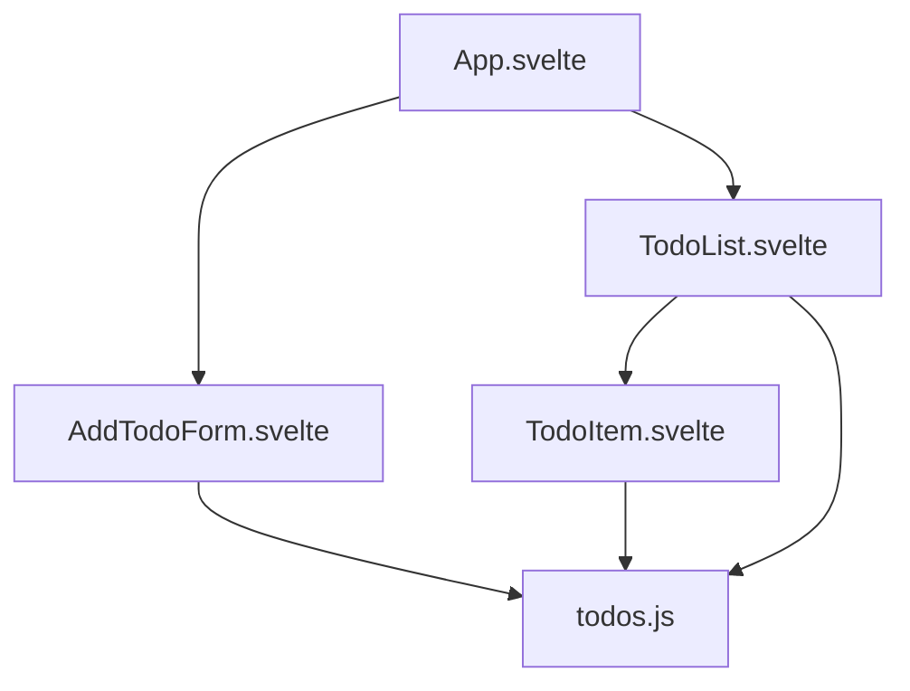
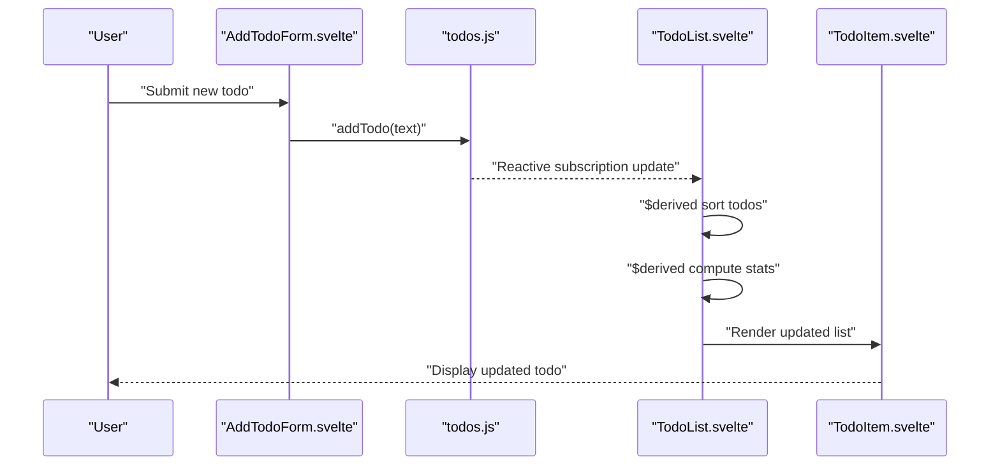
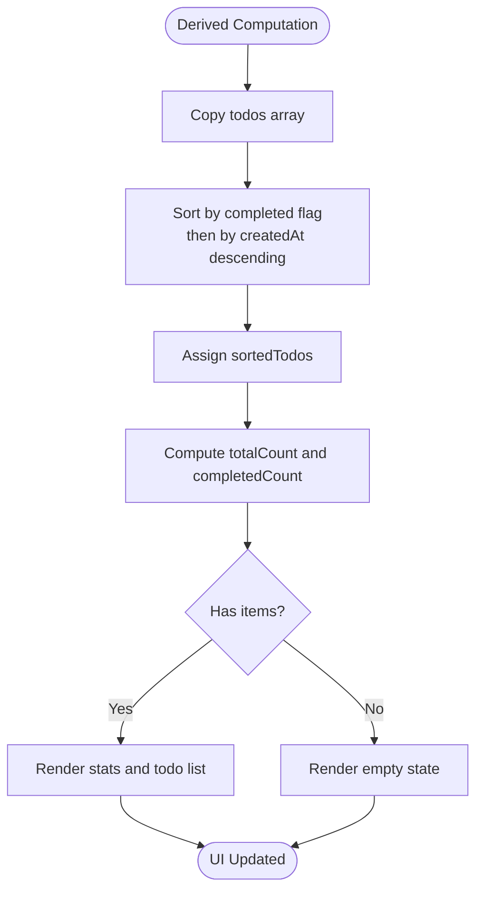
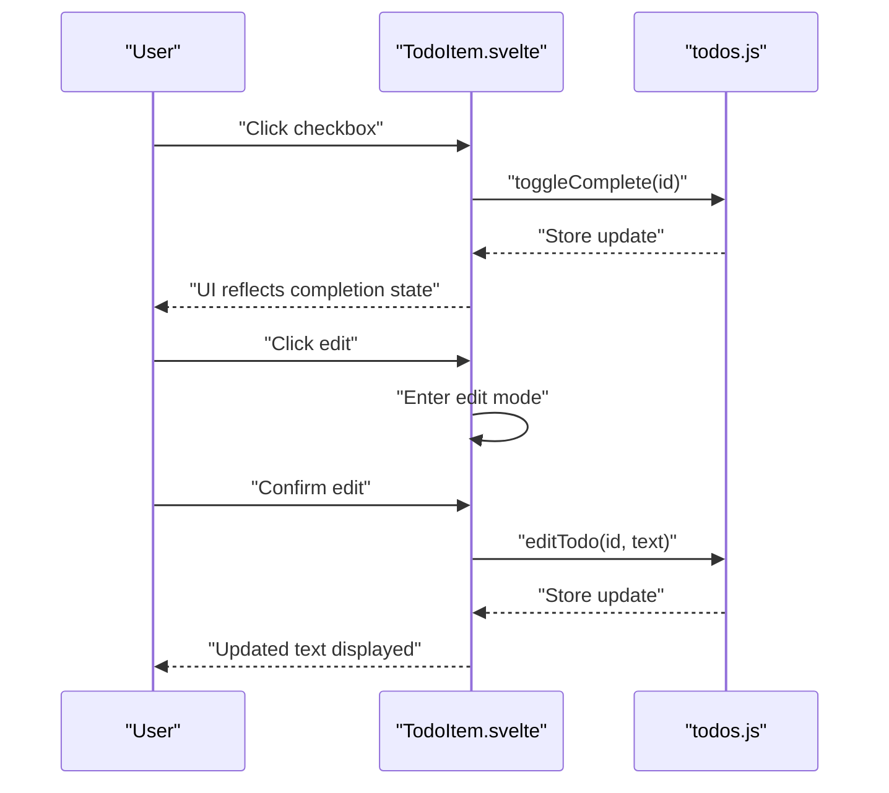
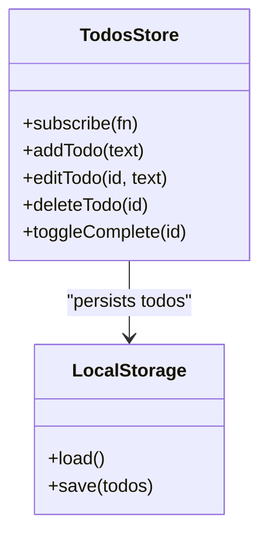
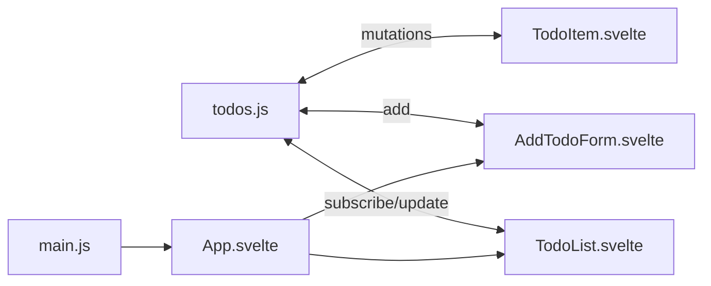

# TodoList Component

<cite>
**Referenced Files in This Document**
- [TodoList.svelte](file://src/lib/components/TodoList.svelte)
- [TodoItem.svelte](file://src/lib/components/TodoItem.svelte)
- [AddTodoForm.svelte](file://src/lib/components/AddTodoForm.svelte)
- [todos.js](file://src/lib/stores/todos.js)
- [App.svelte](file://src/App.svelte)
- [main.js](file://src/main.js)
</cite>

## Table of Contents
1. [Introduction](#introduction)
2. [Project Structure](#project-structure)
3. [Core Components](#core-components)
4. [Architecture Overview](#architecture-overview)
5. [Detailed Component Analysis](#detailed-component-analysis)
6. [Dependency Analysis](#dependency-analysis)
7. [Performance Considerations](#performance-considerations)
8. [Troubleshooting Guide](#troubleshooting-guide)
9. [Conclusion](#conclusion)

## Introduction
This document provides comprehensive documentation for the TodoList component, focusing on task display logic, sorting algorithms for organizing completed and pending tasks, and statistics calculation for progress tracking. It explains the component's interaction with the todos store, reactive data binding, and state synchronization. Practical examples demonstrate customizing list presentation, handling empty states, and implementing additional filtering or sorting options.

## Project Structure
The TodoList component is part of a Svelte-based application. The relevant files and their roles are:
- App.svelte: Root component that composes AddTodoForm and TodoList.
- TodoList.svelte: Renders the list of todos, displays statistics, and handles empty states.
- TodoItem.svelte: Individual todo item renderer with edit/delete/toggle actions.
- AddTodoForm.svelte: Form for adding new todos.
- todos.js: Todos store managing CRUD operations and persistence via localStorage.
- main.js: Application bootstrap mounting the root component.

**Diagram sources**
- [App.svelte](file://src/App.svelte)
- [TodoList.svelte](file://src/lib/components/TodoList.svelte)
- [TodoItem.svelte](file://src/lib/components/TodoItem.svelte)
- [AddTodoForm.svelte](file://src/lib/components/AddTodoForm.svelte)
- [todos.js](file://src/lib/stores/todos.js)

**Section sources**
- [App.svelte](file://src/App.svelte)
- [main.js](file://src/main.js)

## Core Components
- TodoList.svelte: Central component responsible for rendering the todo list, calculating completion statistics, and applying sorting logic. It uses derived values for reactive computations and transitions for smooth UI updates.
- TodoItem.svelte: Represents a single todo with interactive controls for editing, toggling completion, and deletion.
- AddTodoForm.svelte: Provides input for adding new todos and integrates with the todos store.
- todos.js: A Svelte writable store that persists todos to localStorage and exposes methods for add/edit/delete/toggle operations.

Key responsibilities:
- Task display: Iterates over sorted todos and renders TodoItem components.
- Sorting: Orders completed items after pending items, with newest items first among each group.
- Statistics: Computes total and completed counts and renders a progress bar.
- Empty state: Displays a friendly message when there are no tasks.
- Transitions: Uses Svelte transitions for animations during item addition/removal.

**Section sources**
- [TodoList.svelte](file://src/lib/components/TodoList.svelte)
- [TodoItem.svelte](file://src/lib/components/TodoItem.svelte)
- [AddTodoForm.svelte](file://src/lib/components/AddTodoForm.svelte)
- [todos.js](file://src/lib/stores/todos.js)

## Architecture Overview
The TodoList component subscribes to the todos store and derives computed values for sorting and statistics. Changes in the store propagate reactively to the UI, ensuring the list, stats, and transitions remain synchronized.

**Diagram sources**
- [AddTodoForm.svelte](file://src/lib/components/AddTodoForm.svelte)
- [todos.js](file://src/lib/stores/todos.js)
- [TodoList.svelte](file://src/lib/components/TodoList.svelte)
- [TodoItem.svelte](file://src/lib/components/TodoItem.svelte)

## Detailed Component Analysis

### TodoList.svelte: Task Display, Sorting, and Statistics
- Reactive data binding:
  - Subscribes to the todos store and derives sortedTodos, totalCount, and completedCount.
  - Derived values automatically recompute when the store changes.
- Sorting algorithm:
  - Sorts by completion status first (pending before completed).
  - Within each completion group, sorts by creation time (newest first).
- Statistics calculation:
  - totalCount: length of todos.
  - completedCount: filtered count of completed todos.
  - Progress percentage: completedCount divided by totalCount.
- Rendering logic:
  - Conditional rendering for empty state versus populated list.
  - Uses transitions for item insertion/removal and flip animation for reordering.
- Presentation customization:
  - Styles define layout, typography, and progress bar appearance.
  - Empty state includes icon, heading, and instructions.

**Diagram sources**
- [TodoList.svelte](file://src/lib/components/TodoList.svelte)

**Section sources**
- [TodoList.svelte](file://src/lib/components/TodoList.svelte)

### TodoItem.svelte: Individual Task Interaction
- Props-driven rendering: Receives a single todo object.
- Edit mode: Toggles into edit mode with input bound to local state; confirms or cancels edits.
- Actions:
  - Toggle completion by calling store method.
  - Delete by calling store method.
- Visual feedback: Completed state styling and hover actions visibility.

**Diagram sources**
- [TodoItem.svelte](file://src/lib/components/TodoItem.svelte)
- [todos.js](file://src/lib/stores/todos.js)

**Section sources**
- [TodoItem.svelte](file://src/lib/components/TodoItem.svelte)

### AddTodoForm.svelte: Adding New Tasks
- Local state: Tracks input value with reactive binding.
- Submission: Prevents default form submission, trims input, and adds to store.
- Keyboard support: Enter key triggers submission.
- Disabled button: Based on input validity.

**Section sources**
- [AddTodoForm.svelte](file://src/lib/components/AddTodoForm.svelte)

### todos.js: Store Implementation and Persistence
- Initialization: Loads persisted todos from localStorage on startup.
- Persistence: Subscribes to store updates and writes to localStorage.
- Methods:
  - addTodo: Creates a new todo with unique ID, sets completed=false, and prepends to list.
  - editTodo: Updates text for a matching ID.
  - deleteTodo: Filters out a todo by ID.
  - toggleComplete: Flips completion status for a matching ID.

**Diagram sources**
- [todos.js](file://src/lib/stores/todos.js)

**Section sources**
- [todos.js](file://src/lib/stores/todos.js)

## Dependency Analysis
- TodoList.svelte depends on:
  - todos store for reactive data.
  - TodoItem.svelte for rendering individual items.
  - Svelte transitions for animations.
- TodoItem.svelte depends on:
  - todos store for mutations.
  - props for rendering a single todo.
- AddTodoForm.svelte depends on:
  - todos store for adding new items.
- App.svelte composes:
  - AddTodoForm and TodoList as children.
- main.js mounts:
  - App.svelte into the DOM.

**Diagram sources**
- [todos.js](file://src/lib/stores/todos.js)
- [TodoList.svelte](file://src/lib/components/TodoList.svelte)
- [TodoItem.svelte](file://src/lib/components/TodoItem.svelte)
- [AddTodoForm.svelte](file://src/lib/components/AddTodoForm.svelte)
- [App.svelte](file://src/App.svelte)
- [main.js](file://src/main.js)

**Section sources**
- [App.svelte](file://src/App.svelte)
- [main.js](file://src/main.js)

## Performance Considerations
- Derived computations: Sorting and statistics are recomputed only when the todos array changes, minimizing unnecessary work.
- Transition costs: Flip animation runs per item change; keep lists reasonably sized for smooth performance.
- Store updates: Batched updates via update callbacks reduce redundant subscriptions.
- Persistence: localStorage writes occur on every store change; consider debouncing for very frequent updates if needed.

## Troubleshooting Guide
- Empty list display:
  - Verify totalCount derived value reflects current store length.
  - Confirm conditional rendering branch for empty state is reachable.
- Sorting anomalies:
  - Ensure completed flag is boolean and createdAt is numeric.
  - Check that sorting comparator handles equal completion statuses correctly.
- Progress bar not updating:
  - Confirm completedCount derived value recalculates after toggles.
  - Verify division by totalCount avoids zero denominator scenarios.
- Animations not triggering:
  - Confirm unique keys are used in each block to track items properly.
  - Ensure transition directives are applied to container elements around items.
- Store persistence issues:
  - Check localStorage availability and error handling in store subscription.
  - Validate that todos are initialized from localStorage on startup.

**Section sources**
- [TodoList.svelte](file://src/lib/components/TodoList.svelte)
- [todos.js](file://src/lib/stores/todos.js)

## Conclusion
The TodoList component demonstrates clean separation of concerns: the store manages state and persistence, while the UI components focus on rendering and interactions. Derived values enable efficient, reactive updates for sorting and statistics. The modular design supports easy customization, such as altering sort criteria, adding filters, or extending presentation styles.