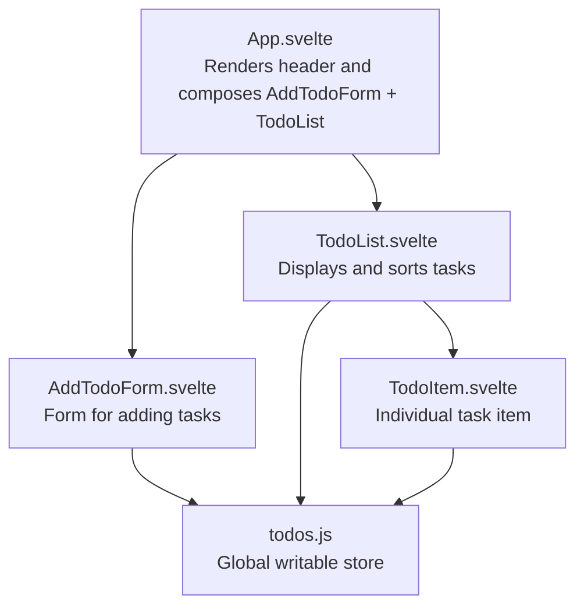
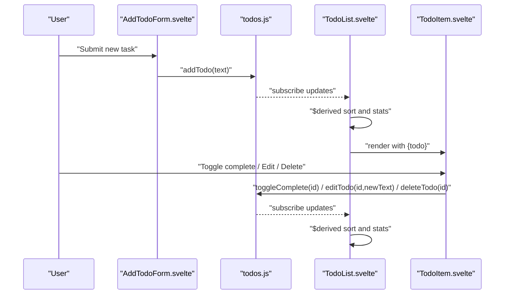
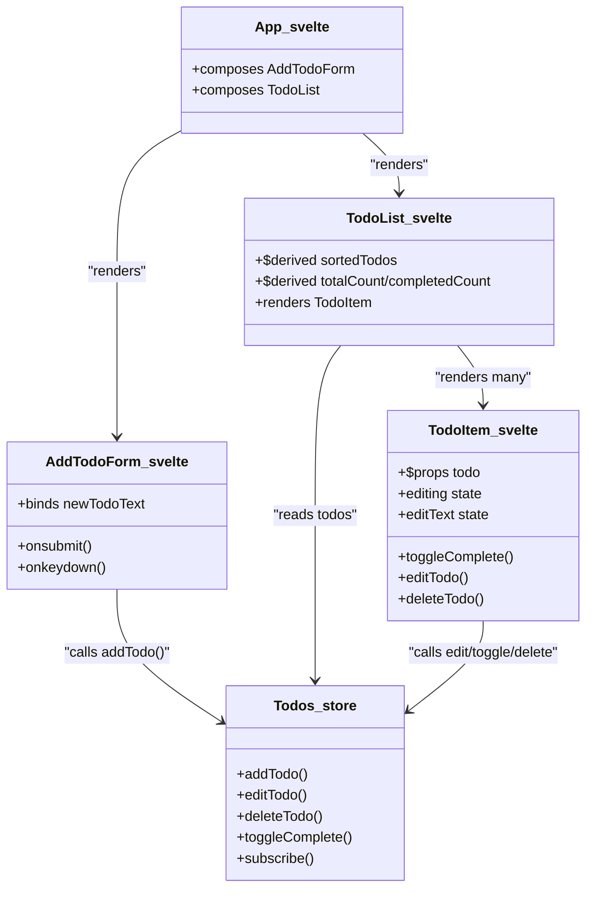
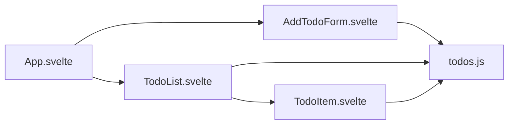

# UI Components

<cite>
**Referenced Files in This Document**
- [App.svelte](file://src/App.svelte)
- [AddTodoForm.svelte](file://src/lib/components/AddTodoForm.svelte)
- [TodoList.svelte](file://src/lib/components/TodoList.svelte)
- [TodoItem.svelte](file://src/lib/components/TodoItem.svelte)
- [todos.js](file://src/lib/stores/todos.js)
</cite>

## Table of Contents
1. [Introduction](#introduction)
2. [Project Structure](#project-structure)
3. [Core Components](#core-components)
4. [Architecture Overview](#architecture-overview)
5. [Detailed Component Analysis](#detailed-component-analysis)
6. [Dependency Analysis](#dependency-analysis)
7. [Performance Considerations](#performance-considerations)
8. [Troubleshooting Guide](#troubleshooting-guide)
9. [Conclusion](#conclusion)

## Introduction
This document describes the UI components of the Todo List application with a focus on three primary components: AddTodoForm for task creation, TodoList for displaying and organizing tasks, and TodoItem for individual task representation. It explains component props, events, slots, customization options, usage examples via file references, component states and interactions, Material Design implementation, component composition patterns, and integration with the global state management system.

## Project Structure
The application is structured around Svelte components and a centralized store for state persistence. The main application page composes the form and list components, while each component encapsulates its own presentation and interactions. The global store persists tasks to local storage and exposes actions to mutate state.

**Diagram sources**
- [App.svelte:1-18](file://src/App.svelte#L1-L18)
- [AddTodoForm.svelte:1-19](file://src/lib/components/AddTodoForm.svelte#L1-L19)
- [TodoList.svelte:1-16](file://src/lib/components/TodoList.svelte#L1-L16)
- [TodoItem.svelte:1-4](file://src/lib/components/TodoItem.svelte#L1-L4)
- [todos.js:14-62](file://src/lib/stores/todos.js#L14-L62)

**Section sources**
- [App.svelte:1-75](file://src/App.svelte#L1-L75)
- [AddTodoForm.svelte:1-123](file://src/lib/components/AddTodoForm.svelte#L1-L123)
- [TodoList.svelte:1-113](file://src/lib/components/TodoList.svelte#L1-L113)
- [TodoItem.svelte:1-180](file://src/lib/components/TodoItem.svelte#L1-L180)
- [todos.js:1-62](file://src/lib/stores/todos.js#L1-L62)

## Core Components
This section documents the three UI components and their roles in the application.

- AddTodoForm
  - Purpose: Provides a form to add new tasks to the list.
  - Props: None.
  - Events: Submits a form to create a new task.
  - Slots: Not used.
  - Customization: Styling via CSS classes; button disabled state based on input.
  - Integration: Uses the global todos store to add a new task.

- TodoList
  - Purpose: Renders the list of tasks, displays statistics, and shows an empty state.
  - Props: None.
  - Events: None.
  - Slots: None.
  - Customization: Progress bar styling; empty state iconography; transitions for list items.
  - Integration: Derives sorted tasks from the global todos store and passes each task to TodoItem.

- TodoItem
  - Purpose: Represents a single task with inline editing, completion toggling, and deletion.
  - Props: todo (object with id, text, completed, createdAt).
  - Events: None.
  - Slots: None.
  - Customization: Hover actions, Material icons for checkmarks and actions, visual feedback for completion.
  - Integration: Calls store methods to edit, toggle, and delete tasks.

**Section sources**
- [AddTodoForm.svelte:1-123](file://src/lib/components/AddTodoForm.svelte#L1-L123)
- [TodoList.svelte:1-113](file://src/lib/components/TodoList.svelte#L1-L113)
- [TodoItem.svelte:1-180](file://src/lib/components/TodoItem.svelte#L1-L180)
- [todos.js:14-62](file://src/lib/stores/todos.js#L14-L62)

## Architecture Overview
The UI components integrate with a global writable store that manages the task collection. The store persists data to local storage and exposes methods to add, edit, delete, and toggle task completion. The TodoList component derives computed values for sorting and statistics, while TodoItem handles per-task interactions.

**Diagram sources**
- [AddTodoForm.svelte:6-12](file://src/lib/components/AddTodoForm.svelte#L6-L12)
- [todos.js:28-38](file://src/lib/stores/todos.js#L28-L38)
- [TodoList.svelte:7-16](file://src/lib/components/TodoList.svelte#L7-L16)
- [TodoItem.svelte:13-18](file://src/lib/components/TodoItem.svelte#L13-L18)
- [todos.js:52-58](file://src/lib/stores/todos.js#L52-L58)

## Detailed Component Analysis

### AddTodoForm Component
- Role: Accepts user input and creates a new task via the global store.
- Props: None.
- Events:
  - onsubmit triggers submission handler.
  - onkeydown supports Enter key submission.
- Behavior:
  - Prevents submission of empty text.
  - Clears input after successful submission.
- Material Design:
  - Uses Material Icons for visual cues.
  - Styled input container with focus ring and hover effects.
- Customization:
  - Button disabled state based on input value.
  - Placeholder text and typography aligned with Roboto.

Usage example (reference path):
- [AddTodoForm.svelte:21-36](file://src/lib/components/AddTodoForm.svelte#L21-L36)

**Section sources**
- [AddTodoForm.svelte:1-123](file://src/lib/components/AddTodoForm.svelte#L1-L123)
- [todos.js:28-38](file://src/lib/stores/todos.js#L28-L38)

### TodoList Component
- Role: Displays the list of tasks, derived statistics, and empty state.
- Props: None.
- Derived computations:
  - sortedTodos: Sorts by completion status, then by creation time (newest first).
  - totalCount and completedCount: Computed counts for UI.
- Transitions and animations:
  - flip animation for item rearrangements.
  - fly transition for new items entering.
  - fade transition for items leaving and empty state.
- Material Design:
  - Progress bar with filled segment reflecting completion percentage.
  - Empty state with Material Icons and typography.
- Customization:
  - Progress fill width dynamically reflects completion ratio.
  - Empty state icon and messaging.

Usage example (reference path):
- [TodoList.svelte:18-43](file://src/lib/components/TodoList.svelte#L18-L43)

**Section sources**
- [TodoList.svelte:1-113](file://src/lib/components/TodoList.svelte#L1-L113)

### TodoItem Component
- Role: Renders a single task with inline editing, completion toggle, and delete action.
- Props:
  - todo: Object containing id, text, completed, createdAt.
- States:
  - editing: Controls whether the item is in edit mode.
  - editText: Local state bound to the edit input.
- Interactions:
  - Toggle completion via checkbox bound to store method.
  - Edit mode: Enter confirms, Escape cancels.
  - Delete removes the task via store method.
- Material Design:
  - Material Icons for checkboxes and action buttons.
  - Hover actions reveal with opacity transitions.
  - Color accents for completed state and hover states.
- Customization:
  - Conditional classes for completed state.
  - Hover-triggered visibility of action buttons.

Usage example (reference path):
- [TodoItem.svelte:34-73](file://src/lib/components/TodoItem.svelte#L34-L73)

**Section sources**
- [TodoItem.svelte:1-180](file://src/lib/components/TodoItem.svelte#L1-L180)
- [todos.js:40-58](file://src/lib/stores/todos.js#L40-L58)

### Composition Patterns and Global State Integration
- Composition:
  - App.svelte composes AddTodoForm and TodoList.
  - TodoList renders multiple TodoItem instances.
- Global state:
  - todos store exposes add/edit/delete/toggle methods.
  - Store subscribes to updates and writes to localStorage.
  - Components reactively consume store state via reactive declarations.

**Diagram sources**
- [App.svelte:1-18](file://src/App.svelte#L1-L18)
- [AddTodoForm.svelte:1-19](file://src/lib/components/AddTodoForm.svelte#L1-L19)
- [TodoList.svelte:1-16](file://src/lib/components/TodoList.svelte#L1-L16)
- [TodoItem.svelte:1-4](file://src/lib/components/TodoItem.svelte#L1-L4)
- [todos.js:14-62](file://src/lib/stores/todos.js#L14-L62)

**Section sources**
- [App.svelte:1-18](file://src/App.svelte#L1-L18)
- [todos.js:14-62](file://src/lib/stores/todos.js#L14-L62)

## Dependency Analysis
- Component dependencies:
  - TodoList depends on TodoItem and the todos store.
  - TodoItem depends on the todos store.
  - AddTodoForm depends on the todos store.
  - App.svelte composes AddTodoForm and TodoList.
- External dependencies:
  - Svelte transitions and animations (fly, fade, flip) are used in TodoList.
- Store dependency:
  - All components depend on the todos store for data and mutations.

**Diagram sources**
- [App.svelte:1-18](file://src/App.svelte#L1-L18)
- [AddTodoForm.svelte:1-2](file://src/lib/components/AddTodoForm.svelte#L1-L2)
- [TodoList.svelte:1-3](file://src/lib/components/TodoList.svelte#L1-L3)
- [TodoItem.svelte:1-2](file://src/lib/components/TodoItem.svelte#L1-L2)
- [todos.js:14-62](file://src/lib/stores/todos.js#L14-L62)

**Section sources**
- [TodoList.svelte:1-6](file://src/lib/components/TodoList.svelte#L1-L6)
- [TodoItem.svelte:1-2](file://src/lib/components/TodoItem.svelte#L1-L2)
- [AddTodoForm.svelte:1-2](file://src/lib/components/AddTodoForm.svelte#L1-L2)
- [todos.js:14-62](file://src/lib/stores/todos.js#L14-L62)

## Performance Considerations
- Reactive derivations:
  - Sorting and counting are derived from the store, minimizing unnecessary re-renders.
- Animations:
  - Transitions are applied selectively to improve perceived performance.
- Local storage persistence:
  - Store writes are throttled by subscription; avoid excessive writes by batching operations if needed.
- Rendering:
  - Using keyed each blocks ensures efficient DOM updates when items are added/removed.

## Troubleshooting Guide
- Form submission does nothing:
  - Ensure input is not empty; the submit handler prevents empty submissions.
  - Verify the store’s addTodo method is reachable.
  - Reference: [AddTodoForm.svelte:6-12](file://src/lib/components/AddTodoForm.svelte#L6-L12), [todos.js:28-38](file://src/lib/stores/todos.js#L28-L38)
- Task does not appear:
  - Confirm the store subscription is active and the component subscribes to $todos.
  - Reference: [TodoList.svelte:2](file://src/lib/components/TodoList.svelte#L2)
- Editing does not save:
  - Ensure the edit input is not empty; confirmEdit requires trimmed text.
  - Reference: [TodoItem.svelte:13-18](file://src/lib/components/TodoItem.svelte#L13-L18), [todos.js:40-46](file://src/lib/stores/todos.js#L40-L46)
- Completion toggle not working:
  - Verify the checkbox event handler calls the store’s toggleComplete method.
  - Reference: [TodoItem.svelte:57](file://src/lib/components/TodoItem.svelte#L57), [todos.js:52-58](file://src/lib/stores/todos.js#L52-L58)
- Delete button does nothing:
  - Confirm the delete handler invokes store’s deleteTodo method.
  - Reference: [TodoItem.svelte:68](file://src/lib/components/TodoItem.svelte#L68), [todos.js:48-50](file://src/lib/stores/todos.js#L48-L50)

**Section sources**
- [AddTodoForm.svelte:6-12](file://src/lib/components/AddTodoForm.svelte#L6-L12)
- [TodoList.svelte:2](file://src/lib/components/TodoList.svelte#L2)
- [TodoItem.svelte:13-18](file://src/lib/components/TodoItem.svelte#L13-L18)
- [todos.js:28-38](file://src/lib/stores/todos.js#L28-L38)
- [todos.js:40-46](file://src/lib/stores/todos.js#L40-L46)
- [todos.js:52-58](file://src/lib/stores/todos.js#L52-L58)
- [todos.js:48-50](file://src/lib/stores/todos.js#L48-L50)

## Conclusion
The Todo List application demonstrates clean separation of concerns: AddTodoForm handles creation, TodoList orchestrates display and derived computations, and TodoItem encapsulates per-task interactions. The global todos store centralizes state and persistence, enabling seamless updates across components. Material Design is consistently applied through icons, spacing, and color accents, while Svelte transitions enhance user experience. The documented props, events, states, and integrations provide a solid foundation for extending or customizing the UI components.